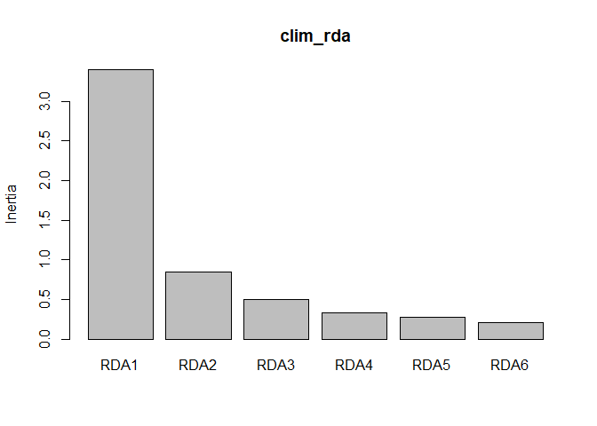
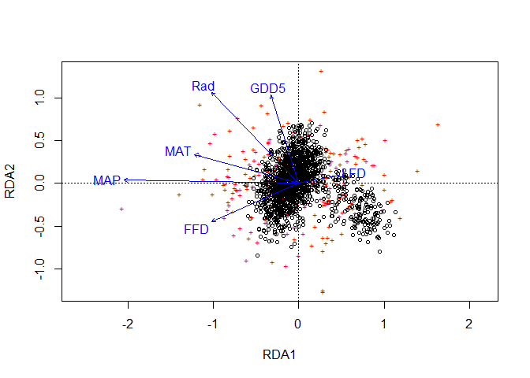
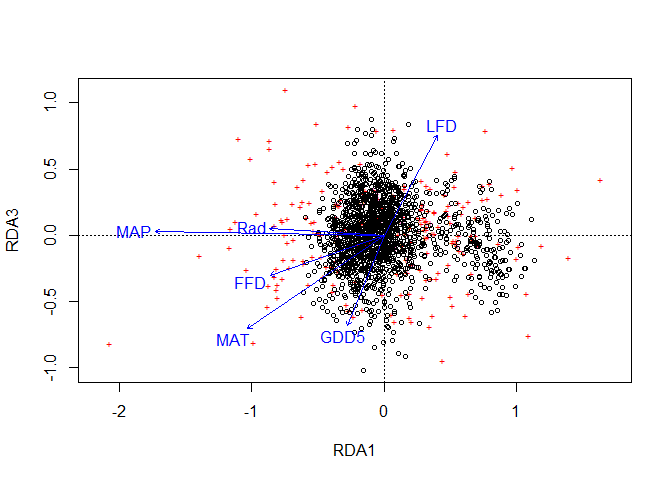
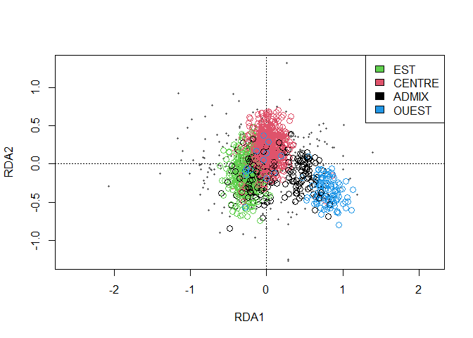
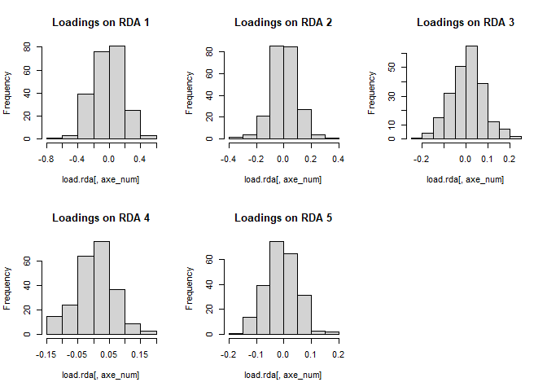
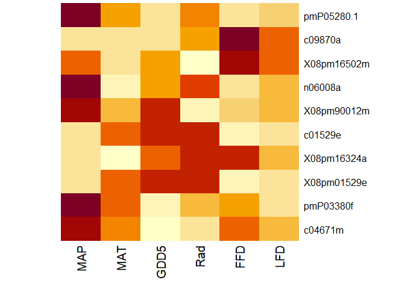
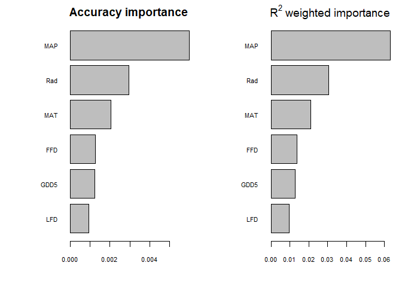
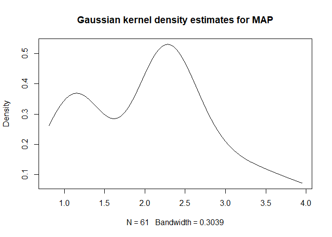
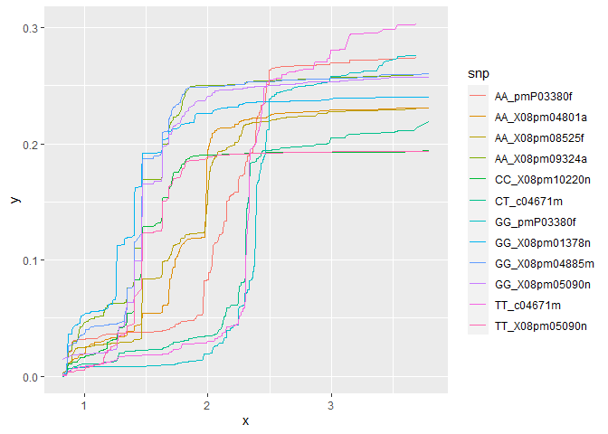

Association génotype-environnement
================

# I. Introduction

Dans ce tutoriel, nous allons mener une analyse de type association
génotype-environnement au moyen de deux méthodes. D’abord une analyse en
redondance (*redundancy analysis*, RDA) qui nous permettra d’identifier
des locus putativement adaptatifs. Puis nous réaliserons une *Gradient
Forest* (GF), qui nous permettra de confirmer les résultats obtenus
grâce à la RDA et de visualiser la relation entre les locus identifiés
et les variables environnementales. Le jeu de données que nous allons
utiliser contient une série de SNP provenant de plusieurs populations
d’épinettes noires (*Picea mariana*) de tout le Canada ainsi que des
variables environnementales associées au site d’origine de ces
provenances.

# II. Analyse en redondance

l’ARD est une méthode d’association génotype-environnement multivariée
qui consiste en une ordination contrainte similaire a l’analyse en
composantes principales. Elle permet de modéliser les relations
linéaires entre plusieurs prédicteurs environnementaux et la variation
génomique au sein d’une espèce ou d’une population. Ce qui permet
d’identifier les fréquences allèliques qui covarient avec
l’environnement.

Ce tutoriel est inspiré de celui accompagnant l’article de Forester et
al. ([2018](https://onlinelibrary.wiley.com/doi/abs/10.1111/mec.14584)),
disponible [ici](https://popgen.nescent.org/2018-03-27_RDA_GEA.html).

## Imports

### Packages

Le package utilisé pour cette analyse est le package
[vegan](https://vegandevs.github.io/vegan/articles/FAQ-vegan.html#what-is-vegan).

``` r
#install.packages("vegan") # Pour installer 
library(vegan)
```

### Données

Nos données sont dans deux fichiers différents. Nous pouvons les
importer et effectuer un léger nettoyage.

``` r
## Importe
data_genotype <- read.csv("./Genotypes_AGE.csv", header = TRUE, stringsAsFactors = FALSE)
data_climate  <- read.csv("./Climate_AGE.csv", header = TRUE, stringsAsFactors = FALSE)

## Nettoie les données
data_climate  <- data_climate[-1]
data_genotype <- subset(data_genotype, select = -c(Sample_Name, Site))
```

| Provenance_Code | X011_BR_F15_02 | X013_BR_1\_E01_02 | X015_B3_r\_B10_05 | X021_BR_1\_G24_03_01 | X033_TB_D02_02 | X042_BR_E10_15 | X044_B3_r\_N02_11 | X044_B3_r\_N02_13 | X046_B3_L09_02 | X0612_B3_G14_05 | X062_B3_r\_P04_02 | X072_B3_r\_I19_04 | X074_B3_r\_L04_05 | X08pm00650e | X08pm01378n | X08pm01471a | X08pm01529e | X08pm01685n | X08pm02343e | X08pm02470a | X08pm02470c | X08pm02623e | X08pm03656e | X08pm04073m | X08pm04142a | X08pm04220m | X08pm04312b | X08pm04486a | X08pm04550n | X08pm04662f | X08pm04794b | X08pm04801a | X08pm04885m | X08pm04914n | X08pm05090n | X08pm05205e | X08pm05601n | X08pm05720a | X08pm05731a | X08pm05811e | X08pm05883n | X08pm06036f | X08pm06122n | X08pm06372a | X08pm06511g | X08pm06677e | X08pm07074m | X08pm07126a | X08pm07183g | X08pm07185m | X08pm07350a | X08pm07400k | X08pm07414e | X08pm07506d | X08pm07561n | X08pm07562n | X08pm07602a | X08pm07602b | X08pm07667a | X08pm07681e | X08pm07759a | X08pm08021m | X08pm08125a | X08pm08143a | X08pm08152b | X08pm08177a | X08pm08250f | X08pm08316b | X08pm08339a | X08pm08349n | X08pm08441m | X08pm08525f | X08pm08892f | X08pm08922f | X08pm09027f | X08pm09063f | X08pm09163e | X08pm09324a | X08pm09324c | X08pm09327m | X08pm09440a | X08pm09562b | X08pm09573a | X08pm09870a | X08pm10001f | X08pm10140e | X08pm10193f | X08pm10220n | X08pm10254m | X08pm10328f | X08pm10438f | X08pm10784k | X08pm10998e | X08pm11112m | X08pm11157e | X08pm11291f | X08pm11326a | X08pm11408m | X08pm11945m | X08pm12124a | X08pm12492e | X08pm12821e | X08pm13366n | X08pm13634e | X08pm13661m | X08pm13855m | X08pm13855n | X08pm13950f | X08pm14745h | X08pm15280b | X08pm15328f | X08pm15817a | X08pm15817d | X08pm15965e | X08pm16192b | X08pm16324a | X08pm16364e | X08pm16502m | X08pm90012m | X08pm90013a | X08pm90035a | X08pm90155e | X08pm90172a | X13749d | X162_B3_r\_L01_10 | X191_B3_r\_G18_01 | X2016_B3_r\_M09_02 | X206_B3_C13_06 | c01529e | c02309e | c02343e | c03056e | c03870a | c04220m | c04312b | c04554n | c04662f | c04671m | c05720c | c05937s | c07074e | c08080a | c08085m | c08102m | c08398a | c09063f | c09406f | c09573a | c09644m | c09870a | c09889a | c09898f | c10140e | c10254m | c11176n | c13855m | c14320f | c15051g | GQ0013_BR_1.P02_1.220 | GQ0046_B3.E02_1.564 | GQ0066_B3.L09_1.205 | GQ0164_N16_CapINB_268 | GQ0165_E01_CapINB_457 | GQ0173_B3_r.O10_1.244 | GQ0201_E06_CapINB_784 | GQ0206_J07_CapINB_529 | GQ0222_B7.B17_1.379 | GQ0253_G06_CapINB_355 | GQ0255_K05_CapINB_525 | GQ02903_P22_CapINB_607 | GQ03105_I04_CapINB_621 | GQ03110_A22_CapINB_594 | GQ03113_N22_CapINB_1684 | GQ03126_O11_CapINB_993 | GQ03208_E06_CapINB_506 | GQ03215_H11_CapINB_881 | GQ03303_N09_CapINB_1240 | GQ03304_O08_CapINB_248 | GQ03311_L15_CapINB_1645 | GQ03312_B13_CapINB_151 | GQ03313_G17_CapINB_320 | GQ03315_E13_CapINB_573 | GQ03318_K08_CapINB_566 | GQ03510_A24_CapINB_661 | GQ03606_L11_CapINB_1166 | GQ03607_L12_CapINB_1080 | GQ04102_B16_CapINB_705 | GQ04111_E10_CapINB_447 | n01685e | n01685n | n02722g | n04563m | n04569a | n06008a | n06447n | n07126a | n07245m | n07265a | n07964b | n08152e | n08316b | n08892e | n09324c | n09327n | n10085e | n10503e | n14751j | P01075.1 | P12463.1 | P13240.1 | P9580.1 | pmP01687.3 | pmP03380f | pmP04543.1 | pmP04543.2 | pmP05280.1 | pmP05312.1 | pmP06392.1 | pmP06490.1 | pmP06661.1 | pmP06742j | pmP07757.1 | pmP10060.1 | pmP10495.1 | pmP10520.2 | pmP10981.1 | pmP16279a | pmPBB.PF00847.7b.a |
|----------------:|:---------------|:------------------|:------------------|:---------------------|:---------------|:---------------|:------------------|:------------------|:---------------|:----------------|:------------------|:------------------|:------------------|:------------|:------------|:------------|:------------|:------------|:------------|:------------|:------------|:------------|:------------|:------------|:------------|:------------|:------------|:------------|:------------|:------------|:------------|:------------|:------------|:------------|:------------|:------------|:------------|:------------|:------------|:------------|:------------|:------------|:------------|:------------|:------------|:------------|:------------|:------------|:------------|:------------|:------------|:------------|:------------|:------------|:------------|:------------|:------------|:------------|:------------|:------------|:------------|:------------|:------------|:------------|:------------|:------------|:------------|:------------|:------------|:------------|:------------|:------------|:------------|:------------|:------------|:------------|:------------|:------------|:------------|:------------|:------------|:------------|:------------|:------------|:------------|:------------|:------------|:------------|:------------|:------------|:------------|:------------|:------------|:------------|:------------|:------------|:------------|:------------|:------------|:------------|:------------|:------------|:------------|:------------|:------------|:------------|:------------|:------------|:------------|:------------|:------------|:------------|:------------|:------------|:------------|:------------|:------------|:------------|:------------|:------------|:------------|:------------|:------------|:--------|:------------------|:------------------|:-------------------|:---------------|:--------|:--------|:--------|:--------|:--------|:--------|:--------|:--------|:--------|:--------|:--------|:--------|:--------|:--------|:--------|:--------|:--------|:--------|:--------|:--------|:--------|:--------|:--------|:--------|:--------|:--------|:--------|:--------|:--------|:--------|:----------------------|:--------------------|:--------------------|:----------------------|:----------------------|:----------------------|:----------------------|:----------------------|:--------------------|:----------------------|:----------------------|:-----------------------|:-----------------------|:-----------------------|:------------------------|:-----------------------|:-----------------------|:-----------------------|:------------------------|:-----------------------|:------------------------|:-----------------------|:-----------------------|:-----------------------|:-----------------------|:-----------------------|:------------------------|:------------------------|:-----------------------|:-----------------------|:--------|:--------|:--------|:--------|:--------|:--------|:--------|:--------|:--------|:--------|:--------|:--------|:--------|:--------|:--------|:--------|:--------|:--------|:--------|:---------|:---------|:---------|:--------|:-----------|:----------|:-----------|:-----------|:-----------|:-----------|:-----------|:-----------|:-----------|:----------|:-----------|:-----------|:-----------|:-----------|:-----------|:----------|:-------------------|
|             321 | GG             | GG                | CC                | CT                   | AA             | GT             | CC                | TT                | CT             | CC              | AG                | AA                | CG                | GG          | GG          | AG          | GG          | CC          | CT          | AA          | AG          | CC          | GG          | CT          | CC          | TT          | GG          | GG          | CT          | GG          | GG          | GG          | GG          | TT          | NA          | AT          | CC          | GT          | AA          | AA          | TT          | GG          | AA          | AA          | CT          | AA          | AG          | CT          | NA          | GG          | GG          | TT          | GG          | TT          | CC          | CC          | AA          | CC          | CC          | CT          | TT          | AG          | TG          | TT          | CC          | AC          | AA          | AA          | GG          | GT          | AG          | AG          | TT          | AG          | CT          | CC          | AA          | AC          | AG          | GG          | TT          | CT          | AT          | AA          | AA          | AA          | TT          | CC          | TT          | CT          | TT          | CC          | TG          | AA          | GG          | NA          | CT          | TG          | CG          | CC          | CC          | CC          | GG          | TT          | GG          | TT          | CT          | TT          | GT          | CC          | TT          | CC          | TT          | AA          | CG          | GG          | AA          | AA          | CT          | AG          | CC          | AA          | AG          | AA      | GT                | GG                | AA                 | CA             | GG      | AG      | CT      | AA      | TT      | TT      | CC      | CT      | GG      | CT      | TT      | TT      | CT      | CC      | AA      | GG      | CT      | CG      | AT      | AT      | TT      | GG      | CT      | GG      | AA      | NA      | AG      | AA      | AA      | GG      | AA                    | TT                  | CC                  | AT                    | AA                    | NA                    | CT                    | TG                    | NA                  | CT                    | GG                    | TG                     | AG                     | CC                     | GG                      | AA                     | CT                     | TT                     | CC                      | CC                     | CC                      | CC                     | AG                     | TT                     | GG                     | CT                     | AG                      | CC                      | CC                     | CG                     | AG      | CC      | CC      | NA      | AA      | TT      | GG      | CT      | CC      | CT      | TT      | GG      | TT      | CC      | AG      | CC      | GG      | TT      | GG      | AC       | AG       | AT       | TT      | GT         | AG        | TT         | CT         | CT         | CC         | CC         | AG         | TT         | GG        | AA         | GT         | CC         | GG         | TT         | CT        | AA                 |
|             321 | AA             | AA                | CT                | CT                   | AA             | GG             | CT                | TT                | CC             | CT              | AG                | AG                | CC                | AG          | GG          | NA          | AG          | CT          | CT          | AA          | AA          | TT          | GG          | CC          | GG          | CT          | AA          | GG          | CC          | TG          | GG          | AG          | GG          | AT          | GT          | AT          | CG          | TT          | AC          | AG          | TT          | CG          | AG          | AA          | CC          | AA          | GG          | CC          | CT          | GG          | GG          | TT          | AG          | TT          | AC          | CT          | CC          | TT          | CC          | CT          | TT          | AG          | TT          | TT          | CC          | CC          | AA          | CA          | GG          | GG          | AG          | AA          | CT          | GG          | CC          | CC          | AG          | AA          | AA          | GG          | TT          | TT          | AT          | CA          | AT          | TT          | TT          | TT          | TT          | CC          | CC          | CG          | GG          | AA          | AG          | AG          | CT          | TT          | CG          | CT          | CC          | CT          | CG          | AA          | GG          | CT          | CC          | TT          | GG          | CC          | CC          | CC          | TT          | AA          | CC          | AG          | AA          | AC          | TT          | GG          | CC          | CA          | AG          | AA      | GT                | GG                | CA                 | CA             | AG      | GG      | CT      | AA      | CT      | CT      | TT      | TT      | TG      | TT      | TT      | AT      | TT      | CT      | AA      | TT      | CC      | GG      | AA      | AT      | CT      | GG      | CC      | GG      | TT      | TT      | AG      | AG      | AA      | GG      | NA                    | CT                  | CC                  | TT                    | GG                    | CC                    | TT                    | TT                    | TG                  | CC                    | GG                    | TG                     | AG                     | CT                     | GG                      | AG                     | CT                     | TT                     | NA                      | TT                     | CT                      | CC                     | AA                     | CT                     | TT                     | CC                     | AG                      | CG                      | TT                     | CG                     | AA      | CT      | CT      | CC      | AA      | CT      | TT      | CC      | CC      | CC      | TT      | GG      | TG      | CC      | AA      | CC      | GG      | TT      | GG      | AC       | AA       | AT       | CT      | GT         | AG        | CT         | CT         | TT         | GG         | NA         | AA         | CT         | AA        | AT         | TT         | CC         | AG         | CC         | CC        | AG                 |
|             321 | GG             | AG                | CT                | TT                   | AA             | GT             | CC                | AT                | CT             | CC              | AA                | GG                | CG                | GG          | GG          | GG          | GG          | TT          | TT          | AA          | AA          | CT          | AG          | CC          | CG          | CT          | GG          | CG          | CC          | TG          | CG          | AG          | AG          | AT          | GT          | AT          | CG          | GT          | CC          | AA          | TT          | GG          | AA          | AA          | CC          | AA          | AA          | CT          | NA          | AA          | AG          | AT          | AA          | CT          | CC          | CT          | AA          | CC          | CC          | CT          | TT          | GG          | TG          | TT          | NA          | CC          | AG          | NA          | GG          | GG          | NA          | AA          | CT          | AG          | CT          | CT          | AA          | AC          | AA          | GG          | CT          | CT          | AA          | CC          | TT          | TT          | CT          | TT          | CT          | CC          | CT          | NA          | TG          | TT          | GG          | AG          | CT          | TT          | CG          | CC          | CC          | CT          | CG          | NA          | GG          | CC          | CC          | TT          | GG          | CC          | NA          | CC          | TT          | AG          | NA          | GG          | AA          | AC          | TT          | GG          | CC          | AA          | AG          | AA      | GT                | AA                | CA                 | CA             | GG      | AG      | TT      | AA      | TT      | CT      | CC      | NA      | TG      | TT      | CT      | AT      | TT      | CC      | AA      | GG      | CT      | CC      | AA      | AA      | CT      | GG      | CT      | GG      | TT      | CT      | AG      | GG      | NA      | GG      | AA                    | CC                  | CT                  | TT                    | NA                    | CC                    | TT                    | TG                    | TG                  | CC                    | GG                    | TT                     | GG                     | CT                     | NA                      | AG                     | CT                     | TT                     | CC                      | CC                     | CC                      | CC                     | AG                     | CT                     | GT                     | CC                     | AA                      | CG                      | TT                     | GG                     | AA      | TT      | CT      | NA      | AA      | TT      | TT      | CT      | CC      | CT      | TT      | NA      | TT      | CC      | AA      | CC      | GG      | NA      | GG      | CC       | GG       | TT       | TT      | GT         | AG        | TT         | CC         | TT         | GG         | CA         | AG         | TT         | AG        | AT         | TT         | CT         | GG         | TT         | CT        | AG                 |
|             321 | AA             | AG                | CC                | TT                   | AT             | GT             | CT                | AA                | CC             | CC              | AA                | AG                | NA                | GG          | GG          | AG          | GG          | NA          | TT          | AA          | AA          | CC          | GG          | CT          | GG          | TT          | GG          | GG          | NA          | GG          | GG          | AG          | GG          | TT          | GT          | AA          | GG          | TT          | CC          | NA          | TT          | NA          | AG          | AA          | CT          | AT          | AG          | CC          | TT          | AG          | AG          | AT          | GG          | CC          | AC          | CC          | AA          | CT          | CC          | CC          | TG          | AG          | TT          | NA          | CC          | NA          | NA          | NA          | GG          | GG          | GG          | AG          | TT          | NA          | CC          | CC          | AA          | CC          | NA          | GG          | TT          | CT          | AT          | CC          | AT          | TT          | TT          | TT          | TT          | TT          | TT          | CC          | GG          | TT          | GG          | AA          | CC          | TT          | CG          | CT          | CT          | CC          | CC          | NA          | TG          | CC          | CC          | TT          | GG          | CC          | CC          | CC          | TT          | AA          | GG          | GG          | AA          | NA          | TT          | GG          | CC          | AA          | GG          | AA      | NA                | GG                | CA                 | CA             | GG      | AG      | TT      | AA      | CT      | TT      | CC      | CC      | GG      | TT      | TT      | TT      | TT      | CC      | AA      | TT      | CC      | CG      | AA      | AT      | CT      | AG      | CC      | GG      | TT      | TT      | AG      | GG      | AA      | GG      | AA                    | CT                  | CC                  | AT                    | AG                    | CC                    | CT                    | TG                    | GG                  | CC                    | GG                    | TT                     | NA                     | CT                     | GG                      | AA                     | CT                     | TT                     | CT                      | CC                     | NA                      | CC                     | AG                     | CT                     | GT                     | CC                     | AA                      | CG                      | CT                     | CG                     | AA      | CC      | CT      | CG      | AA      | TT      | TT      | CC      | CC      | CT      | TT      | GG      | TT      | CC      | GG      | CC      | GG      | TG      | AG      | CC       | GG       | TT       | NA      | GT         | AG        | TT         | NA         | TT         | CG         | CC         | AG         | NA         | AG        | AT         | NA         | CT         | AG         | TT         | CT        | AG                 |
|             321 | NA             | AG                | NA                | CT                   | AT             | TT             | CC                | TT                | NA             | CC              | AG                | NA                | NA                | AG          | GG          | GG          | GG          | NA          | CC          | AA          | GG          | CC          | AG          | CT          | CG          | CT          | AG          | GG          | NA          | NA          | CG          | NA          | AG          | TT          | GG          | AA          | CC          | GT          | AC          | AG          | TT          | GG          | AG          | AC          | CC          | NA          | AA          | NA          | TT          | AG          | AA          | AT          | GG          | CC          | AC          | CC          | NA          | TT          | CC          | CT          | TG          | AG          | NA          | CT          | CT          | NA          | NA          | CA          | GG          | GT          | AG          | AA          | TT          | AG          | CC          | CC          | NA          | AC          | AG          | GG          | NA          | TT          | NA          | CC          | AA          | NA          | NA          | TT          | CT          | NA          | TT          | CG          | GG          | AT          | AG          | GG          | NA          | NA          | NA          | CC          | CC          | CT          | CC          | AT          | TG          | CC          | CC          | TT          | GG          | TT          | NA          | NA          | TT          | NA          | CC          | GG          | AC          | AC          | TT          | AA          | CC          | CA          | NA          | AA      | TT                | AG                | NA                 | AA             | GG      | GG      | CC      | AA      | CT      | CT      | CT      | TT      | TT      | TT      | CT      | TT      | TT      | CC      | AA      | GT      | CT      | CG      | AT      | AA      | CT      | AG      | CC      | AG      | TT      | CT      | AG      | GG      | AA      | NA      | CA                    | NA                  | CC                  | AT                    | AG                    | CC                    | NA                    | NA                    | TT                  | CT                    | GG                    | TG                     | AG                     | NA                     | CG                      | NA                     | TT                     | TT                     | CT                      | CT                     | CC                      | CT                     | AG                     | CT                     | GT                     | CC                     | NA                      | CC                      | CT                     | GG                     | AA      | CT      | TT      | CC      | AA      | TT      | TT      | TT      | CC      | CT      | TT      | GG      | TG      | CC      | AG      | CC      | GG      | TG      | GG      | CC       | NA       | TT       | TT      | TT         | AA        | TT         | TT         | TT         | GG         | CA         | AA         | CT         | AA        | AT         | TT         | NA         | GG         | CT         | NA        | NA                 |
|             321 | AG             | AG                | TT                | TT                   | AT             | GG             | CT                | AT                | CC             | CT              | NA                | GG                | GG                | AG          | GG          | AG          | AG          | CC          | TT          | AG          | AA          | TT          | GG          | CT          | GG          | CT          | AG          | GG          | CC          | TG          | GG          | AG          | GG          | AT          | TT          | AA          | CG          | TT          | AA          | AA          | TT          | GG          | AG          | AA          | CT          | AA          | AG          | CC          | TT          | GG          | GG          | AT          | GG          | TT          | AC          | CC          | CC          | TT          | CC          | CT          | GG          | AA          | TT          | TT          | CT          | CC          | AG          | AA          | GG          | GG          | AG          | AA          | TT          | AG          | CT          | CC          | AG          | CC          | AG          | GG          | TT          | TT          | AT          | CC          | AA          | TT          | TT          | TT          | CC          | CT          | TT          | CC          | GG          | AT          | AG          | AG          | CC          | GG          | CC          | CT          | CC          | CT          | CG          | AT          | GG          | CT          | CC          | TT          | GT          | CT          | CC          | CC          | TT          | AA          | CC          | AG          | AC          | AC          | TT          | GG          | CT          | AA          | AA          | NA      | GT                | AG                | AA                 | AA             | AG      | GG      | TT      | AA      | TT      | CT      | CT      | CT      | TG      | CC      | TT      | AT      | TT      | CT      | AA      | TT      | CC      | GG      | AT      | AT      | CC      | GG      | CC      | GG      | TT      | CC      | AG      | AG      | AA      | GG      | AA                    | CT                  | CT                  | AT                    | AA                    | CC                    | TT                    | TG                    | TG                  | CC                    | GG                    | TT                     | AG                     | TT                     | CG                      | AA                     | TT                     | TT                     | CC                      | TT                     | CC                      | CC                     | AG                     | CC                     | GT                     | CC                     | AG                      | GG                      | TT                     | GG                     | AG      | CC      | CT      | CC      | AA      | CT      | TT      | CC      | CC      | TT      | TT      | GG      | TT      | CT      | AG      | CC      | TG      | TT      | GG      | AC       | GG       | AT       | CT      | TT         | AG        | TT         | CC         | TT         | CG         | CA         | AG         | TT         | AG        | AA         | GG         | CC         | GG         | CC         | CC        | AA                 |

Les SNP

| Site | Latitude | Longitude | Compo_maj |      MAP |        MAT |     GDD5 |      Rad |      FFD |      LFD |
|-----:|---------:|----------:|:----------|---------:|-----------:|---------:|---------:|---------:|---------:|
|  321 |  46.9333 |  -72.1000 | EST       | 3.429269 |  2.9266667 | 1450.567 | 5138.003 | 249.1000 | 144.8333 |
|  325 |  50.4500 |  -73.6333 | CENTRE    | 2.276511 | -1.0866667 | 1085.453 | 4732.160 | 244.5000 | 163.9333 |
|  326 |  49.0333 |  -73.4500 | CENTRE    | 2.309096 |  0.1233333 | 1180.313 | 4831.620 | 235.2333 | 161.7000 |
|  329 |  47.8667 |  -71.2000 | ADMIX     | 2.353379 | -0.4733333 | 1037.480 | 5376.190 | 201.9333 | 170.4667 |
|  332 |  48.5000 |  -67.1167 | EST       | 2.415571 |  1.1300000 | 1217.323 | 5062.813 | 230.4667 | 161.0667 |
|  333 |  49.6167 |  -77.7500 | CENTRE    | 2.455799 |  0.1033333 | 1267.590 | 4906.657 | 234.3333 | 162.8667 |

Nos variables climatiques

Voici à quoi correspondent nos données environnementales:

| Variable  |                        Description                        |
|:---------:|:---------------------------------------------------------:|
|   Site    | Le numéro du site d’origine de la population (provenance) |
| Latitude  |                 Latitude de la provenance                 |
| Longitude |                Longitude de la provenance                 |
|    MAP    |          Précipitations annuelles moyennes (mm)           |
|    MAT    |             Température annuelle moyenne (°C)             |
|   GDD5    |      Degré-jour de croissance au-dessus de 5°C (DJ)       |
|    Rad    |               Radiations annuelles totales                |
|    FFD    |                    Premier jour de gel                    |
|    LFD    |                    Dernier jour de gel                    |

## Préparation des données

Pour réaliser la RDA, nous avons besoin de mettre les données génomiques
sous forme de matrice numérique avec les échantillons en ligne et les
SNP en colonne. De plus, il nous faut choisir quoi faire avec les
données manquantes (environ 3% de NA), car la RDA ne les accepte pas.
Nous allons les remplacer par le génotype le plus courant. Cela permet
de ne pas perdre de données. Mais il faut faire attention, car plus il
manque de données, plus il y a un risque d’introduire de fausses
associations.

``` r
# On remplace les différents SNP par une valeur numérique.
data_snp_num <- data_genotype
data_snp_num <- data.frame(lapply(data_snp_num, factor))
data_snp_num <- data.frame(sapply(data_snp_num[-1], unclass))
data_snp_num <- cbind(Provenance_Code = data_genotype$Provenance_Code, data_snp_num)

# Puis on remplace les valeurs manquantes par le génotype le plus courant.
data_snp_num <- apply(data_snp_num, 2, function(x) replace(x, is.na(x), as.numeric(names(which.max(table(x))))))

# Enfin, on en profite pour rajouter les variables environnementales dans le même data.frame.
data_snp_num <- merge(data_climate, data_snp_num, by.x = "Site", by.y = "Provenance_Code")
data_snp_num <- na.omit(data_snp_num)
```

| Site | Latitude | Longitude | Compo_maj |      MAP |      MAT |     GDD5 |      Rad |   FFD |      LFD | X011_BR_F15_02 | X013_BR_1\_E01_02 | X015_B3_r\_B10_05 | X021_BR_1\_G24_03_01 | X033_TB_D02_02 | X042_BR_E10_15 | X044_B3_r\_N02_11 | X044_B3_r\_N02_13 | X046_B3_L09_02 | X0612_B3_G14_05 | X062_B3_r\_P04_02 | X072_B3_r\_I19_04 | X074_B3_r\_L04_05 | X08pm00650e | X08pm01378n | X08pm01471a | X08pm01529e | X08pm01685n | X08pm02343e | X08pm02470a | X08pm02470c | X08pm02623e | X08pm03656e | X08pm04073m | X08pm04142a | X08pm04220m | X08pm04312b | X08pm04486a | X08pm04550n | X08pm04662f | X08pm04794b | X08pm04801a | X08pm04885m | X08pm04914n | X08pm05090n | X08pm05205e | X08pm05601n | X08pm05720a | X08pm05731a | X08pm05811e | X08pm05883n | X08pm06036f | X08pm06122n | X08pm06372a | X08pm06511g | X08pm06677e | X08pm07074m | X08pm07126a | X08pm07183g | X08pm07185m | X08pm07350a | X08pm07400k | X08pm07414e | X08pm07506d | X08pm07561n | X08pm07562n | X08pm07602a | X08pm07602b | X08pm07667a | X08pm07681e | X08pm07759a | X08pm08021m | X08pm08125a | X08pm08143a | X08pm08152b | X08pm08177a | X08pm08250f | X08pm08316b | X08pm08339a | X08pm08349n | X08pm08441m | X08pm08525f | X08pm08892f | X08pm08922f | X08pm09027f | X08pm09063f | X08pm09163e | X08pm09324a | X08pm09324c | X08pm09327m | X08pm09440a | X08pm09562b | X08pm09573a | X08pm09870a | X08pm10001f | X08pm10140e | X08pm10193f | X08pm10220n | X08pm10254m | X08pm10328f | X08pm10438f | X08pm10784k | X08pm10998e | X08pm11112m | X08pm11157e | X08pm11291f | X08pm11326a | X08pm11408m | X08pm11945m | X08pm12124a | X08pm12492e | X08pm12821e | X08pm13366n | X08pm13634e | X08pm13661m | X08pm13855m | X08pm13855n | X08pm13950f | X08pm14745h | X08pm15280b | X08pm15328f | X08pm15817a | X08pm15817d | X08pm15965e | X08pm16192b | X08pm16324a | X08pm16364e | X08pm16502m | X08pm90012m | X08pm90013a | X08pm90035a | X08pm90155e | X08pm90172a | X13749d | X162_B3_r\_L01_10 | X191_B3_r\_G18_01 | X2016_B3_r\_M09_02 | X206_B3_C13_06 | c01529e | c02309e | c02343e | c03056e | c03870a | c04220m | c04312b | c04554n | c04662f | c04671m | c05720c | c05937s | c07074e | c08080a | c08085m | c08102m | c08398a | c09063f | c09406f | c09573a | c09644m | c09870a | c09889a | c09898f | c10140e | c10254m | c11176n | c13855m | c14320f | c15051g | GQ0013_BR_1.P02_1.220 | GQ0046_B3.E02_1.564 | GQ0066_B3.L09_1.205 | GQ0164_N16_CapINB_268 | GQ0165_E01_CapINB_457 | GQ0173_B3_r.O10_1.244 | GQ0201_E06_CapINB_784 | GQ0206_J07_CapINB_529 | GQ0222_B7.B17_1.379 | GQ0253_G06_CapINB_355 | GQ0255_K05_CapINB_525 | GQ02903_P22_CapINB_607 | GQ03105_I04_CapINB_621 | GQ03110_A22_CapINB_594 | GQ03113_N22_CapINB_1684 | GQ03126_O11_CapINB_993 | GQ03208_E06_CapINB_506 | GQ03215_H11_CapINB_881 | GQ03303_N09_CapINB_1240 | GQ03304_O08_CapINB_248 | GQ03311_L15_CapINB_1645 | GQ03312_B13_CapINB_151 | GQ03313_G17_CapINB_320 | GQ03315_E13_CapINB_573 | GQ03318_K08_CapINB_566 | GQ03510_A24_CapINB_661 | GQ03606_L11_CapINB_1166 | GQ03607_L12_CapINB_1080 | GQ04102_B16_CapINB_705 | GQ04111_E10_CapINB_447 | n01685e | n01685n | n02722g | n04563m | n04569a | n06008a | n06447n | n07126a | n07245m | n07265a | n07964b | n08152e | n08316b | n08892e | n09324c | n09327n | n10085e | n10503e | n14751j | P01075.1 | P12463.1 | P13240.1 | P9580.1 | pmP01687.3 | pmP03380f | pmP04543.1 | pmP04543.2 | pmP05280.1 | pmP05312.1 | pmP06392.1 | pmP06490.1 | pmP06661.1 | pmP06742j | pmP07757.1 | pmP10060.1 | pmP10495.1 | pmP10520.2 | pmP10981.1 | pmP16279a | pmPBB.PF00847.7b.a |
|-----:|---------:|----------:|:----------|---------:|---------:|---------:|---------:|------:|---------:|---------------:|------------------:|------------------:|---------------------:|---------------:|---------------:|------------------:|------------------:|---------------:|----------------:|------------------:|------------------:|------------------:|------------:|------------:|------------:|------------:|------------:|------------:|------------:|------------:|------------:|------------:|------------:|------------:|------------:|------------:|------------:|------------:|------------:|------------:|------------:|------------:|------------:|------------:|------------:|------------:|------------:|------------:|------------:|------------:|------------:|------------:|------------:|------------:|------------:|------------:|------------:|------------:|------------:|------------:|------------:|------------:|------------:|------------:|------------:|------------:|------------:|------------:|------------:|------------:|------------:|------------:|------------:|------------:|------------:|------------:|------------:|------------:|------------:|------------:|------------:|------------:|------------:|------------:|------------:|------------:|------------:|------------:|------------:|------------:|------------:|------------:|------------:|------------:|------------:|------------:|------------:|------------:|------------:|------------:|------------:|------------:|------------:|------------:|------------:|------------:|------------:|------------:|------------:|------------:|------------:|------------:|------------:|------------:|------------:|------------:|------------:|------------:|------------:|------------:|------------:|------------:|------------:|------------:|------------:|------------:|------------:|------------:|------------:|------------:|------------:|------------:|--------:|------------------:|------------------:|-------------------:|---------------:|--------:|--------:|--------:|--------:|--------:|--------:|--------:|--------:|--------:|--------:|--------:|--------:|--------:|--------:|--------:|--------:|--------:|--------:|--------:|--------:|--------:|--------:|--------:|--------:|--------:|--------:|--------:|--------:|--------:|--------:|----------------------:|--------------------:|--------------------:|----------------------:|----------------------:|----------------------:|----------------------:|----------------------:|--------------------:|----------------------:|----------------------:|-----------------------:|-----------------------:|-----------------------:|------------------------:|-----------------------:|-----------------------:|-----------------------:|------------------------:|-----------------------:|------------------------:|-----------------------:|-----------------------:|-----------------------:|-----------------------:|-----------------------:|------------------------:|------------------------:|-----------------------:|-----------------------:|--------:|--------:|--------:|--------:|--------:|--------:|--------:|--------:|--------:|--------:|--------:|--------:|--------:|--------:|--------:|--------:|--------:|--------:|--------:|---------:|---------:|---------:|--------:|-----------:|----------:|-----------:|-----------:|-----------:|-----------:|-----------:|-----------:|-----------:|----------:|-----------:|-----------:|-----------:|-----------:|-----------:|----------:|-------------------:|
|  321 |  46.9333 |     -72.1 | EST       | 3.429269 | 2.926667 | 1450.567 | 5138.003 | 249.1 | 144.8333 |              1 |                 2 |                 3 |                    2 |              1 |              2 |                 2 |                 2 |              1 |               1 |                 1 |                 1 |                 2 |           1 |           2 |           2 |           2 |           1 |           1 |           3 |           1 |           2 |           3 |           2 |           2 |           2 |           2 |           3 |           2 |           2 |           3 |           1 |           2 |           2 |           1 |           1 |           2 |           3 |           1 |           1 |           3 |           3 |           1 |           1 |           2 |           1 |           2 |           1 |           2 |           2 |           3 |           2 |           2 |           3 |           2 |           2 |           1 |           3 |           1 |           1 |           2 |           1 |           2 |           3 |           1 |           3 |           2 |           2 |           3 |           1 |           3 |           1 |           2 |           2 |           1 |           1 |           1 |           3 |           2 |           2 |           3 |           3 |           1 |           3 |           1 |           2 |           3 |           2 |           1 |           2 |           2 |           1 |           1 |           2 |           3 |           3 |           1 |           3 |           3 |           1 |           1 |           2 |           1 |           2 |           1 |           1 |           1 |           3 |           3 |           2 |           3 |           3 |           3 |           1 |           3 |           2 |           3 |           3 |           2 |           2 |           1 |           1 |           3 |       1 |                 2 |                 3 |                  1 |              2 |       2 |       3 |       1 |       1 |       3 |       2 |       2 |       3 |       2 |       2 |       3 |       2 |       3 |       2 |       2 |       2 |       2 |       3 |       1 |       1 |       1 |       3 |       1 |       3 |       2 |       1 |       2 |       3 |       1 |       1 |                     2 |                   2 |                   2 |                     1 |                     2 |                     1 |                     3 |                     2 |                   1 |                     1 |                     3 |                      3 |                      1 |                      2 |                       3 |                      2 |                      2 |                      3 |                       1 |                      2 |                       1 |                      1 |                      2 |                      2 |                      1 |                      2 |                       1 |                       1 |                      3 |                      3 |       2 |       1 |       2 |       1 |       1 |       2 |       3 |       1 |       1 |       3 |       3 |       3 |       2 |       1 |       2 |       3 |       2 |       3 |       3 |        1 |        3 |        3 |       2 |          1 |         2 |          2 |          3 |          2 |          3 |          2 |          2 |          3 |         2 |          2 |          3 |          2 |          2 |          1 |         2 |                  1 |
|  321 |  46.9333 |     -72.1 | EST       | 3.429269 | 2.926667 | 1450.567 | 5138.003 | 249.1 | 144.8333 |              1 |                 3 |                 3 |                    1 |              2 |              2 |                 1 |                 3 |              2 |               2 |                 1 |                 1 |                 2 |           3 |           3 |           3 |           3 |           3 |           2 |           1 |           2 |           2 |           3 |           2 |           3 |           2 |           3 |           3 |           2 |           2 |           1 |           1 |           2 |           2 |           1 |           1 |           2 |           3 |           3 |           1 |           3 |           3 |           3 |           2 |           1 |           2 |           2 |           1 |           3 |           2 |           2 |           2 |           2 |           1 |           1 |           1 |           1 |           3 |           1 |           1 |           2 |           2 |           3 |           3 |           1 |           3 |           1 |           2 |           3 |           1 |           3 |           1 |           3 |           1 |           1 |           1 |           2 |           3 |           3 |           3 |           3 |           1 |           3 |           2 |           2 |           2 |           2 |           3 |           3 |           3 |           1 |           2 |           1 |           2 |           2 |           2 |           3 |           2 |           2 |           3 |           1 |           1 |           2 |           2 |           1 |           1 |           1 |           3 |           1 |           1 |           1 |           3 |           2 |           1 |           3 |           2 |           1 |           2 |           3 |           2 |           1 |           1 |           3 |       1 |                 2 |                 2 |                  2 |              2 |       3 |       3 |       2 |       1 |       3 |       1 |       1 |       3 |       2 |       2 |       3 |       1 |       3 |       2 |       1 |       3 |       1 |       2 |       1 |       3 |       3 |       2 |       1 |       3 |       2 |       2 |       3 |       3 |       1 |       2 |                     3 |                   2 |                   2 |                     3 |                     2 |                     1 |                     3 |                     2 |                   1 |                     1 |                     3 |                      2 |                      2 |                      3 |                       3 |                      1 |                      2 |                      3 |                       3 |                      2 |                       2 |                      1 |                      3 |                      2 |                      2 |                      1 |                       3 |                       1 |                      2 |                      2 |       1 |       3 |       3 |       1 |       1 |       1 |       3 |       1 |       1 |       2 |       3 |       3 |       2 |       2 |       3 |       3 |       1 |       2 |       3 |        3 |        3 |        3 |       3 |          3 |         3 |          3 |          3 |          3 |          3 |          3 |          2 |          3 |         1 |          2 |          3 |          1 |          3 |          2 |         1 |                  1 |
|  321 |  46.9333 |     -72.1 | EST       | 3.429269 | 2.926667 | 1450.567 | 5138.003 | 249.1 | 144.8333 |              1 |                 2 |                 1 |                    3 |              2 |              2 |                 2 |                 1 |              1 |               1 |                 1 |                 2 |                 3 |           3 |           3 |           2 |           3 |           1 |           3 |           1 |           1 |           1 |           3 |           2 |           3 |           3 |           3 |           3 |           1 |           1 |           3 |           2 |           3 |           3 |           2 |           1 |           3 |           3 |           3 |           1 |           3 |           3 |           2 |           1 |           2 |           2 |           2 |           1 |           3 |           2 |           2 |           2 |           3 |           1 |           2 |           1 |           1 |           2 |           1 |           1 |           2 |           2 |           3 |           3 |           1 |           3 |           1 |           1 |           3 |           1 |           3 |           2 |           3 |           2 |           1 |           1 |           1 |           3 |           2 |           3 |           3 |           2 |           2 |           3 |           2 |           3 |           3 |           3 |           3 |           3 |           3 |           1 |           1 |           3 |           3 |           1 |           1 |           3 |           2 |           2 |           2 |           1 |           1 |           2 |           2 |           1 |           1 |           3 |           1 |           1 |           1 |           3 |           3 |           1 |           3 |           3 |           1 |           3 |           3 |           3 |           1 |           1 |           3 |       1 |                 2 |                 3 |                  2 |              2 |       3 |       2 |       3 |       1 |       2 |       3 |       1 |       1 |       1 |       3 |       3 |       3 |       3 |       1 |       1 |       3 |       1 |       2 |       1 |       2 |       2 |       2 |       1 |       3 |       3 |       3 |       2 |       3 |       1 |       1 |                     1 |                   2 |                   1 |                     2 |                     2 |                     1 |                     2 |                     2 |                   1 |                     1 |                     3 |                      3 |                      2 |                      2 |                       3 |                      1 |                      2 |                      3 |                       2 |                      1 |                       1 |                      1 |                      2 |                      2 |                      2 |                      1 |                       1 |                       2 |                      2 |                      2 |       1 |       1 |       2 |       2 |       1 |       3 |       3 |       1 |       1 |       2 |       3 |       3 |       3 |       1 |       3 |       3 |       1 |       2 |       2 |        3 |        3 |        3 |       3 |          2 |         2 |          3 |          2 |          3 |          2 |          3 |          2 |          3 |         2 |          2 |          3 |          2 |          2 |          3 |         2 |                  2 |
|  321 |  46.9333 |     -72.1 | EST       | 3.429269 | 2.926667 | 1450.567 | 5138.003 | 249.1 | 144.8333 |              2 |                 1 |                 3 |                    3 |              1 |              1 |                 1 |                 3 |              3 |               1 |                 3 |                 2 |                 3 |           2 |           3 |           3 |           2 |           1 |           2 |           1 |           1 |           2 |           3 |           1 |           3 |           1 |           2 |           2 |           1 |           2 |           3 |           1 |           3 |           2 |           1 |           1 |           2 |           3 |           1 |           1 |           3 |           3 |           1 |           1 |           3 |           1 |           3 |           1 |           1 |           1 |           3 |           2 |           2 |           3 |           2 |           1 |           1 |           1 |           1 |           2 |           3 |           2 |           2 |           3 |           1 |           2 |           2 |           1 |           3 |           1 |           2 |           1 |           3 |           3 |           2 |           1 |           3 |           3 |           3 |           3 |           3 |           1 |           1 |           1 |           3 |           3 |           3 |           3 |           1 |           1 |           3 |           1 |           2 |           2 |           2 |           3 |           1 |           3 |           3 |           3 |           1 |           1 |           1 |           3 |           1 |           2 |           2 |           2 |           1 |           1 |           3 |           2 |           2 |           1 |           3 |           3 |           2 |           3 |           3 |           3 |           1 |           1 |           1 |       1 |                 3 |                 1 |                  1 |              1 |       2 |       3 |       2 |       1 |       2 |       1 |       2 |       2 |       2 |       3 |       3 |       3 |       2 |       1 |       1 |       3 |       1 |       2 |       1 |       3 |       2 |       3 |       1 |       3 |       3 |       1 |       1 |       2 |       1 |       1 |                     1 |                   3 |                   2 |                     2 |                     3 |                     1 |                     3 |                     2 |                   1 |                     1 |                     3 |                      3 |                      3 |                      3 |                       2 |                      1 |                      3 |                      3 |                       1 |                      3 |                       2 |                      2 |                      3 |                      3 |                      2 |                      3 |                       1 |                       1 |                      2 |                      3 |       1 |       1 |       3 |       2 |       1 |       2 |       3 |       1 |       1 |       2 |       3 |       3 |       3 |       2 |       3 |       3 |       1 |       3 |       3 |        3 |        2 |        2 |       3 |          1 |         1 |          3 |          2 |          3 |          1 |          2 |          2 |          3 |         3 |          1 |          3 |          1 |          3 |          3 |         3 |                  3 |
|  321 |  46.9333 |     -72.1 | EST       | 3.429269 | 2.926667 | 1450.567 | 5138.003 | 249.1 | 144.8333 |              3 |                 3 |                 3 |                    2 |              2 |              2 |                 2 |                 2 |              1 |               1 |                 2 |                 3 |                 2 |           2 |           3 |           3 |           2 |           1 |           3 |           1 |           2 |           3 |           3 |           2 |           3 |           2 |           2 |           3 |           1 |           2 |           3 |           1 |           3 |           3 |           2 |           1 |           1 |           3 |           2 |           1 |           3 |           1 |           2 |           2 |           2 |           1 |           3 |           1 |           1 |           2 |           3 |           3 |           1 |           2 |           3 |           2 |           1 |           2 |           1 |           1 |           2 |           1 |           3 |           2 |           1 |           3 |           1 |           1 |           2 |           1 |           2 |           2 |           2 |           2 |           2 |           1 |           2 |           3 |           2 |           2 |           2 |           1 |           1 |           3 |           2 |           3 |           3 |           2 |           3 |           1 |           2 |           1 |           1 |           2 |           2 |           2 |           1 |           2 |           2 |           1 |           1 |           2 |           2 |           3 |           2 |           1 |           1 |           3 |           1 |           2 |           1 |           3 |           1 |           1 |           1 |           3 |           3 |           2 |           3 |           2 |           1 |           1 |           1 |       2 |                 3 |                 3 |                  1 |              1 |       2 |       3 |       3 |       1 |       3 |       2 |       2 |       3 |       2 |       2 |       3 |       3 |       3 |       1 |       1 |       2 |       2 |       3 |       1 |       1 |       1 |       2 |       1 |       3 |       3 |       2 |       1 |       3 |       1 |       1 |                     1 |                   2 |                   2 |                     3 |                     1 |                     1 |                     2 |                     1 |                   3 |                     2 |                     3 |                      3 |                      1 |                      2 |                       3 |                      1 |                      3 |                      3 |                       1 |                      1 |                       1 |                      1 |                      3 |                      1 |                      2 |                      3 |                       2 |                       1 |                      2 |                      3 |       2 |       1 |       2 |       1 |       1 |       2 |       3 |       1 |       1 |       1 |       3 |       3 |       3 |       1 |       2 |       3 |       1 |       3 |       3 |        3 |        3 |        2 |       3 |          2 |         2 |          2 |          1 |          1 |          2 |          3 |          2 |          3 |         1 |          1 |          3 |          3 |          2 |          3 |         2 |                  2 |
|  321 |  46.9333 |     -72.1 | EST       | 3.429269 | 2.926667 | 1450.567 | 5138.003 | 249.1 | 144.8333 |              3 |                 2 |                 2 |                    3 |              1 |              2 |                 1 |                 2 |              2 |               1 |                 1 |                 3 |                 2 |           3 |           3 |           3 |           3 |           3 |           3 |           1 |           1 |           2 |           2 |           1 |           2 |           2 |           3 |           2 |           1 |           2 |           2 |           2 |           2 |           2 |           2 |           2 |           2 |           2 |           3 |           1 |           3 |           3 |           1 |           1 |           1 |           1 |           1 |           2 |           3 |           1 |           2 |           2 |           1 |           2 |           3 |           2 |           1 |           1 |           1 |           2 |           3 |           3 |           2 |           3 |           1 |           3 |           2 |           1 |           3 |           1 |           3 |           1 |           2 |           2 |           2 |           2 |           1 |           2 |           1 |           3 |           2 |           2 |           1 |           3 |           3 |           3 |           2 |           3 |           2 |           1 |           2 |           1 |           2 |           3 |           3 |           2 |           2 |           3 |           2 |           1 |           1 |           2 |           2 |           2 |           1 |           1 |           1 |           3 |           1 |           1 |           1 |           3 |           3 |           2 |           3 |           3 |           1 |           2 |           3 |           3 |           1 |           1 |           2 |       1 |                 2 |                 1 |                  2 |              2 |       3 |       2 |       3 |       1 |       3 |       2 |       1 |       3 |       2 |       3 |       2 |       2 |       3 |       1 |       1 |       1 |       2 |       1 |       1 |       1 |       2 |       3 |       2 |       3 |       3 |       2 |       2 |       3 |       1 |       1 |                     1 |                   1 |                   2 |                     3 |                     3 |                     1 |                     3 |                     2 |                   2 |                     1 |                     3 |                      3 |                      3 |                      2 |                       2 |                      2 |                      2 |                      3 |                       1 |                      1 |                       1 |                      1 |                      2 |                      2 |                      2 |                      1 |                       1 |                       2 |                      3 |                      3 |       1 |       3 |       2 |       1 |       1 |       3 |       3 |       2 |       1 |       2 |       3 |       3 |       3 |       1 |       1 |       3 |       1 |       3 |       3 |        3 |        3 |        3 |       3 |          2 |         2 |          3 |          1 |          3 |          3 |          2 |          2 |          3 |         2 |          2 |          3 |          2 |          3 |          3 |         2 |                  2 |

Notre ensemble de données complet

## Analyse

On peut ensuite réaliser la RDA.

``` r
columns_climate <- c(5:10) # Syntactic sugar.
columns_snps    <- c(-1, -2, -3, -4, -5, -6, -7, -8, -9, -10)

# On réalise la RDA.
clim_rda <- rda(data_snp_num[columns_snps] ~ ., 
                data  = data_snp_num[columns_climate], 
                scale = T)
print(clim_rda)
```

    ## Call: rda(formula = data_snp_num[columns_snps] ~ MAP + MAT + GDD5 + Rad
    ## + FFD + LFD, data = data_snp_num[columns_climate], scale = T)
    ## 
    ##                 Inertia Proportion Rank
    ## Total         228.00000    1.00000     
    ## Constrained     5.55730    0.02437    6
    ## Unconstrained 222.44270    0.97563  228
    ## Inertia is correlations 
    ## 
    ## Eigenvalues for constrained axes:
    ##  RDA1  RDA2  RDA3  RDA4  RDA5  RDA6 
    ## 3.396 0.848 0.499 0.329 0.272 0.213 
    ## 
    ## Eigenvalues for unconstrained axes:
    ##   PC1   PC2   PC3   PC4   PC5   PC6   PC7   PC8 
    ## 4.647 3.229 2.713 2.568 2.515 2.408 2.363 2.325 
    ## (Showing 8 of 228 unconstrained eigenvalues)

La RDA décompose la variance selon des axes contraints correspondant à
nos variables climatiques (affichés sous le nom “RDA”). Puis la variance
résiduelle est modélisée par une PCA selon des axes non contraints (les
valeurs “PC”). La colonne “Proportion” indique la part de la variance
expliquée par nos variables (a la ligne “Constrained”). Mais cette
valeur est biaisée et on peut calculer le R<sup>2</sup> ajusté de la
façon suivante.

``` r
# Montre le R^2 ajusté pour l'ordination contrainte.
RsquareAdj(clim_rda)
```

    ## $r.squared
    ## [1] 0.02437413
    ## 
    ## $adj.r.squared
    ## [1] 0.02061207

Nos variables expliquent seulement 2% de la variance. Ce qui est normal
étant donné que la plupart des SNPs sont neutres et donc ne sont pas
corrélés avec les variables environnementales.

Les valeurs propres (eigenvalues) des axes contraints reflètent la
variance expliquée et peuvent être visualisées graphiquement.

``` r
summary(eigenvals(clim_rda, model = "constrained"))
```

    ## Importance of components:
    ##                         RDA1   RDA2    RDA3    RDA4    RDA5    RDA6
    ## Eigenvalue            3.3959 0.8480 0.49877 0.32948 0.27188 0.21326
    ## Proportion Explained  0.6111 0.1526 0.08975 0.05929 0.04892 0.03838
    ## Cumulative Proportion 0.6111 0.7637 0.85341 0.91270 0.96162 1.00000

``` r
screeplot(clim_rda)
```

<!-- -->

Le premier axe explique la plus grande partie de la variance. C’est
peut-être le seul qu’on aura besoin d’intégrer lors de notre recherche
de SNP candidats, pour en être sûr on peut tester si chaque axe est
significatif en utilisant un test F.

``` r
#signif.axis <- anova.cca(clim_rda, by="axis", parallel=getOption("mc.cores")) #!! Attention prend beaucoup de temps !!
#print(signif.axis)
```

Finalement, tous les axes sont significatifs (p\<0.001), donc il vaut
mieux tous les inclure pour rechercher les SNP candidats.

On peut aussi vérifier le facteur d’inflation de la variance des
prédicteurs de notre modèle pour être sûr que tout va bien avant de
passer à la suite de l’analyse.

``` r
vif.cca(clim_rda)
```

    ##      MAP      MAT     GDD5      Rad      FFD      LFD 
    ## 2.673267 5.790771 4.898626 3.251875 4.399640 5.163666

Toutes les valeurs sont en dessous de 10, donc il ne devrait pas y avoir
de problème de colinéarité.

## Représentation graphique

On peut représenter les résultats de la RDA graphiquement. Sur les
graphiques suivants, les croix rouges représentent les SNP et les
cercles noirs, les individus. Les vecteurs bleus sont nos prédicteurs
environnementaux. Le tout est arrangé selon les axes d’ordination qui
sont une combinaison linéaire des prédicteurs.

``` r
plot(clim_rda, scaling = 3) # Par défaut on a les axes 1 et2.
```

<!-- -->

``` r
plot(clim_rda, 
     choices = c(1, 3),    # Axes 1 et 3.
     scaling=3)  
```

<!-- -->

On peut noter qu’il y a un [effet
d’arche](https://phylonetworks.blogspot.com/2012/12/distortions-and-artifacts-in-pca.html)
sur nos graphiques. Ce type d’artefact fait apparaitre les valeurs
extrêmes (aux deux extrémités de l’arche) comme plus proche qu’elles ne
le sont réellement. Ce n’est pas un problème majeur, mais doit être pris
en compte dans l’interprétation du graphique.

On peut aussi apporter plus d’information en colorant les points selon
une variable d’intérêt, par exemple le groupe génétique liée à la lignée
glaciaire:

``` r
plot(clim_rda, 
     type = "n", 
     scaling = 3)

# On rajoute les SNP.
points(clim_rda, 
       display = "species", 
       pch = 20, 
       cex = 0.7, 
       col = "gray32", 
       scaling = 3)

 # Et les individus colorés par groupes génétiques.
points(clim_rda, 
       display = "sites", 
       pch = 21, 
       cex = 1.3, 
       col = as.factor(data_snp_num$Compo_maj), 
       scaling = 3)

legend(x = "topright",
       legend = unique(as.factor(data_snp_num$Compo_maj)),
       fill = unique(as.factor(data_snp_num$Compo_maj))) 
```

<!-- -->

Ici, on voit bien les différents groupes génétiques et notamment le
groupe ouest qui se démarque des deux autres. Ce n’est pas surprenant,
car due à son histoire post-glaciaire, le groupe est génétiquement un
peu plus éloigné des deux autres. De plus, la position géographique des
trois groupes selon un gradient longitudinal coïncide avec un gradient
des précipitations, ce qui peut en partie expliquer leur position sur le
graphique.

## Identifier les SNP putativement adaptatifs

Nous allons ensuite rechercher quels SNP possèdent une forte association
avec nos facteurs environnementaux et seraient donc putativement
adaptatifs.

Pour ça nous allons regarder la charge de chaque SNP sur chaque axe et
isoler ceux avec une forte déviation standard (c’est-à-dire une forte
association avec les facteurs environnementaux).

``` r
## On extrait les charges.
axis <- c(1:5) # Pour les cinq axes.
load.rda <- scores(clim_rda, 
                   choices = axis,   
                   display = "species")

## On peut regarder la distribution des SNP sur chaque axe.
par(mfrow = c(2, 3))
for (axe_num in axis){
  hist(load.rda[, axe_num], main=paste("Loadings on RDA", axe_num))
}
```

<!-- -->

Les histogrammes montrent que les SNP possèdent une distribution
relativement normale sur chaque axe. Plus les SNP sont éloignés du
centre, plus ils ont une forte association avec l’axe. C’est ceux qui en
sont le plus loin qui nous intéressent et que nous allons isoler.

``` r
## On définit quelques fonctions pour la suite.

outliers <- function(x,z){
  #'Cette fonction renvoie les points de donnée aberrants dans x, qui ont une déviation standard plus grande que z.
  lims <- mean(x) + c(-1, 1) * z * sd(x)     # Trouve les charges limites à +/-z de déviation standards.     
  x[x < lims[1] | x > lims[2]]               # Isole les locus au-delà de ces limites.
}

get_candidates <- function(axe, stand_dev){
  #'Fonction wrapper. Crée un dataframe contenant les allèles candidats pour un axe donné.
  #'axe: L'objet axe de la RDA.
  #'stand_dev: La déviation standard au-dessus de laquelle on garde un allèle.
  cand_axe <- outliers(axe, stand_dev)
  
  print(paste("Il y a", length(cand_axe), "allèles candidats corrélés a l'axe numéro", axe_num))
  
  cand_axe <- cbind.data.frame(rep(axe_num,times = length(cand_axe)), names(cand_axe), unname(cand_axe))
  colnames(cand_axe) <- c("axis","snp","loading")
  return(cand_axe)
}
```

On peut maintenant extraire les SNP candidats. La déviation standard
correspond au niveau de sélectivité que l’on désire:

| DS       | 2      | 2,25    | 2,5    | 2,75    | 3        | 3,25    | 3,5      |
|----------|--------|---------|--------|---------|----------|---------|----------|
| Valeur P | p=0,05 | p=0,025 | p=0,01 | p=0,006 | p=0,0027 | p=0,001 | p=0,0005 |

Ici on va choisir une déviation standard minimum de 2,75.

``` r
stand_dev <- 2.75
candidates <- data.frame()

for (axe_num in axis){ 
  axe <- load.rda[, axe_num]
  cand_axe <- get_candidates(axe, stand_dev)
  candidates <- rbind(candidates, cand_axe)
}
```

    ## [1] "Il y a 2 allèles candidats corrélés a l'axe numéro 1"
    ## [1] "Il y a 3 allèles candidats corrélés a l'axe numéro 2"
    ## [1] "Il y a 2 allèles candidats corrélés a l'axe numéro 3"
    ## [1] "Il y a 0 allèles candidats corrélés a l'axe numéro 4"
    ## [1] "Il y a 3 allèles candidats corrélés a l'axe numéro 5"

``` r
candidates$snp <- as.character(candidates$snp)
```

``` r
knitr::kable(candidates)
```

| axis | snp         |    loading |
|-----:|:------------|-----------:|
|    1 | c04671m     |  0.5718590 |
|    1 | pmP03380f   | -0.7249146 |
|    2 | X08pm01529e | -0.3084630 |
|    2 | X08pm16324a |  0.3266173 |
|    2 | c01529e     | -0.3149034 |
|    3 | X08pm90012m | -0.2055020 |
|    3 | n06008a     |  0.2375673 |
|    5 | X08pm16502m |  0.1589828 |
|    5 | c09870a     | -0.1610843 |
|    5 | pmP05280.1  |  0.1504073 |

Nous avons 10 SNPs candidats au total avec p\<0,006 (moyennement
restrictif, pas mal de faux positifs).

On ajoute ensuite la corrélation de chaque SNP avec les facteurs
environnementaux.

``` r
cand_num_tot <- length(candidates$snp)
corr_mat <- matrix(nrow = (cand_num_tot), ncol = length(colnames(data_snp_num[columns_climate]))) 
colnames(corr_mat) <- colnames(data_snp_num[columns_climate])

for (i in 1:cand_num_tot) {
  nam <- candidates[i, 2]
  snp.gen <- data_snp_num[columns_snps][, nam]
  corr_mat[i,] <- apply(data_snp_num[columns_climate], 2, function(x) cor(x,snp.gen))
}

candidates <- cbind.data.frame(candidates, corr_mat)  
```

``` r
knitr::kable(candidates)
```

| axis | snp         |    loading |        MAP |        MAT |       GDD5 |        Rad |        FFD |        LFD |
|-----:|:------------|-----------:|-----------:|-----------:|-----------:|-----------:|-----------:|-----------:|
|    1 | c04671m     |  0.5718590 | -0.3363288 | -0.2057122 | -0.0228119 | -0.0611562 | -0.2453073 |  0.1495079 |
|    1 | pmP03380f   | -0.7249146 |  0.4458584 |  0.3213123 |  0.0938410 |  0.1934482 |  0.2196815 | -0.1322157 |
|    2 | X08pm01529e | -0.3084630 | -0.0514724 | -0.1296090 | -0.1814942 | -0.1721768 | -0.0270213 |  0.0458289 |
|    2 | X08pm16324a |  0.3266173 | -0.0403016 | -0.0083198 |  0.1057309 |  0.1292150 | -0.1325639 |  0.0671799 |
|    2 | c01529e     | -0.3149034 | -0.0524494 | -0.1342069 | -0.1886580 | -0.1726184 | -0.0302474 |  0.0511401 |
|    3 | X08pm90012m | -0.2055020 | -0.0909689 |  0.0431859 |  0.0819024 | -0.0159557 | -0.0336086 | -0.0441510 |
|    3 | n06008a     |  0.2375673 |  0.1555808 |  0.0034915 | -0.0707348 |  0.1116462 |  0.0271430 |  0.0588522 |
|    5 | X08pm16502m |  0.1589828 | -0.0401719 | -0.0290133 | -0.0363651 | -0.0219472 |  0.0475935 | -0.0414364 |
|    5 | c09870a     | -0.1610843 | -0.0295493 | -0.0274232 |  0.0314108 |  0.0692613 | -0.1391444 |  0.0945611 |
|    5 | pmP05280.1  |  0.1504073 | -0.1269195 | -0.0502947 | -0.0042243 | -0.0587279 |  0.0102424 | -0.0255001 |

On peut aussi regarder avec quel facteur chaque SNP est corrélé le plus
fortement.

``` r
for (i in 1:length(candidates$snp)) {
  bar <- candidates[i,]
  candidates[i,10] <- names(which.max(abs(bar[4:9]))) # Trouve la variable.
  candidates[i,11] <- max(abs(bar[4:9]))              # Trouve la corrélation.
}

colnames(candidates)[10] <- "predictor"
colnames(candidates)[11] <- "correlation"
```

``` r
# Montre combien de SNP sont corrélés le plus fortement avec chaque variable.
knitr::kable(table(candidates$predictor))
```

| Var1 | Freq |
|:-----|-----:|
| FFD  |    3 |
| GDD5 |    2 |
| MAP  |    5 |

3 SNP sont corrélés avec le premier jour de gel, 2 avec le degré-jour et
5 avec la précipitation annuelle moyenne. Les SNP peuvent être corrélés
avec plus d’un facteur. On peut finalement représenter la corrélation de
nos SNP candidats grâce à une heatmap.

``` r
corr <- candidates[c(4, 5, 6, 7, 8, 9)]
rownames(corr) <- candidates$snp
heatmap((abs(as.matrix(corr))), Rowv = NA, Colv = NA)
```

<!-- -->

# II. Gradient forest

GF s’appuie sur des forêts aléatoires pour associer variables
environnementales et changements dans les fréquences alléliques.

## Import

Pour cette analyse nous utiliserons le package
[gradientForest](https://rdrr.io/rforge/gradientForest/)

``` r
#install.packages("gradientForest", repos="http://R-Forge.R-project.org") # Pour installer
library(gradientForest)

# Nous utiliserons aussi les packages suivants:
#install.packages("dplyr")
library(dplyr)
```

    ## Warning: package 'dplyr' was built under R version 4.2.3

``` r
#install.packages("ggplot2")
library(ggplot2)
```

    ## Warning: package 'ggplot2' was built under R version 4.2.3

## Préparation des données

Pour une GF, nous avons besoin de la fréquence des génotypes de chaque
SNP dans chaque population. Nous devons donc la calculer à partir de nos
données d’origine et de l’associer aux variables environnementales. Pour
cela, nous allons commencer par définir la fonction suivante :

``` r
get_freq <- function(col){
  #'Cette fonction calcule la fréquence d'une variable catégorique (p. ex. génotype) dans une colonne donnée'
  freq <- table(col)
  freq <- freq/sum(freq)
  freq <- as.data.frame(freq)
  row.names(freq) <- freq$col
  freq$col <- NULL
  freq <- t(freq)
  return(freq) 
}
```

Puis on l’utilise sur nos données :

``` r
## On crée un dataframe vide avec une provenance (population) par ligne.
provenances    <- unique(data_genotype$Provenance_Code)
data_freq_snps <- data.frame(Provenance_Code = provenances)

## Puis, pour chaque SNP (column),...  
for(col in names(data_genotype[-1])){
  gen_freq <- data.frame(matrix(ncol = 0, nrow = 0))
  
  ## ... on calcule la fréquence des différents génotypes par provenance...
  for(prov in provenances){
    pop      <- subset(data_genotype, Provenance_Code == prov)
    pop_freq <- get_freq(pop[[col]])
    pop_freq <- cbind(pop_freq, Provenance_Code = c(prov))

    names(pop_freq) <- prov
    pop_freq <- data.frame(pop_freq)
    gen_freq      <- bind_rows(gen_freq, pop_freq)
  }
  gen_freq[is.na(gen_freq)] <- 0
  colnames(gen_freq)[names(gen_freq) != "Provenance_Code"] <- paste(colnames(gen_freq)[names(gen_freq) != "Provenance_Code"], col, sep = '_')
  
  ## ... et on l'ajoute à notre dataframe vide.
  data_freq_snps <- merge(data_freq_snps, gen_freq, by = "Provenance_Code")
}

## On peut ensuite ajouter nos donées environnemental pour n'avoir qu'un seul dataframe.
data_freq_snps <- merge(data_climate, data_freq_snps, by.x = "Site", by.y = "Provenance_Code")
```

| Site | Latitude | Longitude | Compo_maj |      MAP |        MAT |     GDD5 |      Rad |      FFD |      LFD | AA_X011_BR_F15_02 | AG_X011_BR_F15_02 | GG_X011_BR_F15_02 | AA_X013_BR_1\_E01_02 | AG_X013_BR_1\_E01_02 | GG_X013_BR_1\_E01_02 | CC_X015_B3_r\_B10_05 | CT_X015_B3_r\_B10_05 | TT_X015_B3_r\_B10_05 | CC_X021_BR_1\_G24_03_01 | CT_X021_BR_1\_G24_03_01 | TT_X021_BR_1\_G24_03_01 | AA_X033_TB_D02_02 | AT_X033_TB_D02_02 | TT_X033_TB_D02_02 | GG_X042_BR_E10_15 | GT_X042_BR_E10_15 | TT_X042_BR_E10_15 | CC_X044_B3_r\_N02_11 | CT_X044_B3_r\_N02_11 | TT_X044_B3_r\_N02_11 | AA_X044_B3_r\_N02_13 | AT_X044_B3_r\_N02_13 | TT_X044_B3_r\_N02_13 | CC_X046_B3_L09_02 | CT_X046_B3_L09_02 | TT_X046_B3_L09_02 | CC_X0612_B3_G14_05 | CT_X0612_B3_G14_05 | TT_X0612_B3_G14_05 | AA_X062_B3_r\_P04_02 | AG_X062_B3_r\_P04_02 | GG_X062_B3_r\_P04_02 | AA_X072_B3_r\_I19_04 | AG_X072_B3_r\_I19_04 | GG_X072_B3_r\_I19_04 | CC_X074_B3_r\_L04_05 | CG_X074_B3_r\_L04_05 | GG_X074_B3_r\_L04_05 | AA_X08pm00650e | AG_X08pm00650e | GG_X08pm00650e | AG_X08pm01378n | GG_X08pm01378n | AA_X08pm01378n | AA_X08pm01471a | AG_X08pm01471a | GG_X08pm01471a | AA_X08pm01529e | AG_X08pm01529e | GG_X08pm01529e | CC_X08pm01685n | CT_X08pm01685n | TT_X08pm01685n | CC_X08pm02343e | CT_X08pm02343e | TT_X08pm02343e | AA_X08pm02470a | AG_X08pm02470a | GG_X08pm02470a | AA_X08pm02470c | AG_X08pm02470c | GG_X08pm02470c | CC_X08pm02623e | CT_X08pm02623e | TT_X08pm02623e | AG_X08pm03656e | GG_X08pm03656e | AA_X08pm03656e | CC_X08pm04073m | CT_X08pm04073m | TT_X08pm04073m | CC_X08pm04142a | CG_X08pm04142a | GG_X08pm04142a | CC_X08pm04220m | CT_X08pm04220m | TT_X08pm04220m | AA_X08pm04312b | AG_X08pm04312b | GG_X08pm04312b | CG_X08pm04486a | GG_X08pm04486a | CC_X08pm04486a | CC_X08pm04550n | CT_X08pm04550n | TT_X08pm04550n | GG_X08pm04662f | TG_X08pm04662f | TT_X08pm04662f | CC_X08pm04794b | CG_X08pm04794b | GG_X08pm04794b | AA_X08pm04801a | AG_X08pm04801a | GG_X08pm04801a | AG_X08pm04885m | GG_X08pm04885m | AA_X08pm04885m | AA_X08pm04914n | AT_X08pm04914n | TT_X08pm04914n | GG_X08pm05090n | GT_X08pm05090n | TT_X08pm05090n | AA_X08pm05205e | AT_X08pm05205e | TT_X08pm05205e | CC_X08pm05601n | CG_X08pm05601n | GG_X08pm05601n | GT_X08pm05720a | TT_X08pm05720a | GG_X08pm05720a | AA_X08pm05731a | AC_X08pm05731a | CC_X08pm05731a | AA_X08pm05811e | AG_X08pm05811e | GG_X08pm05811e | TT_X08pm05883n | AT_X08pm05883n | AA_X08pm05883n | CC_X08pm06036f | CG_X08pm06036f | GG_X08pm06036f | AA_X08pm06122n | AG_X08pm06122n | GG_X08pm06122n | AA_X08pm06372a | AC_X08pm06372a | CC_X08pm06372a | CC_X08pm06511g | CT_X08pm06511g | TT_X08pm06511g | AA_X08pm06677e | AT_X08pm06677e | TT_X08pm06677e | AA_X08pm07074m | AG_X08pm07074m | GG_X08pm07074m | CC_X08pm07126a | CT_X08pm07126a | TT_X08pm07126a | CC_X08pm07183g | CT_X08pm07183g | TT_X08pm07183g | AA_X08pm07185m | AG_X08pm07185m | GG_X08pm07185m | AA_X08pm07350a | AG_X08pm07350a | GG_X08pm07350a | AA_X08pm07400k | AT_X08pm07400k | TT_X08pm07400k | AA_X08pm07414e | AG_X08pm07414e | GG_X08pm07414e | CC_X08pm07506d | CT_X08pm07506d | TT_X08pm07506d | AA_X08pm07561n | AC_X08pm07561n | CC_X08pm07561n | CC_X08pm07562n | CT_X08pm07562n | TT_X08pm07562n | AA_X08pm07602a | CC_X08pm07602a | CA_X08pm07602a | CC_X08pm07602b | CT_X08pm07602b | TT_X08pm07602b | CC_X08pm07667a | CT_X08pm07667a | TT_X08pm07667a | CC_X08pm07681e | CT_X08pm07681e | TT_X08pm07681e | GG_X08pm07759a | TG_X08pm07759a | TT_X08pm07759a | AA_X08pm08021m | AG_X08pm08021m | GG_X08pm08021m | GG_X08pm08125a | TG_X08pm08125a | TT_X08pm08125a | CT_X08pm08143a | TT_X08pm08143a | CC_X08pm08143a | CC_X08pm08152b | CT_X08pm08152b | TT_X08pm08152b | AC_X08pm08177a | CC_X08pm08177a | AA_X08pm08177a | AA_X08pm08250f | AG_X08pm08250f | GG_X08pm08250f | AA_X08pm08316b | CA_X08pm08316b | CC_X08pm08316b | CG_X08pm08339a | GG_X08pm08339a | CC_X08pm08339a | GG_X08pm08349n | GT_X08pm08349n | TT_X08pm08349n | AA_X08pm08441m | AG_X08pm08441m | GG_X08pm08441m | AA_X08pm08525f | AG_X08pm08525f | GG_X08pm08525f | CC_X08pm08892f | CT_X08pm08892f | TT_X08pm08892f | AA_X08pm08922f | AG_X08pm08922f | GG_X08pm08922f | CC_X08pm09027f | CT_X08pm09027f | TT_X08pm09027f | CC_X08pm09063f | CT_X08pm09063f | TT_X08pm09063f | AA_X08pm09163e | AG_X08pm09163e | GG_X08pm09163e | AA_X08pm09324a | AC_X08pm09324a | CC_X08pm09324a | AA_X08pm09324c | AG_X08pm09324c | GG_X08pm09324c | AG_X08pm09327m | GG_X08pm09327m | AA_X08pm09327m | CT_X08pm09440a | TT_X08pm09440a | CC_X08pm09440a | CC_X08pm09562b | CT_X08pm09562b | TT_X08pm09562b | AA_X08pm09573a | AT_X08pm09573a | TT_X08pm09573a | AA_X08pm09870a | CA_X08pm09870a | CC_X08pm09870a | AA_X08pm10001f | AT_X08pm10001f | TT_X08pm10001f | AA_X08pm10140e | AT_X08pm10140e | TT_X08pm10140e | CT_X08pm10193f | TT_X08pm10193f | CC_X08pm10193f | CC_X08pm10220n | CT_X08pm10220n | TT_X08pm10220n | CC_X08pm10254m | CT_X08pm10254m | TT_X08pm10254m | CC_X08pm10328f | CT_X08pm10328f | TT_X08pm10328f | CC_X08pm10438f | CT_X08pm10438f | TT_X08pm10438f | CC_X08pm10784k | CG_X08pm10784k | GG_X08pm10784k | GG_X08pm10998e | TG_X08pm10998e | TT_X08pm10998e | AA_X08pm11112m | AT_X08pm11112m | TT_X08pm11112m | AG_X08pm11157e | GG_X08pm11157e | AA_X08pm11157e | AA_X08pm11291f | AG_X08pm11291f | GG_X08pm11291f | CC_X08pm11326a | CT_X08pm11326a | TT_X08pm11326a | GG_X08pm11408m | TG_X08pm11408m | TT_X08pm11408m | CC_X08pm11945m | CG_X08pm11945m | GG_X08pm11945m | CC_X08pm12124a | CT_X08pm12124a | TT_X08pm12124a | CC_X08pm12492e | CT_X08pm12492e | TT_X08pm12492e | CC_X08pm12821e | CT_X08pm12821e | TT_X08pm12821e | CC_X08pm13366n | CG_X08pm13366n | GG_X08pm13366n | AA_X08pm13634e | AT_X08pm13634e | TT_X08pm13634e | GG_X08pm13661m | TG_X08pm13661m | TT_X08pm13661m | CC_X08pm13855m | CT_X08pm13855m | TT_X08pm13855m | CC_X08pm13855n | CT_X08pm13855n | TT_X08pm13855n | CT_X08pm13950f | TT_X08pm13950f | CC_X08pm13950f | GG_X08pm14745h | GT_X08pm14745h | TT_X08pm14745h | CC_X08pm15280b | CT_X08pm15280b | TT_X08pm15280b | CC_X08pm15328f | CT_X08pm15328f | TT_X08pm15328f | AC_X08pm15817a | CC_X08pm15817a | AA_X08pm15817a | AA_X08pm15817d | AT_X08pm15817d | TT_X08pm15817d | AA_X08pm15965e | AG_X08pm15965e | GG_X08pm15965e | CC_X08pm16192b | CG_X08pm16192b | GG_X08pm16192b | AG_X08pm16324a | GG_X08pm16324a | AA_X08pm16324a | AA_X08pm16364e | AC_X08pm16364e | CC_X08pm16364e | AA_X08pm16502m | AC_X08pm16502m | CC_X08pm16502m | CT_X08pm90012m | TT_X08pm90012m | CC_X08pm90012m | AA_X08pm90013a | AG_X08pm90013a | GG_X08pm90013a | CC_X08pm90035a | CT_X08pm90035a | TT_X08pm90035a | AA_X08pm90155e | CA_X08pm90155e | CC_X08pm90155e | AA_X08pm90172a | AG_X08pm90172a | GG_X08pm90172a | AA_X13749d | AG_X13749d | GG_X13749d | GG_X162_B3_r\_L01_10 | GT_X162_B3_r\_L01_10 | TT_X162_B3_r\_L01_10 | AA_X191_B3_r\_G18_01 | AG_X191_B3_r\_G18_01 | GG_X191_B3_r\_G18_01 | AA_X2016_B3_r\_M09_02 | CA_X2016_B3_r\_M09_02 | CC_X2016_B3_r\_M09_02 | AA_X206_B3_C13_06 | CA_X206_B3_C13_06 | CC_X206_B3_C13_06 | AA_c01529e | AG_c01529e | GG_c01529e | AG_c02309e | GG_c02309e | AA_c02309e | CC_c02343e | CT_c02343e | TT_c02343e | AA_c03056e | AG_c03056e | GG_c03056e | CT_c03870a | TT_c03870a | CC_c03870a | CC_c04220m | CT_c04220m | TT_c04220m | CC_c04312b | CT_c04312b | TT_c04312b | CC_c04554n | CT_c04554n | TT_c04554n | GG_c04662f | TG_c04662f | TT_c04662f | CC_c04671m | CT_c04671m | TT_c04671m | CT_c05720c | TT_c05720c | CC_c05720c | AA_c05937s | AT_c05937s | TT_c05937s | CT_c07074e | TT_c07074e | CC_c07074e | CC_c08080a | CT_c08080a | TT_c08080a | AA_c08085m | AG_c08085m | GG_c08085m | GG_c08102m | GT_c08102m | TT_c08102m | CC_c08398a | CT_c08398a | TT_c08398a | CC_c09063f | CG_c09063f | GG_c09063f | AA_c09406f | AT_c09406f | TT_c09406f | AA_c09573a | AT_c09573a | TT_c09573a | CC_c09644m | CT_c09644m | TT_c09644m | AG_c09870a | GG_c09870a | AA_c09870a | CC_c09889a | CT_c09889a | TT_c09889a | AG_c09898f | GG_c09898f | AA_c09898f | AA_c10140e | AT_c10140e | TT_c10140e | CC_c10254m | CT_c10254m | TT_c10254m | AA_c11176n | AG_c11176n | GG_c11176n | AA_c13855m | AG_c13855m | GG_c13855m | AA_c14320f | CA_c14320f | CC_c14320f | GG_c15051g | GT_c15051g | TT_c15051g | AA_GQ0013_BR_1.P02_1.220 | CA_GQ0013_BR_1.P02_1.220 | CC_GQ0013_BR_1.P02_1.220 | CC_GQ0046_B3.E02_1.564 | CT_GQ0046_B3.E02_1.564 | TT_GQ0046_B3.E02_1.564 | CC_GQ0066_B3.L09_1.205 | CT_GQ0066_B3.L09_1.205 | TT_GQ0066_B3.L09_1.205 | AA_GQ0164_N16_CapINB_268 | AT_GQ0164_N16_CapINB_268 | TT_GQ0164_N16_CapINB_268 | AA_GQ0165_E01_CapINB_457 | AG_GQ0165_E01_CapINB_457 | GG_GQ0165_E01_CapINB_457 | CC_GQ0173_B3_r.O10_1.244 | CT_GQ0173_B3_r.O10_1.244 | TT_GQ0173_B3_r.O10_1.244 | CC_GQ0201_E06_CapINB_784 | CT_GQ0201_E06_CapINB_784 | TT_GQ0201_E06_CapINB_784 | GG_GQ0206_J07_CapINB_529 | TG_GQ0206_J07_CapINB_529 | TT_GQ0206_J07_CapINB_529 | GG_GQ0222_B7.B17_1.379 | TG_GQ0222_B7.B17_1.379 | TT_GQ0222_B7.B17_1.379 | CC_GQ0253_G06_CapINB_355 | CT_GQ0253_G06_CapINB_355 | TT_GQ0253_G06_CapINB_355 | GG_GQ0255_K05_CapINB_525 | AG_GQ0255_K05_CapINB_525 | AA_GQ0255_K05_CapINB_525 | GG_GQ02903_P22_CapINB_607 | TG_GQ02903_P22_CapINB_607 | TT_GQ02903_P22_CapINB_607 | AA_GQ03105_I04_CapINB_621 | AG_GQ03105_I04_CapINB_621 | GG_GQ03105_I04_CapINB_621 | CC_GQ03110_A22_CapINB_594 | CT_GQ03110_A22_CapINB_594 | TT_GQ03110_A22_CapINB_594 | CG_GQ03113_N22_CapINB_1684 | GG_GQ03113_N22_CapINB_1684 | CC_GQ03113_N22_CapINB_1684 | AA_GQ03126_O11_CapINB_993 | AG_GQ03126_O11_CapINB_993 | GG_GQ03126_O11_CapINB_993 | CC_GQ03208_E06_CapINB_506 | CT_GQ03208_E06_CapINB_506 | TT_GQ03208_E06_CapINB_506 | CT_GQ03215_H11_CapINB_881 | TT_GQ03215_H11_CapINB_881 | CC_GQ03215_H11_CapINB_881 | CC_GQ03303_N09_CapINB_1240 | CT_GQ03303_N09_CapINB_1240 | TT_GQ03303_N09_CapINB_1240 | CC_GQ03304_O08_CapINB_248 | CT_GQ03304_O08_CapINB_248 | TT_GQ03304_O08_CapINB_248 | CC_GQ03311_L15_CapINB_1645 | CT_GQ03311_L15_CapINB_1645 | TT_GQ03311_L15_CapINB_1645 | CC_GQ03312_B13_CapINB_151 | CT_GQ03312_B13_CapINB_151 | TT_GQ03312_B13_CapINB_151 | AA_GQ03313_G17_CapINB_320 | AG_GQ03313_G17_CapINB_320 | GG_GQ03313_G17_CapINB_320 | CC_GQ03315_E13_CapINB_573 | CT_GQ03315_E13_CapINB_573 | TT_GQ03315_E13_CapINB_573 | GG_GQ03318_K08_CapINB_566 | GT_GQ03318_K08_CapINB_566 | TT_GQ03318_K08_CapINB_566 | CC_GQ03510_A24_CapINB_661 | CT_GQ03510_A24_CapINB_661 | TT_GQ03510_A24_CapINB_661 | AA_GQ03606_L11_CapINB_1166 | AG_GQ03606_L11_CapINB_1166 | GG_GQ03606_L11_CapINB_1166 | CC_GQ03607_L12_CapINB_1080 | CG_GQ03607_L12_CapINB_1080 | GG_GQ03607_L12_CapINB_1080 | CC_GQ04102_B16_CapINB_705 | CT_GQ04102_B16_CapINB_705 | TT_GQ04102_B16_CapINB_705 | CG_GQ04111_E10_CapINB_447 | GG_GQ04111_E10_CapINB_447 | CC_GQ04111_E10_CapINB_447 | AA_n01685e | AG_n01685e | GG_n01685e | CC_n01685n | CT_n01685n | TT_n01685n | CC_n02722g | CT_n02722g | TT_n02722g | CC_n04563m | CG_n04563m | GG_n04563m | AA_n04569a | AG_n04569a | GG_n04569a | CC_n06008a | CT_n06008a | TT_n06008a | GG_n06447n | TT_n06447n | TG_n06447n | CC_n07126a | CT_n07126a | TT_n07126a | CC_n07245m | CT_n07245m | TT_n07245m | CC_n07265a | CT_n07265a | TT_n07265a | AA_n07964b | TT_n07964b | AT_n07964b | GG_n08152e | AG_n08152e | AA_n08152e | TG_n08316b | TT_n08316b | GG_n08316b | CC_n08892e | CT_n08892e | TT_n08892e | AA_n09324c | AG_n09324c | GG_n09324c | CA_n09327n | CC_n09327n | AA_n09327n | GG_n10085e | TG_n10085e | TT_n10085e | TG_n10503e | TT_n10503e | GG_n10503e | AG_n14751j | GG_n14751j | AA_n14751j | AA_P01075.1 | AC_P01075.1 | CC_P01075.1 | AA_P12463.1 | AG_P12463.1 | GG_P12463.1 | AA_P13240.1 | AT_P13240.1 | TT_P13240.1 | CT_P9580.1 | TT_P9580.1 | CC_P9580.1 | GG_pmP01687.3 | GT_pmP01687.3 | TT_pmP01687.3 | AA_pmP03380f | AG_pmP03380f | GG_pmP03380f | CT_pmP04543.1 | TT_pmP04543.1 | CC_pmP04543.1 | CC_pmP04543.2 | CT_pmP04543.2 | TT_pmP04543.2 | CC_pmP05280.1 | CT_pmP05280.1 | TT_pmP05280.1 | CC_pmP05312.1 | CG_pmP05312.1 | GG_pmP05312.1 | CA_pmP06392.1 | CC_pmP06392.1 | AA_pmP06392.1 | AA_pmP06490.1 | AG_pmP06490.1 | GG_pmP06490.1 | CC_pmP06661.1 | CT_pmP06661.1 | TT_pmP06661.1 | AA_pmP06742j | AG_pmP06742j | GG_pmP06742j | AA_pmP07757.1 | AT_pmP07757.1 | TT_pmP07757.1 | GG_pmP10060.1 | GT_pmP10060.1 | TT_pmP10060.1 | CC_pmP10495.1 | CT_pmP10495.1 | TT_pmP10495.1 | AG_pmP10520.2 | GG_pmP10520.2 | AA_pmP10520.2 | CC_pmP10981.1 | CT_pmP10981.1 | TT_pmP10981.1 | CC_pmP16279a | CT_pmP16279a | TT_pmP16279a | AA_pmPBB.PF00847.7b.a | AG_pmPBB.PF00847.7b.a | GG_pmPBB.PF00847.7b.a |
|-----:|---------:|----------:|:----------|---------:|-----------:|---------:|---------:|---------:|---------:|------------------:|------------------:|------------------:|---------------------:|---------------------:|---------------------:|---------------------:|---------------------:|---------------------:|------------------------:|------------------------:|------------------------:|------------------:|------------------:|------------------:|------------------:|------------------:|------------------:|---------------------:|---------------------:|---------------------:|---------------------:|---------------------:|---------------------:|------------------:|------------------:|------------------:|-------------------:|-------------------:|-------------------:|---------------------:|---------------------:|---------------------:|---------------------:|---------------------:|---------------------:|---------------------:|---------------------:|---------------------:|---------------:|---------------:|---------------:|---------------:|---------------:|---------------:|---------------:|---------------:|---------------:|---------------:|---------------:|---------------:|---------------:|---------------:|---------------:|---------------:|---------------:|---------------:|---------------:|---------------:|---------------:|---------------:|---------------:|---------------:|---------------:|---------------:|---------------:|---------------:|---------------:|---------------:|---------------:|---------------:|---------------:|---------------:|---------------:|---------------:|---------------:|---------------:|---------------:|---------------:|---------------:|---------------:|---------------:|---------------:|---------------:|---------------:|---------------:|---------------:|---------------:|---------------:|---------------:|---------------:|---------------:|---------------:|---------------:|---------------:|---------------:|---------------:|---------------:|---------------:|---------------:|---------------:|---------------:|---------------:|---------------:|---------------:|---------------:|---------------:|---------------:|---------------:|---------------:|---------------:|---------------:|---------------:|---------------:|---------------:|---------------:|---------------:|---------------:|---------------:|---------------:|---------------:|---------------:|---------------:|---------------:|---------------:|---------------:|---------------:|---------------:|---------------:|---------------:|---------------:|---------------:|---------------:|---------------:|---------------:|---------------:|---------------:|---------------:|---------------:|---------------:|---------------:|---------------:|---------------:|---------------:|---------------:|---------------:|---------------:|---------------:|---------------:|---------------:|---------------:|---------------:|---------------:|---------------:|---------------:|---------------:|---------------:|---------------:|---------------:|---------------:|---------------:|---------------:|---------------:|---------------:|---------------:|---------------:|---------------:|---------------:|---------------:|---------------:|---------------:|---------------:|---------------:|---------------:|---------------:|---------------:|---------------:|---------------:|---------------:|---------------:|---------------:|---------------:|---------------:|---------------:|---------------:|---------------:|---------------:|---------------:|---------------:|---------------:|---------------:|---------------:|---------------:|---------------:|---------------:|---------------:|---------------:|---------------:|---------------:|---------------:|---------------:|---------------:|---------------:|---------------:|---------------:|---------------:|---------------:|---------------:|---------------:|---------------:|---------------:|---------------:|---------------:|---------------:|---------------:|---------------:|---------------:|---------------:|---------------:|---------------:|---------------:|---------------:|---------------:|---------------:|---------------:|---------------:|---------------:|---------------:|---------------:|---------------:|---------------:|---------------:|---------------:|---------------:|---------------:|---------------:|---------------:|---------------:|---------------:|---------------:|---------------:|---------------:|---------------:|---------------:|---------------:|---------------:|---------------:|---------------:|---------------:|---------------:|---------------:|---------------:|---------------:|---------------:|---------------:|---------------:|---------------:|---------------:|---------------:|---------------:|---------------:|---------------:|---------------:|---------------:|---------------:|---------------:|---------------:|---------------:|---------------:|---------------:|---------------:|---------------:|---------------:|---------------:|---------------:|---------------:|---------------:|---------------:|---------------:|---------------:|---------------:|---------------:|---------------:|---------------:|---------------:|---------------:|---------------:|---------------:|---------------:|---------------:|---------------:|---------------:|---------------:|---------------:|---------------:|---------------:|---------------:|---------------:|---------------:|---------------:|---------------:|---------------:|---------------:|---------------:|---------------:|---------------:|---------------:|---------------:|---------------:|---------------:|---------------:|---------------:|---------------:|---------------:|---------------:|---------------:|---------------:|---------------:|---------------:|---------------:|---------------:|---------------:|---------------:|---------------:|---------------:|---------------:|---------------:|---------------:|---------------:|---------------:|---------------:|---------------:|---------------:|---------------:|---------------:|---------------:|---------------:|---------------:|---------------:|---------------:|---------------:|---------------:|---------------:|---------------:|---------------:|---------------:|---------------:|---------------:|---------------:|---------------:|---------------:|---------------:|---------------:|---------------:|---------------:|---------------:|---------------:|---------------:|---------------:|---------------:|---------------:|---------------:|---------------:|---------------:|---------------:|---------------:|---------------:|---------------:|---------------:|-----------:|-----------:|-----------:|---------------------:|---------------------:|---------------------:|---------------------:|---------------------:|---------------------:|----------------------:|----------------------:|----------------------:|------------------:|------------------:|------------------:|-----------:|-----------:|-----------:|-----------:|-----------:|-----------:|-----------:|-----------:|-----------:|-----------:|-----------:|-----------:|-----------:|-----------:|-----------:|-----------:|-----------:|-----------:|-----------:|-----------:|-----------:|-----------:|-----------:|-----------:|-----------:|-----------:|-----------:|-----------:|-----------:|-----------:|-----------:|-----------:|-----------:|-----------:|-----------:|-----------:|-----------:|-----------:|-----------:|-----------:|-----------:|-----------:|-----------:|-----------:|-----------:|-----------:|-----------:|-----------:|-----------:|-----------:|-----------:|-----------:|-----------:|-----------:|-----------:|-----------:|-----------:|-----------:|-----------:|-----------:|-----------:|-----------:|-----------:|-----------:|-----------:|-----------:|-----------:|-----------:|-----------:|-----------:|-----------:|-----------:|-----------:|-----------:|-----------:|-----------:|-----------:|-----------:|-----------:|-----------:|-----------:|-----------:|-----------:|-----------:|-----------:|-----------:|-----------:|-----------:|-----------:|-----------:|-------------------------:|-------------------------:|-------------------------:|-----------------------:|-----------------------:|-----------------------:|-----------------------:|-----------------------:|-----------------------:|-------------------------:|-------------------------:|-------------------------:|-------------------------:|-------------------------:|-------------------------:|-------------------------:|-------------------------:|-------------------------:|-------------------------:|-------------------------:|-------------------------:|-------------------------:|-------------------------:|-------------------------:|-----------------------:|-----------------------:|-----------------------:|-------------------------:|-------------------------:|-------------------------:|-------------------------:|-------------------------:|-------------------------:|--------------------------:|--------------------------:|--------------------------:|--------------------------:|--------------------------:|--------------------------:|--------------------------:|--------------------------:|--------------------------:|---------------------------:|---------------------------:|---------------------------:|--------------------------:|--------------------------:|--------------------------:|--------------------------:|--------------------------:|--------------------------:|--------------------------:|--------------------------:|--------------------------:|---------------------------:|---------------------------:|---------------------------:|--------------------------:|--------------------------:|--------------------------:|---------------------------:|---------------------------:|---------------------------:|--------------------------:|--------------------------:|--------------------------:|--------------------------:|--------------------------:|--------------------------:|--------------------------:|--------------------------:|--------------------------:|--------------------------:|--------------------------:|--------------------------:|--------------------------:|--------------------------:|--------------------------:|---------------------------:|---------------------------:|---------------------------:|---------------------------:|---------------------------:|---------------------------:|--------------------------:|--------------------------:|--------------------------:|--------------------------:|--------------------------:|--------------------------:|-----------:|-----------:|-----------:|-----------:|-----------:|-----------:|-----------:|-----------:|-----------:|-----------:|-----------:|-----------:|-----------:|-----------:|-----------:|-----------:|-----------:|-----------:|-----------:|-----------:|-----------:|-----------:|-----------:|-----------:|-----------:|-----------:|-----------:|-----------:|-----------:|-----------:|-----------:|-----------:|-----------:|-----------:|-----------:|-----------:|-----------:|-----------:|-----------:|-----------:|-----------:|-----------:|-----------:|-----------:|-----------:|-----------:|-----------:|-----------:|-----------:|-----------:|-----------:|-----------:|-----------:|-----------:|-----------:|-----------:|-----------:|------------:|------------:|------------:|------------:|------------:|------------:|------------:|------------:|------------:|-----------:|-----------:|-----------:|--------------:|--------------:|--------------:|-------------:|-------------:|-------------:|--------------:|--------------:|--------------:|--------------:|--------------:|--------------:|--------------:|--------------:|--------------:|--------------:|--------------:|--------------:|--------------:|--------------:|--------------:|--------------:|--------------:|--------------:|--------------:|--------------:|--------------:|-------------:|-------------:|-------------:|--------------:|--------------:|--------------:|--------------:|--------------:|--------------:|--------------:|--------------:|--------------:|--------------:|--------------:|--------------:|--------------:|--------------:|--------------:|-------------:|-------------:|-------------:|----------------------:|----------------------:|----------------------:|
|  321 |  46.9333 |  -72.1000 | EST       | 3.429269 |  2.9266667 | 1450.567 | 5138.003 | 249.1000 | 144.8333 |         0.4705882 |         0.2941176 |         0.2352941 |            0.3529412 |            0.2941176 |            0.3529412 |            0.1176471 |            0.2941176 |            0.5882353 |               0.1111111 |               0.5555556 |               0.3333333 |         0.5555556 |         0.4444444 |         0.0000000 |         0.4117647 |         0.4705882 |         0.1176471 |            0.5000000 |            0.4444444 |            0.0555556 |            0.0555556 |            0.3333333 |            0.6111111 |         0.5882353 |         0.3529412 |         0.0588235 |          0.7500000 |          0.1875000 |          0.0625000 |            0.5000000 |            0.3750000 |            0.1250000 |            0.3529412 |            0.4117647 |            0.2352941 |            0.2500000 |            0.5625000 |            0.1875000 |      0.0555556 |      0.4444444 |      0.5000000 |      0.2222222 |      0.7777778 |      0.0000000 |      0.0588235 |      0.5294118 |      0.4117647 |      0.1111111 |      0.4444444 |      0.4444444 |      0.6250000 |      0.1250000 |      0.2500000 |      0.2777778 |      0.4444444 |      0.2777778 |      0.7647059 |      0.1764706 |      0.0588235 |      0.6666667 |      0.2222222 |      0.1111111 |      0.3888889 |      0.3888889 |      0.2222222 |      0.2222222 |      0.7777778 |      0.0000000 |      0.3333333 |      0.4444444 |      0.2222222 |      0.1111111 |      0.5000000 |      0.3888889 |      0.3529412 |      0.5294118 |      0.1176471 |      0.1176471 |      0.4117647 |      0.4705882 |      0.1764706 |      0.8235294 |      0.0000000 |      0.4666667 |      0.5333333 |      0.0000000 |      0.2352941 |      0.7058824 |      0.0588235 |      0.1111111 |      0.3333333 |      0.5555556 |      0.2941176 |      0.6470588 |      0.0588235 |      0.3888889 |      0.6111111 |      0.0000000 |      0.2222222 |      0.3333333 |      0.4444444 |      0.6250000 |      0.3125000 |      0.0625000 |      0.6875000 |      0.3125000 |      0.0000000 |      0.2222222 |      0.6111111 |      0.1666667 |      0.3333333 |      0.6666667 |      0.0000000 |      0.5000000 |      0.2222222 |      0.2777778 |      0.7647059 |      0.2352941 |      0.0000000 |      1.0000000 |      0.0000000 |        0.00000 |      0.0625000 |      0.1250000 |      0.8125000 |      0.2777778 |      0.4444444 |      0.2777778 |      0.7058824 |      0.2352941 |      0.0588235 |      0.4444444 |      0.5000000 |      0.0555556 |      0.8823529 |      0.1176471 |      0.0000000 |      0.1666667 |      0.5555556 |      0.2777778 |      0.7058824 |      0.2941176 |      0.0000000 |      0.1818182 |      0.1818182 |      0.6363636 |      0.2222222 |      0.4444444 |      0.3333333 |      0.0588235 |      0.3529412 |      0.5882353 |      0.1764706 |      0.5294118 |      0.2941176 |      0.1764706 |      0.3529412 |      0.4705882 |      0.2222222 |      0.2222222 |      0.5555556 |      0.1666667 |      0.6666667 |      0.1666667 |      0.7222222 |      0.2777778 |      0.0000000 |      0.7500000 |      0.2500000 |      0.0000000 |      0.2222222 |      0.3333333 |      0.4444444 |      1.0000000 |      0.0000000 |      0.0000000 |      0.3750000 |      0.5625000 |      0.0625000 |      0.1666667 |      0.3888889 |      0.4444444 |      0.3333333 |      0.5555556 |      0.1111111 |      0.1176471 |      0.4705882 |      0.4117647 |      0.1875000 |      0.8125000 |      0.0000000 |      0.8125000 |      0.1875000 |      0.0000000 |      0.3750000 |      0.6250000 |      0.0000000 |      0.5000000 |      0.3750000 |      0.1250000 |      0.6250000 |      0.3750000 |      0.0000000 |      0.0555556 |      0.9444444 |              0 |      0.8333333 |      0.1666667 |      0.0000000 |      0.0625000 |      0.5000000 |      0.4375000 |      0.7058824 |      0.2352941 |      0.0588235 |      0.0555556 |      0.3333333 |      0.6111111 |      0.1764706 |      0.4705882 |      0.3529412 |      0.5000000 |      0.5000000 |      0.0000000 |      0.8823529 |      0.1176471 |      0.0000000 |      0.4117647 |      0.3529412 |      0.2352941 |      0.0555556 |      0.3333333 |      0.6111111 |      0.1176471 |      0.5882353 |      0.2941176 |      0.2777778 |      0.7222222 |      0.0000000 |      0.2941176 |      0.7058824 |      0.0000000 |      0.2500000 |      0.3750000 |      0.3750000 |      0.5000000 |      0.4166667 |      0.0833333 |      0.1764706 |      0.2941176 |      0.5294118 |      0.2777778 |      0.4444444 |      0.2777778 |      0.1764706 |      0.2352941 |      0.5882353 |      0.2941176 |      0.7058824 |      0.0000000 |      0.0588235 |      0.4117647 |      0.5294118 |      0.4000000 |      0.2666667 |      0.3333333 |      0.3529412 |      0.3529412 |      0.2941176 |      0.1111111 |      0.5000000 |      0.3888889 |      0.6250000 |      0.3750000 |      0.0000000 |      0.7222222 |      0.2777778 |      0.0000000 |      0.1764706 |      0.4705882 |      0.3529412 |      0.4444444 |      0.5555556 |      0.0000000 |      0.3125000 |      0.3750000 |      0.3125000 |      0.4117647 |      0.5294118 |      0.0588235 |      0.1176471 |      0.3529412 |      0.5294118 |      0.1176471 |      0.5882353 |      0.2941176 |      0.4444444 |      0.3333333 |      0.2222222 |      0.7777778 |      0.2222222 |      0.0000000 |      0.3888889 |      0.6111111 |      0.0000000 |      0.4444444 |      0.4444444 |      0.1111111 |      0.1250000 |      0.5625000 |      0.3125000 |      0.7500000 |      0.2500000 |      0.0000000 |      0.5000000 |      0.3888889 |      0.1111111 |      0.6470588 |      0.2941176 |      0.0588235 |      0.0588235 |      0.9411765 |      0.0000000 |      0.6470588 |      0.2352941 |      0.1176471 |      0.6470588 |      0.2352941 |      0.1176471 |      0.4666667 |      0.0666667 |      0.4666667 |      0.1176471 |      0.8823529 |      0.0000000 |      0.1176471 |      0.2941176 |      0.5882353 |      0.9411765 |      0.0588235 |      0.0000000 |      0.2500000 |      0.4375000 |      0.3125000 |      0.2777778 |      0.7222222 |      0.0000000 |      0.6666667 |      0.2222222 |      0.1111111 |      0.1176471 |      0.4705882 |      0.4117647 |      0.3333333 |      0.6666667 |      0.0000000 |      0.1176471 |      0.4117647 |      0.4705882 |      0.8888889 |      0.1111111 |      0.0000000 |      0.8888889 |      0.1111111 |      0.0000000 |      0.3750000 |      0.2500000 |      0.3750000 |  0.8000000 |  0.0666667 |  0.1333333 |            0.1875000 |            0.5000000 |            0.3125000 |            0.2777778 |            0.2777778 |            0.4444444 |             0.4705882 |             0.4705882 |             0.0588235 |         0.5000000 |         0.5000000 |         0.0000000 |  0.1111111 |  0.4444444 |  0.4444444 |  0.1764706 |  0.8235294 |  0.0000000 |  0.2777778 |  0.4444444 |  0.2777778 |  1.0000000 |  0.0000000 |          0 |  0.2777778 |  0.7222222 |  0.0000000 |  0.3888889 |  0.5000000 |  0.1111111 |  0.5000000 |  0.3888889 |  0.1111111 |  0.0588235 |  0.2941176 |  0.6470588 |  0.2222222 |  0.6666667 |  0.1111111 |  0.1111111 |  0.3333333 |  0.5555556 |  0.2777778 |  0.7222222 |  0.0000000 |  0.1111111 |  0.3333333 |  0.5555556 |  0.2352941 |  0.7647059 |  0.0000000 |  0.7058824 |  0.2941176 |  0.0000000 |  0.8750000 |  0.1250000 |  0.0000000 |  0.1666667 |  0.4444444 |  0.3888889 |  0.3333333 |  0.6666667 |  0.0000000 |  0.1111111 |  0.2777778 |  0.6111111 |  0.6250000 |  0.3750000 |  0.0000000 |  0.3888889 |  0.3333333 |  0.2777778 |  0.2777778 |  0.4444444 |  0.2777778 |  0.2777778 |  0.7222222 |  0.0000000 |  0.7777778 |  0.2222222 |  0.0000000 |  0.0555556 |  0.9444444 |  0.0000000 |  0.1666667 |  0.2222222 |  0.6111111 |  0.3750000 |  0.3750000 |  0.2500000 |  0.4444444 |  0.5000000 |  0.0555556 |  0.1250000 |  0.3125000 |  0.5625000 |  0.9375000 |  0.0625000 |  0.0000000 |  0.8823529 |  0.1176471 |   0.000000 |                0.5000000 |                0.3750000 |                0.1250000 |              0.1176471 |              0.6470588 |              0.2352941 |              0.5000000 |              0.5000000 |                      0 |                0.3125000 |                0.3125000 |                0.3750000 |                0.2941176 |                0.4117647 |                0.2941176 |                0.9411765 |                0.0588235 |                0.0000000 |                0.0588235 |                0.3529412 |                0.5882353 |                0.1764706 |                0.6470588 |                0.1764706 |              0.3750000 |              0.5000000 |              0.1250000 |                0.6470588 |                0.2941176 |                0.0588235 |                1.0000000 |                0.0000000 |                        0 |                 0.0555556 |                 0.5555556 |                 0.3888889 |                 0.2941176 |                 0.5294118 |                 0.1764706 |                 0.1176471 |                 0.5294118 |                 0.3529412 |                  0.2352941 |                  0.7647059 |                  0.0000000 |                 0.7058824 |                 0.2352941 |                 0.0588235 |                 0.0588235 |                 0.4705882 |                 0.4705882 |                 0.0588235 |                 0.9411765 |                 0.0000000 |                  0.5882353 |                  0.3529412 |                  0.0588235 |                 0.3333333 |                 0.2777778 |                 0.3888889 |                  0.7058824 |                  0.2941176 |                  0.0000000 |                 0.8125000 |                 0.1875000 |                 0.0000000 |                 0.1176471 |                 0.6470588 |                 0.2352941 |                 0.2352941 |                 0.5294118 |                 0.2352941 |                 0.4444444 |                 0.4444444 |                 0.1111111 |                 0.5000000 |                 0.3125000 |                 0.1875000 |                  0.5294118 |                  0.4117647 |                  0.0588235 |                  0.6111111 |                  0.3333333 |                  0.0555556 |                 0.1333333 |                 0.5333333 |                 0.3333333 |                 0.3888889 |                 0.6111111 |                 0.0000000 |  0.7058824 |  0.2941176 |  0.0000000 |  0.6111111 |  0.1666667 |  0.2222222 |  0.0588235 |  0.6470588 |  0.2941176 |  0.8000000 |  0.2000000 |          0 |  0.9444444 |  0.0555556 |          0 |  0.1111111 |  0.3888889 |  0.5000000 |  0.0555556 |  0.9444444 |  0.0000000 |  0.6666667 |  0.2777778 |  0.0555556 |  1.0000000 |  0.0000000 |          0 |  0.2777778 |  0.5000000 |  0.2222222 |  0.0555556 |  0.9444444 |  0.0000000 |  1.0000000 |  0.0000000 |  0.0000000 |  0.2941176 |  0.7058824 |  0.0000000 |  0.6111111 |  0.3888889 |  0.0000000 |  0.1111111 |  0.5555556 |  0.3333333 |  0.1764706 |  0.8235294 |  0.0000000 |  0.8888889 |  0.1111111 |          0 |  0.2352941 |  0.7647059 |  0.0000000 |  0.0588235 |  0.9411765 |   0.000000 |   0.1111111 |   0.5000000 |   0.3888889 |   0.1176471 |   0.3529412 |   0.5294118 |   0.0555556 |   0.5000000 |   0.4444444 |  0.3529412 |  0.6470588 |  0.0000000 |     0.2941176 |     0.4705882 |     0.2352941 |    0.1111111 |    0.5555556 |    0.3333333 |     0.3529412 |     0.6470588 |     0.0000000 |     0.1875000 |     0.3750000 |     0.4375000 |     0.1111111 |     0.1111111 |     0.7777778 |     0.2222222 |     0.3888889 |     0.3888889 |     0.6470588 |     0.3529412 |     0.0000000 |     0.1111111 |     0.7222222 |     0.1666667 |        0.1250 |     0.1875000 |     0.6875000 |    0.2777778 |    0.5555556 |    0.1666667 |     0.4444444 |     0.3888889 |     0.1666667 |     0.0588235 |     0.0588235 |     0.8823529 |     0.5294118 |     0.3529412 |     0.1176471 |     0.4117647 |     0.5882353 |     0.0000000 |     0.2941176 |     0.2941176 |     0.4117647 |    0.3529412 |    0.5882353 |    0.0588235 |             0.5625000 |             0.3750000 |             0.0625000 |
|  325 |  50.4500 |  -73.6333 | CENTRE    | 2.276511 | -1.0866667 | 1085.453 | 4732.160 | 244.5000 | 163.9333 |         0.3333333 |         0.5555556 |         0.1111111 |            0.3428571 |            0.4000000 |            0.2571429 |            0.1388889 |            0.4444444 |            0.4166667 |               0.0000000 |               0.2647059 |               0.7352941 |         0.5142857 |         0.3142857 |         0.1714286 |         0.1666667 |         0.4444444 |         0.3888889 |            0.1111111 |            0.4722222 |            0.4166667 |            0.0555556 |            0.3888889 |            0.5555556 |         0.3428571 |         0.5142857 |         0.1428571 |          0.5000000 |          0.3333333 |          0.1666667 |            0.5483871 |            0.2580645 |            0.1935484 |            0.1666667 |            0.5277778 |            0.3055556 |            0.2857143 |            0.3142857 |            0.4000000 |      0.1714286 |      0.5428571 |      0.2857143 |      0.1714286 |      0.7714286 |      0.0571429 |      0.0909091 |      0.5151515 |      0.3939394 |      0.0277778 |      0.4166667 |      0.5555556 |      0.9722222 |      0.0277778 |      0.0000000 |      0.4000000 |      0.4857143 |      0.1142857 |      0.7500000 |      0.2222222 |      0.0277778 |      0.6571429 |      0.2857143 |      0.0571429 |      0.3428571 |      0.4285714 |      0.2285714 |      0.1176471 |      0.8235294 |      0.0588235 |      0.3636364 |      0.3939394 |      0.2424242 |      0.0571429 |      0.4000000 |      0.5428571 |      0.5000000 |      0.5000000 |      0.0000000 |      0.0833333 |      0.3333333 |      0.5833333 |      0.1142857 |      0.8571429 |      0.0285714 |      0.6571429 |      0.3142857 |      0.0285714 |      0.6571429 |      0.1714286 |      0.1714286 |      0.1111111 |      0.3888889 |      0.5000000 |      0.4166667 |      0.4722222 |      0.1111111 |      0.1250000 |      0.8437500 |      0.0312500 |      0.2500000 |      0.4722222 |      0.2777778 |      0.6111111 |      0.3611111 |      0.0277778 |      0.4722222 |      0.4444444 |      0.0833333 |      0.4000000 |      0.5142857 |      0.0857143 |      0.5000000 |      0.4444444 |      0.0555556 |      0.1428571 |      0.3428571 |      0.5142857 |      0.6363636 |      0.2727273 |      0.0909091 |      0.6774194 |      0.3225806 |        0.00000 |      0.0000000 |      0.2500000 |      0.7500000 |      0.1176471 |      0.5882353 |      0.2941176 |      0.8125000 |      0.1875000 |      0.0000000 |      0.2857143 |      0.4285714 |      0.2857143 |      0.8888889 |      0.1111111 |      0.0000000 |      0.3333333 |      0.6111111 |      0.0555556 |      0.5277778 |      0.4444444 |      0.0277778 |      0.0322581 |      0.1935484 |      0.7741935 |      0.3611111 |      0.4722222 |      0.1666667 |      0.1818182 |      0.2727273 |      0.5454545 |      0.2571429 |      0.5428571 |      0.2000000 |      0.1428571 |      0.2857143 |      0.5714286 |      0.0857143 |      0.4285714 |      0.4857143 |      0.3611111 |      0.4444444 |      0.1944444 |      0.6857143 |      0.2857143 |      0.0285714 |      0.8709677 |      0.0645161 |      0.0645161 |      0.1176471 |      0.6470588 |      0.2352941 |      0.8823529 |      0.0882353 |      0.0294118 |      0.4545455 |      0.4848485 |      0.0606061 |      0.0000000 |      0.4411765 |      0.5588235 |      0.3235294 |      0.5588235 |      0.1176471 |      0.2777778 |      0.5277778 |      0.1944444 |      0.3888889 |      0.1666667 |      0.4444444 |      0.9393939 |      0.0606061 |      0.0000000 |      0.3611111 |      0.5000000 |      0.1388889 |      0.5555556 |      0.4166667 |      0.0277778 |      0.4166667 |      0.4166667 |      0.1666667 |      0.3142857 |      0.6857143 |              0 |      0.8285714 |      0.1714286 |      0.0000000 |      0.0882353 |      0.5000000 |      0.4117647 |      0.4166667 |      0.4444444 |      0.1388889 |      0.0285714 |      0.3714286 |      0.6000000 |      0.3750000 |      0.5312500 |      0.0937500 |      0.2500000 |      0.5833333 |      0.1666667 |      0.6666667 |      0.2777778 |      0.0555556 |      0.2222222 |      0.5277778 |      0.2500000 |      0.0285714 |      0.5142857 |      0.4571429 |      0.3437500 |      0.5000000 |      0.1562500 |      0.2352941 |      0.7647059 |      0.0000000 |      0.4285714 |      0.4857143 |      0.0857143 |      0.5555556 |      0.3888889 |      0.0555556 |      0.3030303 |      0.3939394 |      0.3030303 |      0.0277778 |      0.5000000 |      0.4722222 |      0.2000000 |      0.4000000 |      0.4000000 |      0.1111111 |      0.4722222 |      0.4166667 |      0.5000000 |      0.5000000 |      0.0000000 |      0.1714286 |      0.4857143 |      0.3428571 |      0.3428571 |      0.4571429 |      0.2000000 |      0.2222222 |      0.1388889 |      0.6388889 |      0.1142857 |      0.5142857 |      0.3714286 |      0.3142857 |      0.2857143 |      0.4000000 |      0.6285714 |      0.3428571 |      0.0285714 |      0.0571429 |      0.5142857 |      0.4285714 |      0.3428571 |      0.6571429 |      0.0000000 |      0.1034483 |      0.5862069 |      0.3103448 |      0.3055556 |      0.5000000 |      0.1944444 |      0.1944444 |      0.4166667 |      0.3888889 |      0.2777778 |      0.5277778 |      0.1944444 |      0.5294118 |      0.4117647 |      0.0588235 |      0.6571429 |      0.3142857 |      0.0285714 |      0.6666667 |      0.3333333 |      0.0000000 |      0.2500000 |      0.5555556 |      0.1944444 |      0.2222222 |      0.5555556 |      0.2222222 |      0.7714286 |      0.1428571 |      0.0857143 |      0.8857143 |      0.1142857 |      0.0000000 |      0.9722222 |      0.0277778 |      0.0000000 |      0.3055556 |      0.6944444 |      0.0000000 |      0.6666667 |      0.3333333 |      0.0000000 |      0.7777778 |      0.2222222 |      0.0000000 |      0.8437500 |      0.0937500 |      0.0625000 |      0.4166667 |      0.5277778 |      0.0555556 |      0.2777778 |      0.3888889 |      0.3333333 |      0.8055556 |      0.1944444 |      0.0000000 |      0.4242424 |      0.2424242 |      0.3333333 |      0.1388889 |      0.8611111 |      0.0000000 |      0.5277778 |      0.3611111 |      0.1111111 |      0.1142857 |      0.3714286 |      0.5142857 |      0.2285714 |      0.7428571 |      0.0285714 |      0.3125000 |      0.6250000 |      0.0625000 |      0.6857143 |      0.3142857 |      0.0000000 |      0.6285714 |      0.3714286 |      0.0000000 |      0.3750000 |      0.3437500 |      0.2812500 |  0.6129032 |  0.1935484 |  0.1935484 |            0.0909091 |            0.4848485 |            0.4242424 |            0.0857143 |            0.3714286 |            0.5428571 |             0.5454545 |             0.3030303 |             0.1515152 |         0.4571429 |         0.4571429 |         0.0857143 |  0.0277778 |  0.4166667 |  0.5555556 |  0.2777778 |  0.6666667 |  0.0555556 |  0.3888889 |  0.5000000 |  0.1111111 |  0.9166667 |  0.0833333 |          0 |  0.1666667 |  0.8333333 |  0.0000000 |  0.5000000 |  0.5000000 |  0.0000000 |  0.5833333 |  0.3333333 |  0.0833333 |  0.0277778 |  0.4722222 |  0.5000000 |  0.6764706 |  0.1470588 |  0.1764706 |  0.0277778 |  0.2777778 |  0.6944444 |  0.4722222 |  0.5000000 |  0.0277778 |  0.0833333 |  0.3333333 |  0.5833333 |  0.2000000 |  0.8000000 |  0.0000000 |  0.6000000 |  0.4000000 |  0.0000000 |  0.5277778 |  0.3888889 |  0.0833333 |  0.3055556 |  0.5555556 |  0.1388889 |  0.4722222 |  0.3888889 |  0.1388889 |  0.0555556 |  0.3611111 |  0.5833333 |  0.4705882 |  0.4705882 |  0.0588235 |  0.2777778 |  0.3888889 |  0.3333333 |  0.1944444 |  0.4166667 |  0.3888889 |  0.1666667 |  0.8055556 |  0.0277778 |  0.5833333 |  0.3333333 |  0.0833333 |  0.2000000 |  0.7714286 |  0.0285714 |  0.1111111 |  0.4722222 |  0.4166667 |  0.3333333 |  0.4722222 |  0.1944444 |  0.5833333 |  0.3888889 |  0.0277778 |  0.0000000 |  0.1111111 |  0.8888889 |  0.9444444 |  0.0555556 |  0.0000000 |  0.9166667 |  0.0833333 |   0.000000 |                0.8181818 |                0.1515152 |                0.0303030 |              0.1666667 |              0.3888889 |              0.4444444 |              0.9142857 |              0.0857143 |                      0 |                0.0277778 |                0.4166667 |                0.5555556 |                0.1562500 |                0.3750000 |                0.4687500 |                0.9428571 |                0.0571429 |                0.0000000 |                0.0555556 |                0.2222222 |                0.7222222 |                0.3611111 |                0.5000000 |                0.1388889 |              0.5277778 |              0.3333333 |              0.1388889 |                0.5555556 |                0.3611111 |                0.0833333 |                0.9166667 |                0.0833333 |                        0 |                 0.0857143 |                 0.5142857 |                 0.4000000 |                 0.2857143 |                 0.4571429 |                 0.2571429 |                 0.2777778 |                 0.5277778 |                 0.1944444 |                  0.5833333 |                  0.2777778 |                  0.1388889 |                 0.2777778 |                 0.5000000 |                 0.2222222 |                 0.0833333 |                 0.5000000 |                 0.4166667 |                 0.1388889 |                 0.8611111 |                 0.0000000 |                  0.7500000 |                  0.2222222 |                  0.0277778 |                 0.3428571 |                 0.4000000 |                 0.2571429 |                  0.4444444 |                  0.4722222 |                  0.0833333 |                 0.6944444 |                 0.2777778 |                 0.0277778 |                 0.1388889 |                 0.3888889 |                 0.4722222 |                 0.0312500 |                 0.5000000 |                 0.4687500 |                 0.4857143 |                 0.5142857 |                 0.0000000 |                 0.4571429 |                 0.4285714 |                 0.1142857 |                  0.1666667 |                  0.4166667 |                  0.4166667 |                  0.7647059 |                  0.2352941 |                  0.0000000 |                 0.2647059 |                 0.4411765 |                 0.2941176 |                 0.5714286 |                 0.4000000 |                 0.0285714 |  0.9444444 |  0.0555556 |  0.0000000 |  0.9722222 |  0.0277778 |  0.0000000 |  0.0666667 |  0.3666667 |  0.5666667 |  0.8333333 |  0.1666667 |          0 |  0.9166667 |  0.0833333 |          0 |  0.0588235 |  0.2941176 |  0.6470588 |  0.0000000 |  0.9444444 |  0.0555556 |  0.5277778 |  0.4444444 |  0.0277778 |  0.8611111 |  0.1388889 |          0 |  0.2500000 |  0.5555556 |  0.1944444 |  0.0277778 |  0.5555556 |  0.4166667 |  1.0000000 |  0.0000000 |  0.0000000 |  0.4166667 |  0.4166667 |  0.1666667 |  0.2500000 |  0.6944444 |  0.0555556 |  0.3333333 |  0.4722222 |  0.1944444 |  0.0277778 |  0.9722222 |  0.0000000 |  0.7222222 |  0.2777778 |          0 |  0.0555556 |  0.9444444 |  0.0000000 |  0.2727273 |  0.6969697 |   0.030303 |   0.0555556 |   0.5277778 |   0.4166667 |   0.1666667 |   0.3611111 |   0.4722222 |   0.0937500 |   0.5312500 |   0.3750000 |  0.3888889 |  0.5833333 |  0.0277778 |     0.1764706 |     0.5000000 |     0.3235294 |    0.4230769 |    0.3461538 |    0.2307692 |     0.3888889 |     0.5555556 |     0.0555556 |     0.1388889 |     0.4444444 |     0.4166667 |     0.0000000 |     0.1944444 |     0.8055556 |     0.2857143 |     0.4571429 |     0.2571429 |     0.5161290 |     0.4193548 |     0.0645161 |     0.2777778 |     0.5277778 |     0.1944444 |        0.0000 |     0.1666667 |     0.8333333 |    0.2222222 |    0.5277778 |    0.2500000 |     0.5428571 |     0.4000000 |     0.0571429 |     0.0277778 |     0.1666667 |     0.8055556 |     0.2222222 |     0.6388889 |     0.1388889 |     0.3333333 |     0.5833333 |     0.0833333 |     0.0882353 |     0.5882353 |     0.3235294 |    0.2941176 |    0.3235294 |    0.3823529 |             0.2285714 |             0.3714286 |             0.4000000 |
|  326 |  49.0333 |  -73.4500 | CENTRE    | 2.309096 |  0.1233333 | 1180.313 | 4831.620 | 235.2333 | 161.7000 |         0.1388889 |         0.6944444 |         0.1666667 |            0.4166667 |            0.3888889 |            0.1944444 |            0.0555556 |            0.5000000 |            0.4444444 |               0.1111111 |               0.5277778 |               0.3611111 |         0.4166667 |         0.4444444 |         0.1388889 |         0.4444444 |         0.3611111 |         0.1944444 |            0.5000000 |            0.3333333 |            0.1666667 |            0.0000000 |            0.3888889 |            0.6111111 |         0.5882353 |         0.2941176 |         0.1176471 |          0.5000000 |          0.4166667 |          0.0833333 |            0.4545455 |            0.3333333 |            0.2121212 |            0.1428571 |            0.4571429 |            0.4000000 |            0.2352941 |            0.3235294 |            0.4411765 |      0.2285714 |      0.5428571 |      0.2285714 |      0.0833333 |      0.8888889 |      0.0277778 |      0.2500000 |      0.5277778 |      0.2222222 |      0.1388889 |      0.5833333 |      0.2777778 |      0.6571429 |      0.3428571 |      0.0000000 |      0.3055556 |      0.4722222 |      0.2222222 |      0.5555556 |      0.3888889 |      0.0555556 |      0.7500000 |      0.2222222 |      0.0277778 |      0.2500000 |      0.4722222 |      0.2777778 |      0.2222222 |      0.6944444 |      0.0833333 |      0.2500000 |      0.5833333 |      0.1666667 |      0.1944444 |      0.3055556 |      0.5000000 |      0.2222222 |      0.5833333 |      0.1944444 |      0.1142857 |      0.3714286 |      0.5142857 |      0.1935484 |      0.8064516 |      0.0000000 |      0.4000000 |      0.5142857 |      0.0857143 |      0.5555556 |      0.3055556 |      0.1388889 |      0.0000000 |      0.1714286 |      0.8285714 |      0.4857143 |      0.4000000 |      0.1142857 |      0.2222222 |      0.7222222 |      0.0555556 |      0.4166667 |      0.5000000 |      0.0833333 |      0.6000000 |      0.3714286 |      0.0285714 |      0.1388889 |      0.6388889 |      0.2222222 |      0.4444444 |      0.4444444 |      0.1111111 |      0.3333333 |      0.6111111 |      0.0555556 |      0.1142857 |      0.5142857 |      0.3714286 |      0.6363636 |      0.1818182 |      0.1818182 |      0.8888889 |      0.1111111 |        0.00000 |      0.0833333 |      0.3611111 |      0.5555556 |      0.4000000 |      0.4000000 |      0.2000000 |      0.8285714 |      0.1714286 |      0.0000000 |      0.2058824 |      0.6176471 |      0.1764706 |      0.7777778 |      0.2222222 |      0.0000000 |      0.3333333 |      0.4166667 |      0.2500000 |      0.4722222 |      0.4444444 |      0.0833333 |      0.0303030 |      0.2121212 |      0.7575758 |      0.4285714 |      0.4285714 |      0.1428571 |      0.0000000 |      0.2727273 |      0.7272727 |      0.2352941 |      0.5882353 |      0.1764706 |      0.2222222 |      0.5555556 |      0.2222222 |      0.0000000 |      0.2857143 |      0.7142857 |      0.2571429 |      0.6000000 |      0.1428571 |      0.6470588 |      0.2941176 |      0.0588235 |      0.7941176 |      0.1470588 |      0.0588235 |      0.2857143 |      0.6000000 |      0.1142857 |      0.5000000 |      0.3888889 |      0.1111111 |      0.3235294 |      0.6176471 |      0.0588235 |      0.0857143 |      0.3428571 |      0.5714286 |      0.5555556 |      0.3611111 |      0.0833333 |      0.1388889 |      0.6944444 |      0.1666667 |      0.4722222 |      0.3611111 |      0.1666667 |      0.7428571 |      0.2285714 |      0.0285714 |      0.5000000 |      0.4722222 |      0.0277778 |      0.3611111 |      0.5833333 |      0.0555556 |      0.5833333 |      0.3611111 |      0.0555556 |      0.0277778 |      0.9722222 |              0 |      0.8285714 |      0.1428571 |      0.0285714 |      0.0000000 |      0.3888889 |      0.6111111 |      0.7222222 |      0.2500000 |      0.0277778 |      0.0277778 |      0.3055556 |      0.6666667 |      0.3428571 |      0.4857143 |      0.1714286 |      0.2222222 |      0.5000000 |      0.2777778 |      0.4857143 |      0.3428571 |      0.1714286 |      0.4166667 |      0.4166667 |      0.1666667 |      0.0555556 |      0.5833333 |      0.3611111 |      0.2500000 |      0.5277778 |      0.2222222 |      0.5000000 |      0.4117647 |      0.0882353 |      0.2285714 |      0.7714286 |      0.0000000 |      0.4166667 |      0.4444444 |      0.1388889 |      0.2500000 |      0.5937500 |      0.1562500 |      0.0833333 |      0.4722222 |      0.4444444 |      0.1212121 |      0.3939394 |      0.4848485 |      0.1666667 |      0.4166667 |      0.4166667 |      0.3611111 |      0.6388889 |      0.0000000 |      0.0555556 |      0.3055556 |      0.6388889 |      0.2777778 |      0.2777778 |      0.4444444 |      0.4857143 |      0.2285714 |      0.2857143 |      0.1388889 |      0.3611111 |      0.5000000 |      0.4857143 |      0.2857143 |      0.2285714 |      0.5714286 |      0.3714286 |      0.0571429 |      0.1944444 |      0.3888889 |      0.4166667 |      0.0833333 |      0.9166667 |      0.0000000 |      0.2500000 |      0.4062500 |      0.3437500 |      0.3055556 |      0.4722222 |      0.2222222 |      0.2222222 |      0.3888889 |      0.3888889 |      0.0833333 |      0.6388889 |      0.2777778 |      0.3055556 |      0.5833333 |      0.1111111 |      0.4166667 |      0.3611111 |      0.2222222 |      0.7777778 |      0.2222222 |      0.0000000 |      0.1666667 |      0.5555556 |      0.2777778 |      0.2727273 |      0.3636364 |      0.3636364 |      0.7777778 |      0.1944444 |      0.0277778 |      0.8857143 |      0.0857143 |      0.0285714 |      0.9166667 |      0.0555556 |      0.0277778 |      0.1666667 |      0.8333333 |      0.0000000 |      0.6111111 |      0.3611111 |      0.0277778 |      1.0000000 |      0.0000000 |      0.0000000 |      0.7142857 |      0.2285714 |      0.0571429 |      0.5555556 |      0.4166667 |      0.0277778 |      0.3055556 |      0.5000000 |      0.1944444 |      0.6774194 |      0.1935484 |      0.1290323 |      0.3571429 |      0.2500000 |      0.3928571 |      0.0833333 |      0.9166667 |      0.0000000 |      0.4857143 |      0.5142857 |      0.0000000 |      0.0000000 |      0.4722222 |      0.5277778 |      0.1111111 |      0.8333333 |      0.0555556 |      0.2647059 |      0.5588235 |      0.1764706 |      0.8888889 |      0.1111111 |      0.0000000 |      0.8055556 |      0.1666667 |      0.0277778 |      0.4444444 |      0.2592593 |      0.2962963 |  0.5625000 |  0.1875000 |  0.2500000 |            0.1935484 |            0.4838710 |            0.3225806 |            0.1111111 |            0.3055556 |            0.5833333 |             0.6111111 |             0.3611111 |             0.0277778 |         0.5142857 |         0.4000000 |         0.0857143 |  0.1142857 |  0.6000000 |  0.2857143 |  0.3428571 |  0.6285714 |  0.0285714 |  0.3055556 |  0.4722222 |  0.2222222 |  1.0000000 |  0.0000000 |          0 |  0.2777778 |  0.7222222 |  0.0000000 |  0.2285714 |  0.6000000 |  0.1714286 |  0.4857143 |  0.4000000 |  0.1142857 |  0.0277778 |  0.1944444 |  0.7777778 |  0.5555556 |  0.3055556 |  0.1388889 |  0.0000000 |  0.1944444 |  0.8055556 |  0.2857143 |  0.7142857 |  0.0000000 |  0.0833333 |  0.3888889 |  0.5277778 |  0.1388889 |  0.8333333 |  0.0277778 |  0.5882353 |  0.4117647 |  0.0000000 |  0.4545455 |  0.5151515 |  0.0303030 |  0.2222222 |  0.4444444 |  0.3333333 |  0.3428571 |  0.6000000 |  0.0571429 |  0.1714286 |  0.4571429 |  0.3714286 |  0.7272727 |  0.2424242 |  0.0303030 |  0.2285714 |  0.5714286 |  0.2000000 |  0.0571429 |  0.5428571 |  0.4000000 |  0.2285714 |  0.7428571 |  0.0285714 |  0.6176471 |  0.3529412 |  0.0294118 |  0.1176471 |  0.8529412 |  0.0294118 |  0.1666667 |  0.4166667 |  0.4166667 |  0.2777778 |  0.2777778 |  0.4444444 |  0.5428571 |  0.4571429 |  0.0000000 |  0.0277778 |  0.1111111 |  0.8611111 |  0.8888889 |  0.0833333 |  0.0277778 |  0.9722222 |  0.0277778 |   0.000000 |                0.7142857 |                0.2857143 |                0.0000000 |              0.0833333 |              0.5277778 |              0.3888889 |              1.0000000 |              0.0000000 |                      0 |                0.1388889 |                0.5277778 |                0.3333333 |                0.1612903 |                0.4516129 |                0.3870968 |                0.4857143 |                0.4857143 |                0.0285714 |                0.0277778 |                0.3888889 |                0.5833333 |                0.2500000 |                0.5555556 |                0.1944444 |              0.3333333 |              0.4444444 |              0.2222222 |                0.5428571 |                0.4000000 |                0.0571429 |                0.9166667 |                0.0833333 |                        0 |                 0.0833333 |                 0.3333333 |                 0.5833333 |                 0.1111111 |                 0.3888889 |                 0.5000000 |                 0.1388889 |                 0.5555556 |                 0.3055556 |                  0.4571429 |                  0.3428571 |                  0.2000000 |                 0.4000000 |                 0.4285714 |                 0.1714286 |                 0.1111111 |                 0.3888889 |                 0.5000000 |                 0.1142857 |                 0.8285714 |                 0.0571429 |                  0.7222222 |                  0.2777778 |                  0.0000000 |                 0.5000000 |                 0.3333333 |                 0.1666667 |                  0.7222222 |                  0.2500000 |                  0.0277778 |                 0.8611111 |                 0.1111111 |                 0.0277778 |                 0.0285714 |                 0.4571429 |                 0.5142857 |                 0.0000000 |                 0.5000000 |                 0.5000000 |                 0.4166667 |                 0.4722222 |                 0.1111111 |                 0.3611111 |                 0.4722222 |                 0.1666667 |                  0.1944444 |                  0.4166667 |                  0.3888889 |                  0.7714286 |                  0.2285714 |                  0.0000000 |                 0.0882353 |                 0.4705882 |                 0.4411765 |                 0.2285714 |                 0.7714286 |                 0.0000000 |  0.9428571 |  0.0285714 |  0.0285714 |  0.6388889 |  0.3611111 |  0.0000000 |  0.1875000 |  0.5312500 |  0.2812500 |  0.8857143 |  0.1142857 |          0 |  0.9142857 |  0.0857143 |          0 |  0.1935484 |  0.5161290 |  0.2903226 |  0.0000000 |  0.9142857 |  0.0857143 |  0.4722222 |  0.4444444 |  0.0833333 |  0.9714286 |  0.0285714 |          0 |  0.2500000 |  0.6111111 |  0.1388889 |  0.0000000 |  0.8857143 |  0.1142857 |  0.9166667 |  0.0833333 |  0.0000000 |  0.3714286 |  0.5714286 |  0.0571429 |  0.5000000 |  0.4166667 |  0.0833333 |  0.2571429 |  0.5428571 |  0.2000000 |  0.1142857 |  0.8857143 |  0.0000000 |  0.9444444 |  0.0555556 |          0 |  0.0555556 |  0.9444444 |  0.0000000 |  0.1379310 |  0.8620690 |   0.000000 |   0.0833333 |   0.3888889 |   0.5277778 |   0.0555556 |   0.6944444 |   0.2500000 |   0.3142857 |   0.4857143 |   0.2000000 |  0.1944444 |  0.8055556 |  0.0000000 |     0.1388889 |     0.5000000 |     0.3611111 |    0.4193548 |    0.3548387 |    0.2258065 |     0.3611111 |     0.5277778 |     0.1111111 |     0.2777778 |     0.5000000 |     0.2222222 |     0.0000000 |     0.1111111 |     0.8888889 |     0.3888889 |     0.2222222 |     0.3888889 |     0.5151515 |     0.3333333 |     0.1515152 |     0.2285714 |     0.4285714 |     0.3428571 |        0.0000 |     0.1944444 |     0.8055556 |    0.1428571 |    0.5142857 |    0.3428571 |     0.4516129 |     0.4838710 |     0.0645161 |     0.0285714 |     0.4000000 |     0.5714286 |     0.5555556 |     0.4166667 |     0.0277778 |     0.2857143 |     0.6285714 |     0.0857143 |     0.0882353 |     0.4705882 |     0.4411765 |    0.2941176 |    0.4705882 |    0.2352941 |             0.1612903 |             0.3870968 |             0.4516129 |
|  329 |  47.8667 |  -71.2000 | ADMIX     | 2.353379 | -0.4733333 | 1037.480 | 5376.190 | 201.9333 | 170.4667 |         0.1875000 |         0.5625000 |         0.2500000 |            0.1875000 |            0.5625000 |            0.2500000 |            0.1250000 |            0.3125000 |            0.5625000 |               0.2352941 |               0.5882353 |               0.1764706 |         0.5882353 |         0.2352941 |         0.1764706 |         0.1764706 |         0.6470588 |         0.1764706 |            0.1764706 |            0.3529412 |            0.4705882 |            0.1176471 |            0.3529412 |            0.5294118 |         0.3125000 |         0.6250000 |         0.0625000 |          0.1764706 |          0.5882353 |          0.2352941 |            0.5333333 |            0.1333333 |            0.3333333 |            0.1250000 |            0.6875000 |            0.1875000 |            0.2500000 |            0.5000000 |            0.2500000 |      0.1176471 |      0.4705882 |      0.4117647 |      0.2352941 |      0.7647059 |      0.0000000 |      0.0588235 |      0.5882353 |      0.3529412 |      0.1176471 |      0.3529412 |      0.5294118 |      0.8823529 |      0.1176471 |      0.0000000 |      0.4705882 |      0.4705882 |      0.0588235 |      0.7058824 |      0.2352941 |      0.0588235 |      0.5882353 |      0.4117647 |      0.0000000 |      0.3529412 |      0.4705882 |      0.1764706 |      0.2352941 |      0.7647059 |      0.0000000 |      0.0588235 |      0.7058824 |      0.2352941 |      0.2352941 |      0.3529412 |      0.4117647 |      0.2352941 |      0.4117647 |      0.3529412 |      0.0000000 |      0.3529412 |      0.6470588 |      0.4000000 |      0.6000000 |      0.0000000 |      0.5333333 |      0.3333333 |      0.1333333 |      0.5625000 |      0.3125000 |      0.1250000 |      0.1764706 |      0.3529412 |      0.4705882 |      0.5000000 |      0.4375000 |      0.0625000 |      0.2352941 |      0.7647059 |      0.0000000 |      0.2941176 |      0.4705882 |      0.2352941 |      0.4375000 |      0.4375000 |      0.1250000 |      0.6470588 |      0.2941176 |      0.0588235 |      0.3529412 |      0.4117647 |      0.2352941 |      0.4117647 |      0.2941176 |      0.2941176 |      0.1176471 |      0.5882353 |      0.2941176 |      0.7647059 |      0.2352941 |      0.0000000 |      0.6470588 |      0.3529412 |        0.00000 |      0.0000000 |      0.3529412 |      0.6470588 |      0.5294118 |      0.2941176 |      0.1764706 |      0.7647059 |      0.2352941 |      0.0000000 |      0.4117647 |      0.4705882 |      0.1176471 |      0.8750000 |      0.0625000 |      0.0625000 |      0.5625000 |      0.4375000 |      0.0000000 |      0.3750000 |      0.5000000 |      0.1250000 |      0.0000000 |      0.2666667 |      0.7333333 |      0.4705882 |      0.4117647 |      0.1176471 |      0.0588235 |      0.4117647 |      0.5294118 |      0.1176471 |      0.6470588 |      0.2352941 |      0.0000000 |      0.5000000 |      0.5000000 |      0.0588235 |      0.3529412 |      0.5882353 |      0.4117647 |      0.4117647 |      0.1764706 |      0.7500000 |      0.1875000 |      0.0625000 |      0.8750000 |      0.1250000 |      0.0000000 |      0.1764706 |      0.7647059 |      0.0588235 |      0.6470588 |      0.2941176 |      0.0588235 |      0.6875000 |      0.0625000 |      0.2500000 |      0.0000000 |      0.4117647 |      0.5882353 |      0.4705882 |      0.5294118 |      0.0000000 |      0.3125000 |      0.3125000 |      0.3750000 |      0.3125000 |      0.5625000 |      0.1250000 |      0.8750000 |      0.1250000 |      0.0000000 |      0.3750000 |      0.5625000 |      0.0625000 |      0.6875000 |      0.3125000 |      0.0000000 |      0.7058824 |      0.2352941 |      0.0588235 |      0.0588235 |      0.9411765 |              0 |      0.7647059 |      0.2352941 |      0.0000000 |      0.0625000 |      0.4375000 |      0.5000000 |      0.5882353 |      0.4117647 |      0.0000000 |      0.0000000 |      0.0588235 |      0.9411765 |      0.2307692 |      0.6153846 |      0.1538462 |      0.2941176 |      0.5882353 |      0.1176471 |      0.5625000 |      0.3750000 |      0.0625000 |      0.3125000 |      0.4375000 |      0.2500000 |      0.1176471 |      0.2941176 |      0.5882353 |      0.2941176 |      0.2941176 |      0.4117647 |      0.2142857 |      0.7857143 |      0.0000000 |      0.0000000 |      1.0000000 |      0.0000000 |      0.6875000 |      0.2500000 |      0.0625000 |      0.8000000 |      0.2000000 |      0.0000000 |      0.1250000 |      0.6250000 |      0.2500000 |      0.1176471 |      0.5882353 |      0.2941176 |      0.1875000 |      0.3750000 |      0.4375000 |      0.3750000 |      0.4375000 |      0.1875000 |      0.0000000 |      0.2500000 |      0.7500000 |      0.3529412 |      0.5294118 |      0.1176471 |      0.0625000 |      0.6875000 |      0.2500000 |      0.1176471 |      0.0588235 |      0.8235294 |      0.5625000 |      0.3125000 |      0.1250000 |      0.5294118 |      0.4705882 |      0.0000000 |      0.1875000 |      0.5000000 |      0.3125000 |      0.2941176 |      0.7058824 |      0.0000000 |      0.3750000 |      0.4375000 |      0.1875000 |      0.2500000 |      0.5000000 |      0.2500000 |      0.2500000 |      0.4375000 |      0.3125000 |      0.4375000 |      0.3125000 |      0.2500000 |      0.5882353 |      0.2352941 |      0.1764706 |      0.4117647 |      0.5294118 |      0.0588235 |      0.7058824 |      0.2352941 |      0.0588235 |      0.2941176 |      0.2941176 |      0.4117647 |      0.3529412 |      0.5294118 |      0.1176471 |      0.9411765 |      0.0588235 |      0.0000000 |      0.7647059 |      0.2352941 |      0.0000000 |      0.7647059 |      0.2352941 |      0.0000000 |      0.2941176 |      0.6470588 |      0.0588235 |      0.6470588 |      0.3529412 |      0.0000000 |      1.0000000 |      0.0000000 |      0.0000000 |      0.6000000 |      0.0666667 |      0.3333333 |      0.2500000 |      0.7500000 |      0.0000000 |      0.2941176 |      0.5294118 |      0.1764706 |      0.8125000 |      0.1250000 |      0.0625000 |      0.2857143 |      0.2857143 |      0.4285714 |      0.1875000 |      0.8125000 |      0.0000000 |      0.4117647 |      0.4705882 |      0.1176471 |      0.0000000 |      0.1764706 |      0.8235294 |      0.1875000 |      0.8125000 |      0.0000000 |      0.3333333 |      0.4666667 |      0.2000000 |      0.8125000 |      0.0625000 |      0.1250000 |      0.5882353 |      0.2941176 |      0.1176471 |      0.3529412 |      0.3529412 |      0.2941176 |  0.3846154 |  0.3076923 |  0.3076923 |            0.0000000 |            0.7500000 |            0.2500000 |            0.1250000 |            0.5625000 |            0.3125000 |             0.5882353 |             0.3529412 |             0.0588235 |         0.7058824 |         0.2941176 |         0.0000000 |  0.1176471 |  0.3529412 |  0.5294118 |  0.3529412 |  0.6470588 |  0.0000000 |  0.4705882 |  0.4705882 |  0.0588235 |  0.8823529 |  0.1176471 |          0 |  0.2941176 |  0.7058824 |  0.0000000 |  0.2352941 |  0.4117647 |  0.3529412 |  0.6470588 |  0.3529412 |  0.0000000 |  0.0625000 |  0.3125000 |  0.6250000 |  0.5625000 |  0.3750000 |  0.0625000 |  0.0000000 |  0.5882353 |  0.4117647 |  0.3529412 |  0.5294118 |  0.1176471 |  0.0588235 |  0.4705882 |  0.4705882 |  0.2352941 |  0.7647059 |  0.0000000 |  0.5625000 |  0.4375000 |  0.0000000 |  0.5000000 |  0.4375000 |  0.0625000 |  0.1764706 |  0.4117647 |  0.4117647 |  0.3125000 |  0.5625000 |  0.1250000 |  0.1176471 |  0.3529412 |  0.5294118 |  0.7058824 |  0.2941176 |  0.0000000 |  0.7058824 |  0.2352941 |  0.0588235 |  0.1764706 |  0.6470588 |  0.1764706 |  0.2941176 |  0.7058824 |  0.0000000 |  0.4117647 |  0.5294118 |  0.0588235 |  0.0588235 |  0.9411765 |  0.0000000 |  0.1764706 |  0.3529412 |  0.4705882 |  0.3529412 |  0.5294118 |  0.1176471 |  0.4705882 |  0.4117647 |  0.1176471 |  0.0000000 |  0.1875000 |  0.8125000 |  0.7058824 |  0.2941176 |  0.0000000 |  0.9411765 |  0.0588235 |   0.000000 |                0.5882353 |                0.4117647 |                0.0000000 |              0.1250000 |              0.4375000 |              0.4375000 |              0.7647059 |              0.2352941 |                      0 |                0.3529412 |                0.3529412 |                0.2941176 |                0.0769231 |                0.3846154 |                0.5384615 |                1.0000000 |                0.0000000 |                0.0000000 |                0.0000000 |                0.4375000 |                0.5625000 |                0.5000000 |                0.3750000 |                0.1250000 |              0.5000000 |              0.3750000 |              0.1250000 |                0.7058824 |                0.2352941 |                0.0588235 |                1.0000000 |                0.0000000 |                        0 |                 0.2352941 |                 0.4117647 |                 0.3529412 |                 0.1764706 |                 0.5882353 |                 0.2352941 |                 0.3750000 |                 0.3750000 |                 0.2500000 |                  0.5333333 |                  0.4000000 |                  0.0666667 |                 0.3750000 |                 0.4375000 |                 0.1875000 |                 0.0588235 |                 0.5882353 |                 0.3529412 |                 0.1250000 |                 0.8750000 |                 0.0000000 |                  0.8125000 |                  0.1875000 |                  0.0000000 |                 0.5882353 |                 0.2941176 |                 0.1176471 |                  0.5294118 |                  0.4705882 |                  0.0000000 |                 0.9375000 |                 0.0625000 |                 0.0000000 |                 0.1176471 |                 0.4117647 |                 0.4705882 |                 0.0000000 |                 0.4375000 |                 0.5625000 |                 0.5294118 |                 0.4117647 |                 0.0588235 |                 0.2352941 |                 0.4705882 |                 0.2941176 |                  0.0000000 |                  0.5625000 |                  0.4375000 |                  0.6470588 |                  0.2941176 |                  0.0588235 |                 0.1875000 |                 0.5000000 |                 0.3125000 |                 0.5000000 |                 0.5000000 |                 0.0000000 |  0.8823529 |  0.1176471 |  0.0000000 |  0.8823529 |  0.1176471 |  0.0000000 |  0.0000000 |  0.2352941 |  0.7647059 |  0.8235294 |  0.1764706 |          0 |  1.0000000 |  0.0000000 |          0 |  0.0588235 |  0.2941176 |  0.6470588 |  0.0588235 |  0.8823529 |  0.0588235 |  0.4117647 |  0.4705882 |  0.1176471 |  0.8235294 |  0.1764706 |          0 |  0.1176471 |  0.6470588 |  0.2352941 |  0.0000000 |  1.0000000 |  0.0000000 |  0.9411765 |  0.0000000 |  0.0588235 |  0.2352941 |  0.7058824 |  0.0588235 |  0.5294118 |  0.4705882 |  0.0000000 |  0.2941176 |  0.2941176 |  0.4117647 |  0.0000000 |  1.0000000 |  0.0000000 |  0.6470588 |  0.3529412 |          0 |  0.0588235 |  0.8235294 |  0.1176471 |  0.2500000 |  0.7500000 |   0.000000 |   0.2352941 |   0.5294118 |   0.2352941 |   0.1875000 |   0.3750000 |   0.4375000 |   0.2941176 |   0.2352941 |   0.4705882 |  0.2352941 |  0.5882353 |  0.1764706 |     0.1176471 |     0.1764706 |     0.7058824 |    0.4705882 |    0.3529412 |    0.1764706 |     0.1875000 |     0.7500000 |     0.0625000 |     0.2352941 |     0.4117647 |     0.3529412 |     0.0000000 |     0.1764706 |     0.8235294 |     0.5294118 |     0.2352941 |     0.2352941 |     0.8571429 |     0.1428571 |     0.0000000 |     0.1764706 |     0.6470588 |     0.1764706 |        0.0625 |     0.1875000 |     0.7500000 |    0.2941176 |    0.3529412 |    0.3529412 |     0.4285714 |     0.2857143 |     0.2857143 |     0.0000000 |     0.0625000 |     0.9375000 |     0.5625000 |     0.3750000 |     0.0625000 |     0.3125000 |     0.5625000 |     0.1250000 |     0.1333333 |     0.8000000 |     0.0666667 |    0.2500000 |    0.5000000 |    0.2500000 |             0.1875000 |             0.4375000 |             0.3750000 |
|  332 |  48.5000 |  -67.1167 | EST       | 2.415571 |  1.1300000 | 1217.323 | 5062.813 | 230.4667 | 161.0667 |         0.2500000 |         0.5555556 |         0.1944444 |            0.3142857 |            0.3428571 |            0.3428571 |            0.1388889 |            0.4166667 |            0.4444444 |               0.2000000 |               0.4285714 |               0.3714286 |         0.4000000 |         0.5714286 |         0.0285714 |         0.3055556 |         0.5555556 |         0.1388889 |            0.1944444 |            0.4722222 |            0.3333333 |            0.1111111 |            0.3888889 |            0.5000000 |         0.5555556 |         0.4444444 |         0.0000000 |          0.4117647 |          0.5000000 |          0.0882353 |            0.7352941 |            0.2352941 |            0.0294118 |            0.1944444 |            0.5555556 |            0.2500000 |            0.0833333 |            0.4166667 |            0.5000000 |      0.0857143 |      0.3714286 |      0.5428571 |      0.1142857 |      0.8000000 |      0.0857143 |      0.1142857 |      0.3714286 |      0.5142857 |      0.2777778 |      0.3611111 |      0.3611111 |      0.7222222 |      0.2500000 |      0.0277778 |      0.3428571 |      0.4000000 |      0.2571429 |      0.6571429 |      0.2857143 |      0.0571429 |      0.6666667 |      0.3030303 |      0.0303030 |      0.1142857 |      0.6857143 |      0.2000000 |      0.2857143 |      0.7142857 |      0.0000000 |      0.3428571 |      0.4857143 |      0.1714286 |      0.2000000 |      0.4285714 |      0.3714286 |      0.3714286 |      0.4571429 |      0.1714286 |      0.0857143 |      0.4000000 |      0.5142857 |      0.3103448 |      0.6206897 |      0.0689655 |      0.6470588 |      0.3235294 |      0.0294118 |      0.7500000 |      0.1388889 |      0.1111111 |      0.0555556 |      0.2777778 |      0.6666667 |      0.4571429 |      0.4571429 |      0.0857143 |      0.2285714 |      0.7714286 |      0.0000000 |      0.1944444 |      0.3055556 |      0.5000000 |      0.5000000 |      0.4444444 |      0.0555556 |      0.5277778 |      0.3611111 |      0.1111111 |      0.4857143 |      0.4571429 |      0.0571429 |      0.6944444 |      0.1666667 |      0.1388889 |      0.1944444 |      0.5277778 |      0.2777778 |      0.8484848 |      0.1212121 |      0.0303030 |      0.9705882 |      0.0294118 |        0.00000 |      0.0285714 |      0.4000000 |      0.5714286 |      0.1428571 |      0.3714286 |      0.4857143 |      0.7428571 |      0.2285714 |      0.0285714 |      0.5588235 |      0.2352941 |      0.2058824 |      0.7777778 |      0.2222222 |      0.0000000 |      0.4571429 |      0.2571429 |      0.2857143 |      0.4166667 |      0.3888889 |      0.1944444 |      0.0937500 |      0.4687500 |      0.4375000 |      0.2222222 |      0.5833333 |      0.1944444 |      0.0606061 |      0.5151515 |      0.4242424 |      0.1562500 |      0.4375000 |      0.4062500 |      0.0833333 |      0.4166667 |      0.5000000 |      0.1428571 |      0.4285714 |      0.4285714 |      0.3055556 |      0.5555556 |      0.1388889 |      0.7941176 |      0.2058824 |      0.0000000 |      0.7352941 |      0.2058824 |      0.0588235 |      0.2571429 |      0.5714286 |      0.1714286 |      0.5428571 |      0.3714286 |      0.0857143 |      0.1714286 |      0.5142857 |      0.3142857 |      0.0857143 |      0.4571429 |      0.4571429 |      0.3428571 |      0.5142857 |      0.1428571 |      0.1111111 |      0.5277778 |      0.3611111 |      0.3714286 |      0.5428571 |      0.0857143 |      0.7714286 |      0.2000000 |      0.0285714 |      0.3055556 |      0.6944444 |      0.0000000 |      0.7222222 |      0.2500000 |      0.0277778 |      0.8055556 |      0.1388889 |      0.0555556 |      0.0571429 |      0.9428571 |              0 |      0.7428571 |      0.2285714 |      0.0285714 |      0.0277778 |      0.5555556 |      0.4166667 |      0.4722222 |      0.4444444 |      0.0833333 |      0.0277778 |      0.4166667 |      0.5555556 |      0.3823529 |      0.4705882 |      0.1470588 |      0.3055556 |      0.5000000 |      0.1944444 |      0.7500000 |      0.2500000 |      0.0000000 |      0.1666667 |      0.6666667 |      0.1666667 |      0.1428571 |      0.2571429 |      0.6000000 |      0.3611111 |      0.3333333 |      0.3055556 |      0.4857143 |      0.5142857 |      0.0000000 |      0.1388889 |      0.8333333 |      0.0277778 |      0.4722222 |      0.4166667 |      0.1111111 |      0.4838710 |      0.2903226 |      0.2258065 |      0.0882353 |      0.4411765 |      0.4705882 |      0.1212121 |      0.3939394 |      0.4848485 |      0.0555556 |      0.3333333 |      0.6111111 |      0.1944444 |      0.7500000 |      0.0555556 |      0.1111111 |      0.5277778 |      0.3611111 |      0.2647059 |      0.3529412 |      0.3823529 |      0.3611111 |      0.2777778 |      0.3611111 |      0.1428571 |      0.6285714 |      0.2285714 |      0.4444444 |      0.3611111 |      0.1944444 |      0.6857143 |      0.3142857 |      0.0000000 |      0.2058824 |      0.4705882 |      0.3235294 |      0.1714286 |      0.7714286 |      0.0571429 |      0.4411765 |      0.4117647 |      0.1470588 |      0.4444444 |      0.4166667 |      0.1388889 |      0.1944444 |      0.4722222 |      0.3333333 |      0.2500000 |      0.4166667 |      0.3333333 |      0.4857143 |      0.4285714 |      0.0857143 |      0.7714286 |      0.2285714 |      0.0000000 |      0.5142857 |      0.4857143 |      0.0000000 |      0.4166667 |      0.4722222 |      0.1111111 |      0.3714286 |      0.5428571 |      0.0857143 |      0.7500000 |      0.1388889 |      0.1111111 |      0.3714286 |      0.5714286 |      0.0571429 |      0.3714286 |      0.6285714 |      0.0000000 |      0.0555556 |      0.9166667 |      0.0277778 |      0.7142857 |      0.2857143 |      0.0000000 |      0.8611111 |      0.1388889 |      0.0000000 |      0.6111111 |      0.1388889 |      0.2500000 |      0.3142857 |      0.6571429 |      0.0285714 |      0.1944444 |      0.4166667 |      0.3888889 |      0.7941176 |      0.2058824 |      0.0000000 |      0.4285714 |      0.2857143 |      0.2857143 |      0.2222222 |      0.6944444 |      0.0833333 |      0.3888889 |      0.3888889 |      0.2222222 |      0.0857143 |      0.4857143 |      0.4285714 |      0.1111111 |      0.8888889 |      0.0000000 |      0.2187500 |      0.4375000 |      0.3437500 |      0.8055556 |      0.1666667 |      0.0277778 |      0.8055556 |      0.1944444 |      0.0000000 |      0.3870968 |      0.2903226 |      0.3225806 |  0.7307692 |  0.1923077 |  0.0769231 |            0.1935484 |            0.3548387 |            0.4516129 |            0.2000000 |            0.2571429 |            0.5428571 |             0.2777778 |             0.5555556 |             0.1666667 |         0.4285714 |         0.4571429 |         0.1142857 |  0.2571429 |  0.3714286 |  0.3714286 |  0.2352941 |  0.7352941 |  0.0294118 |  0.2941176 |  0.4411765 |  0.2647059 |  0.7428571 |  0.2571429 |          0 |  0.2058824 |  0.7058824 |  0.0882353 |  0.3714286 |  0.4571429 |  0.1714286 |  0.4857143 |  0.4285714 |  0.0857143 |  0.0294118 |  0.3235294 |  0.6470588 |  0.7352941 |  0.1470588 |  0.1176471 |  0.0882353 |  0.2647059 |  0.6470588 |  0.6571429 |  0.2857143 |  0.0571429 |  0.1176471 |  0.4705882 |  0.4117647 |  0.2058824 |  0.7647059 |  0.0294118 |  0.4705882 |  0.5000000 |  0.0294118 |  0.3428571 |  0.5714286 |  0.0857143 |  0.4117647 |  0.4705882 |  0.1176471 |  0.5142857 |  0.4285714 |  0.0571429 |  0.0285714 |  0.4857143 |  0.4857143 |  0.5428571 |  0.3714286 |  0.0857143 |  0.4000000 |  0.3142857 |  0.2857143 |  0.4857143 |  0.4000000 |  0.1142857 |  0.3714286 |  0.6285714 |  0.0000000 |  0.5142857 |  0.4285714 |  0.0571429 |  0.2857143 |  0.6857143 |  0.0285714 |  0.0588235 |  0.3529412 |  0.5882353 |  0.2352941 |  0.3823529 |  0.3823529 |  0.5142857 |  0.3714286 |  0.1142857 |  0.0606061 |  0.6060606 |  0.3333333 |  0.9117647 |  0.0882353 |  0.0000000 |  0.9393939 |  0.0606061 |   0.000000 |                0.6470588 |                0.3235294 |                0.0294118 |              0.1428571 |              0.4571429 |              0.4000000 |              0.7647059 |              0.2352941 |                      0 |                0.0285714 |                0.5714286 |                0.4000000 |                0.1176471 |                0.4411765 |                0.4411765 |                0.8857143 |                0.1142857 |                0.0000000 |                0.0000000 |                0.2571429 |                0.7428571 |                0.4166667 |                0.5277778 |                0.0555556 |              0.1944444 |              0.5277778 |              0.2777778 |                0.6388889 |                0.3055556 |                0.0555556 |                0.8333333 |                0.1666667 |                        0 |                 0.1428571 |                 0.5428571 |                 0.3142857 |                 0.1388889 |                 0.3611111 |                 0.5000000 |                 0.3333333 |                 0.6388889 |                 0.0277778 |                  0.4285714 |                  0.4571429 |                  0.1142857 |                 0.2777778 |                 0.4722222 |                 0.2500000 |                 0.1714286 |                 0.4000000 |                 0.4285714 |                 0.0833333 |                 0.8611111 |                 0.0555556 |                  0.7500000 |                  0.2222222 |                  0.0277778 |                 0.4444444 |                 0.3611111 |                 0.1944444 |                  0.6111111 |                  0.3055556 |                  0.0833333 |                 0.8285714 |                 0.1714286 |                 0.0000000 |                 0.1666667 |                 0.4166667 |                 0.4166667 |                 0.0882353 |                 0.5588235 |                 0.3529412 |                 0.6857143 |                 0.2571429 |                 0.0571429 |                 0.2777778 |                 0.4722222 |                 0.2500000 |                  0.1470588 |                  0.4117647 |                  0.4411765 |                  0.7647059 |                  0.2058824 |                  0.0294118 |                 0.2285714 |                 0.3714286 |                 0.4000000 |                 0.3142857 |                 0.6857143 |                 0.0000000 |  0.8571429 |  0.1428571 |  0.0000000 |  0.7272727 |  0.2424242 |  0.0303030 |  0.2424242 |  0.3939394 |  0.3636364 |  0.7586207 |  0.2413793 |          0 |  0.9714286 |  0.0285714 |          0 |  0.0285714 |  0.4285714 |  0.5428571 |  0.0000000 |  0.8000000 |  0.2000000 |  0.4117647 |  0.4117647 |  0.1764706 |  0.9428571 |  0.0571429 |          0 |  0.4117647 |  0.4705882 |  0.1176471 |  0.0285714 |  0.6857143 |  0.2857143 |  0.9705882 |  0.0294118 |  0.0000000 |  0.1142857 |  0.8285714 |  0.0571429 |  0.4117647 |  0.5000000 |  0.0882353 |  0.3428571 |  0.3714286 |  0.2857143 |  0.2058824 |  0.7647059 |  0.0294118 |  0.9411765 |  0.0588235 |          0 |  0.1764706 |  0.8235294 |  0.0000000 |  0.1515152 |  0.8484848 |   0.000000 |   0.0277778 |   0.3888889 |   0.5833333 |   0.2000000 |   0.6285714 |   0.1714286 |   0.3428571 |   0.3428571 |   0.3142857 |  0.3611111 |  0.6111111 |  0.0277778 |     0.1666667 |     0.3055556 |     0.5277778 |    0.1111111 |    0.4722222 |    0.4166667 |     0.2500000 |     0.6388889 |     0.1111111 |     0.2222222 |     0.4722222 |     0.3055556 |     0.0277778 |     0.1944444 |     0.7777778 |     0.2500000 |     0.4444444 |     0.3055556 |     0.4516129 |     0.4516129 |     0.0967742 |     0.3888889 |     0.4444444 |     0.1666667 |        0.0000 |     0.2500000 |     0.7500000 |    0.4444444 |    0.5000000 |    0.0555556 |     0.5937500 |     0.3437500 |     0.0625000 |     0.0277778 |     0.2777778 |     0.6944444 |     0.5428571 |     0.4000000 |     0.0571429 |     0.4375000 |     0.4375000 |     0.1250000 |     0.1176471 |     0.4705882 |     0.4117647 |    0.3611111 |    0.4722222 |    0.1666667 |             0.0571429 |             0.4285714 |             0.5142857 |
|  333 |  49.6167 |  -77.7500 | CENTRE    | 2.455799 |  0.1033333 | 1267.590 | 4906.657 | 234.3333 | 162.8667 |         0.2941176 |         0.4411765 |         0.2647059 |            0.1875000 |            0.4062500 |            0.4062500 |            0.1764706 |            0.5588235 |            0.2647059 |               0.1176471 |               0.5000000 |               0.3823529 |         0.5882353 |         0.3529412 |         0.0588235 |         0.1818182 |         0.5454545 |         0.2727273 |            0.2058824 |            0.4411765 |            0.3529412 |            0.2424242 |            0.4848485 |            0.2727273 |         0.4411765 |         0.3235294 |         0.2352941 |          0.1935484 |          0.4193548 |          0.3870968 |            0.4516129 |            0.2903226 |            0.2580645 |            0.1764706 |            0.4411765 |            0.3823529 |            0.2121212 |            0.5151515 |            0.2727273 |      0.1470588 |      0.4705882 |      0.3823529 |      0.1290323 |      0.8387097 |      0.0322581 |      0.2424242 |      0.4242424 |      0.3333333 |      0.2352941 |      0.4117647 |      0.3529412 |      0.6764706 |      0.2647059 |      0.0588235 |      0.2941176 |      0.6176471 |      0.0882353 |      0.9117647 |      0.0588235 |      0.0294118 |      0.6764706 |      0.3235294 |      0.0000000 |      0.3823529 |      0.4705882 |      0.1470588 |      0.0882353 |      0.8529412 |      0.0588235 |      0.2647059 |      0.6176471 |      0.1176471 |      0.1176471 |      0.3235294 |      0.5588235 |      0.3333333 |      0.3939394 |      0.2727273 |      0.0303030 |      0.3333333 |      0.6363636 |      0.2352941 |      0.7352941 |      0.0294118 |      0.7272727 |      0.2727273 |      0.0000000 |      0.4687500 |      0.3437500 |      0.1875000 |      0.0882353 |      0.3235294 |      0.5882353 |      0.5000000 |      0.4117647 |      0.0882353 |      0.1176471 |      0.8823529 |      0.0000000 |      0.3529412 |      0.5000000 |      0.1470588 |      0.6666667 |      0.3333333 |      0.0000000 |      0.4242424 |      0.4545455 |      0.1212121 |      0.3235294 |      0.4117647 |      0.2647059 |      0.3636364 |      0.5151515 |      0.1212121 |      0.0588235 |      0.4117647 |      0.5294118 |      0.4545455 |      0.4545455 |      0.0909091 |      0.8437500 |      0.1250000 |        0.03125 |      0.1212121 |      0.3939394 |      0.4848485 |      0.1470588 |      0.4705882 |      0.3823529 |      0.7352941 |      0.2352941 |      0.0294118 |      0.2666667 |      0.3333333 |      0.4000000 |      0.7941176 |      0.1764706 |      0.0294118 |      0.5882353 |      0.3235294 |      0.0882353 |      0.1764706 |      0.4705882 |      0.3529412 |      0.0000000 |      0.2758621 |      0.7241379 |      0.2941176 |      0.4705882 |      0.2352941 |      0.0312500 |      0.2812500 |      0.6875000 |      0.1935484 |      0.2903226 |      0.5161290 |      0.2121212 |      0.3030303 |      0.4848485 |      0.0312500 |      0.3437500 |      0.6250000 |      0.1470588 |      0.5882353 |      0.2647059 |      0.7058824 |      0.2941176 |      0.0000000 |      0.8181818 |      0.1212121 |      0.0606061 |      0.3636364 |      0.4545455 |      0.1818182 |      0.5294118 |      0.4411765 |      0.0294118 |      0.4848485 |      0.4242424 |      0.0909091 |      0.0000000 |      0.2352941 |      0.7647059 |      0.2727273 |      0.4848485 |      0.2424242 |      0.0882353 |      0.5000000 |      0.4117647 |      0.5151515 |      0.2424242 |      0.2424242 |      0.6666667 |      0.3333333 |      0.0000000 |      0.3529412 |      0.5882353 |      0.0588235 |      0.6764706 |      0.2647059 |      0.0588235 |      0.2121212 |      0.6060606 |      0.1818182 |      0.0000000 |      1.0000000 |              0 |      0.6176471 |      0.2647059 |      0.1176471 |      0.0303030 |      0.2727273 |      0.6969697 |      0.5454545 |      0.3939394 |      0.0606061 |      0.0588235 |      0.4411765 |      0.5000000 |      0.3939394 |      0.3636364 |      0.2424242 |      0.2352941 |      0.5882353 |      0.1764706 |      0.7878788 |      0.2121212 |      0.0000000 |      0.2647059 |      0.5588235 |      0.1764706 |      0.0000000 |      0.2647059 |      0.7352941 |      0.1176471 |      0.5588235 |      0.3235294 |      0.2187500 |      0.7812500 |      0.0000000 |      0.2121212 |      0.6666667 |      0.1212121 |      0.6666667 |      0.3333333 |      0.0000000 |      0.3437500 |      0.5312500 |      0.1250000 |      0.1515152 |      0.5454545 |      0.3030303 |      0.0000000 |      0.3870968 |      0.6129032 |      0.0294118 |      0.3235294 |      0.6470588 |      0.3823529 |      0.5882353 |      0.0294118 |      0.0588235 |      0.4411765 |      0.5000000 |      0.2666667 |      0.2000000 |      0.5333333 |      0.1250000 |      0.3437500 |      0.5312500 |      0.2058824 |      0.5000000 |      0.2941176 |      0.6562500 |      0.1250000 |      0.2187500 |      0.5882353 |      0.3823529 |      0.0294118 |      0.2424242 |      0.4545455 |      0.3030303 |      0.0588235 |      0.9411765 |      0.0000000 |      0.4090909 |      0.4545455 |      0.1363636 |      0.3823529 |      0.5588235 |      0.0588235 |      0.2647059 |      0.4117647 |      0.3235294 |      0.2058824 |      0.5882353 |      0.2058824 |      0.3529412 |      0.5588235 |      0.0882353 |      0.3823529 |      0.5000000 |      0.1176471 |      0.6764706 |      0.3235294 |      0.0000000 |      0.2941176 |      0.5294118 |      0.1764706 |      0.3548387 |      0.3870968 |      0.2580645 |      0.5882353 |      0.1470588 |      0.2647059 |      0.8484848 |      0.1515152 |      0.0000000 |      0.9090909 |      0.0909091 |      0.0000000 |      0.0937500 |      0.9062500 |      0.0000000 |      0.7272727 |      0.1515152 |      0.1212121 |      1.0000000 |      0.0000000 |      0.0000000 |      0.5000000 |      0.1562500 |      0.3437500 |      0.4705882 |      0.4411765 |      0.0882353 |      0.2121212 |      0.6666667 |      0.1212121 |      0.6875000 |      0.3125000 |      0.0000000 |      0.3225806 |      0.3548387 |      0.3225806 |      0.0588235 |      0.9411765 |      0.0000000 |      0.6470588 |      0.3529412 |      0.0000000 |      0.0625000 |      0.3750000 |      0.5625000 |      0.3235294 |      0.6470588 |      0.0294118 |      0.3437500 |      0.4687500 |      0.1875000 |      0.7941176 |      0.2058824 |      0.0000000 |      0.8529412 |      0.1470588 |      0.0000000 |      0.5333333 |      0.2666667 |      0.2000000 |  0.7096774 |  0.0645161 |  0.2258065 |            0.0937500 |            0.5937500 |            0.3125000 |            0.1818182 |            0.3030303 |            0.5151515 |             0.5757576 |             0.3939394 |             0.0303030 |         0.2941176 |         0.4705882 |         0.2352941 |  0.2352941 |  0.4117647 |  0.3529412 |  0.2058824 |  0.7941176 |  0.0000000 |  0.2941176 |  0.6176471 |  0.0882353 |  0.9411765 |  0.0588235 |          0 |  0.2647059 |  0.7058824 |  0.0294118 |  0.3235294 |  0.4117647 |  0.2647059 |  0.6470588 |  0.3529412 |  0.0000000 |  0.0294118 |  0.3529412 |  0.6176471 |  0.4687500 |  0.3437500 |  0.1875000 |  0.0294118 |  0.4411765 |  0.5294118 |  0.3529412 |  0.5882353 |  0.0588235 |  0.1176471 |  0.3823529 |  0.5000000 |  0.0588235 |  0.9411765 |  0.0000000 |  0.7941176 |  0.1764706 |  0.0294118 |  0.4411765 |  0.4411765 |  0.1176471 |  0.2352941 |  0.6176471 |  0.1470588 |  0.2941176 |  0.5882353 |  0.1176471 |  0.0294118 |  0.2941176 |  0.6764706 |  0.8181818 |  0.1818182 |  0.0000000 |  0.3235294 |  0.5000000 |  0.1764706 |  0.2941176 |  0.4705882 |  0.2352941 |  0.2058824 |  0.7941176 |  0.0000000 |  0.5882353 |  0.3529412 |  0.0588235 |  0.0000000 |  1.0000000 |  0.0000000 |  0.0294118 |  0.3235294 |  0.6470588 |  0.2666667 |  0.2333333 |  0.5000000 |  0.7647059 |  0.2352941 |  0.0000000 |  0.0000000 |  0.1470588 |  0.8529412 |  0.7352941 |  0.2647059 |  0.0000000 |  0.8181818 |  0.1515152 |   0.030303 |                0.3636364 |                0.5151515 |                0.1212121 |              0.1764706 |              0.4117647 |              0.4117647 |              0.9705882 |              0.0294118 |                      0 |                0.0303030 |                0.3939394 |                0.5757576 |                0.1290323 |                0.3548387 |                0.5161290 |                0.8823529 |                0.0882353 |                0.0294118 |                0.0000000 |                0.1764706 |                0.8235294 |                0.4117647 |                0.4117647 |                0.1764706 |              0.2500000 |              0.4687500 |              0.2812500 |                0.3939394 |                0.4545455 |                0.1515152 |                0.7878788 |                0.2121212 |                        0 |                 0.0606061 |                 0.5454545 |                 0.3939394 |                 0.0882353 |                 0.6176471 |                 0.2941176 |                 0.4117647 |                 0.3823529 |                 0.2058824 |                  0.5937500 |                  0.2500000 |                  0.1562500 |                 0.3529412 |                 0.5000000 |                 0.1470588 |                 0.1212121 |                 0.3333333 |                 0.5454545 |                 0.0882353 |                 0.8529412 |                 0.0588235 |                  0.6764706 |                  0.2941176 |                  0.0294118 |                 0.7058824 |                 0.1764706 |                 0.1176471 |                  0.3529412 |                  0.5588235 |                  0.0882353 |                 0.7878788 |                 0.1818182 |                 0.0303030 |                 0.1515152 |                 0.3939394 |                 0.4545455 |                 0.0882353 |                 0.4705882 |                 0.4411765 |                 0.2812500 |                 0.5312500 |                 0.1875000 |                 0.2500000 |                 0.5937500 |                 0.1562500 |                  0.0588235 |                  0.4117647 |                  0.5294118 |                  0.7647059 |                  0.2058824 |                  0.0294118 |                 0.2812500 |                 0.6875000 |                 0.0312500 |                 0.6250000 |                 0.3437500 |                 0.0312500 |  0.9117647 |  0.0882353 |  0.0000000 |  0.6764706 |  0.2647059 |  0.0588235 |  0.2424242 |  0.4242424 |  0.3333333 |  0.7812500 |  0.2187500 |          0 |  0.9705882 |  0.0294118 |          0 |  0.1470588 |  0.3823529 |  0.4705882 |  0.0000000 |  0.8235294 |  0.1764706 |  0.1764706 |  0.4705882 |  0.3529412 |  0.9705882 |  0.0294118 |          0 |  0.3235294 |  0.3529412 |  0.3235294 |  0.0000000 |  0.9117647 |  0.0882353 |  0.6470588 |  0.3529412 |  0.0000000 |  0.6363636 |  0.2121212 |  0.1515152 |  0.6176471 |  0.3823529 |  0.0000000 |  0.1176471 |  0.5588235 |  0.3235294 |  0.0588235 |  0.9117647 |  0.0294118 |  0.8823529 |  0.1176471 |          0 |  0.0588235 |  0.9411765 |  0.0000000 |  0.1176471 |  0.8823529 |   0.000000 |   0.2121212 |   0.5151515 |   0.2727273 |   0.2647059 |   0.4411765 |   0.2941176 |   0.0937500 |   0.6875000 |   0.2187500 |  0.3823529 |  0.5588235 |  0.0588235 |     0.2500000 |     0.4062500 |     0.3437500 |    0.6666667 |    0.2666667 |    0.0666667 |     0.4848485 |     0.3333333 |     0.1818182 |     0.2121212 |     0.5151515 |     0.2727273 |     0.0000000 |     0.2121212 |     0.7878788 |     0.2352941 |     0.4411765 |     0.3235294 |     0.8064516 |     0.1935484 |     0.0000000 |     0.2647059 |     0.5294118 |     0.2058824 |        0.0000 |     0.1764706 |     0.8235294 |    0.2647059 |    0.5294118 |    0.2058824 |     0.3823529 |     0.3823529 |     0.2352941 |     0.0606061 |     0.3636364 |     0.5757576 |     0.4411765 |     0.4705882 |     0.0882353 |     0.2121212 |     0.7272727 |     0.0606061 |     0.1212121 |     0.3333333 |     0.5454545 |    0.4411765 |    0.3529412 |    0.2058824 |             0.2758621 |             0.6206897 |             0.1034483 |

Nos données avec les fréquences des différentes classes génotypiques des
SNP.

## Analyse

On peut ensuite réalise la GF. Les paramètres *ntree* et *mtry*
définissent le nombre d’arbres par forêt aléatoire et le nombre de
variables à considérer à chaque nœud lors de la construction d’un arbre.
Ils peuvent être ajustés pour optimiser les performances du modèle.
D’une manière générale, augmenter le nombre d’arbres augmentera la
précision et la fiabilité du modèle. Mais cela augmentera aussi la
puissance de calcul nécessaire, ce qui peut vite devenir un problème
pour les ensembles de données conséquents. Dans notre cas nous
utiliserons *ntree*=400 car c’est un bon compromis pour notre ensemble
de données. Le nombre de prédicteurs à considérer lors d’un nœud permet
d’influer sur la quantité d’aléatoire voulue dans une forêt. À chaque
nœud lors de la construction d’un arbre, *mtry* les prédicteurs sont
choisi aléatoirement parmi tout ceux disponibles, puis parmi ces
prédicteurs celui qui permet de diviser le plus efficacement les données
est retenu. Diminuer *mtry* permet de donner plus de place aux
prédicteurs moins influents et ainsi de potentiellement capturer leur
effet. Cela introduit aussi de la variation entre les arbres, ce qui est
tout l’intérêt d’un modèle ensembliste. La valeur par défaut de *mtry*
(1/3 des prédicteurs pour une régression) est en général un bon choix.

``` r
clim_var_col <- c(5:10) #Syntactic sugar
snps_col <- c(-1, -2, -3, -4, -5, -6, -7, -8, -9, -10)

clim_var_names <- colnames(data_freq_snps[clim_var_col]) # Les noms des colonnes des variables environnementales
snps_names <- colnames(data_freq_snps[snps_col])         # et des SNP.

# On réalise la GF
gf <- gradientForest(data=data_freq_snps,
                     predictor.vars=clim_var_names,
                     response.vars=snps_names,
                     ntree=500)
```

    ## Warning in randomForest.default(x = X, y = spec_vec, maxLevel = maxLevel, : The
    ## response has five or fewer unique values.  Are you sure you want to do
    ## regression?

    ## Warning in randomForest.default(x = X, y = spec_vec, maxLevel = maxLevel, : The
    ## response has five or fewer unique values.  Are you sure you want to do
    ## regression?

    ## Warning in randomForest.default(x = X, y = spec_vec, maxLevel = maxLevel, : The
    ## response has five or fewer unique values.  Are you sure you want to do
    ## regression?

    ## Warning in randomForest.default(x = X, y = spec_vec, maxLevel = maxLevel, : The
    ## response has five or fewer unique values.  Are you sure you want to do
    ## regression?

    ## Warning in randomForest.default(x = X, y = spec_vec, maxLevel = maxLevel, : The
    ## response has five or fewer unique values.  Are you sure you want to do
    ## regression?

    ## Warning in randomForest.default(x = X, y = spec_vec, maxLevel = maxLevel, : The
    ## response has five or fewer unique values.  Are you sure you want to do
    ## regression?

Le modèle nous avertit que quelques génotypes ont des fréquences avec
moins de cinq valeurs différentes. Il nous demande ensuite si l’on veut
vraiment faire une régression et non une classification (variable
catégorique), ce qui est bien le cas. Ce sont généralement des génotypes
qui ne sont présents que dans quelques populations. Lorsqu’il y en a
peu, ce n’est pas un problème. On peut en obtenir la liste:

``` r
for (n in snps_names){
  if (length(unique(data_freq_snps[n][[1]])) < 5){
    print(n)}
}
```

    ## [1] "TT_X08pm15280b"
    ## [1] "GG_c03056e"
    ## [1] "AA_GQ0255_K05_CapINB_525"
    ## [1] "GG_n04569a"
    ## [1] "TT_n07245m"
    ## [1] "AA_n14751j"

Le modèle GF cherche à associer les gradients environnementaux et les
variations de fréquence des génotypes de chaque SNP. Pour cela, il
s’appuie sur l’importance des variables environnementales au sein des
différentes forêts associées à chaque génotype. Une des premières choses
que l’on peut regarder est l’importance générale de chaque facteur
environnemental dans le modèle:

``` r
plot(gf)
```

<!-- -->

Ici on voit que la variable la plus importante pour expliquer les
variations de fréquences est la moyenne des précipitations annuelle.

On peut aussi regarder le nombre de SNP dans notre jeu de données qui
ont un lien avec nos facteurs environnementaux:

``` r
sprintf("Génotypes expliqués par les facteurs environnementaux/génotypes totaux : %g / %g", 
        gf$species.pos.rsq, length(colnames(data_freq_snps[snps_col])))
```

    ## [1] "Génotypes expliqués par les facteurs environnementaux/génotypes totaux : 273 / 684"

Il y a donc 273 génotypes dont les variations sont au moins en partie
expliquées par nos variables environnementales (foret aléatoire avec un
R<sup>2</sup> positif) sur les 684 au total.

## Identifier les SNP putativement adaptatifs

Parmi ces 273 SNP on peut essayer d’identifier ceux qui ont la plus
forte association avec l’environnement, c’est-à-dire les SNP qui sont
putativement adaptatifs. Pour cela il suffit d’isoler ceux qui ont une
forêt aléatoire avec un R<sup>2</sup> important (par exemple supérieur à
0.4):

``` r
put_snps <- gf$result
thres <- 0.4 # Notre seuil pour le R^2.
put_snps <- sort(put_snps[put_snps > thres], decreasing=TRUE)
put_snps <- data.frame(put_snps)
colnames(put_snps) <- "R^2"

knitr::kable(put_snps)
```

|                |       R^2 |
|:---------------|----------:|
| TT_c04671m     | 0.5274786 |
| AA_X08pm09324a | 0.5226779 |
| AA_pmP03380f   | 0.5052983 |
| GG_X08pm04885m | 0.4956187 |
| TT_X08pm05090n | 0.4596014 |
| GG_X08pm05090n | 0.4437848 |
| AA_X08pm08525f | 0.4410734 |
| CT_c04671m     | 0.4286372 |
| GG_pmP03380f   | 0.4208666 |
| AA_X08pm04801a | 0.4205467 |
| GG_X08pm01378n | 0.4043875 |
| CC_X08pm10220n | 0.4031076 |

Nous avons donc une liste de 0 génotypes avec un R<sup>2</sup> \> 0.4 et
donc putativement adaptatif.

GF nous fournit aussi la contribution de chaque variable
environnementale à ces R<sup>2</sup>, ce qui nous indique avec quelle
variable un génotype est associé.

``` r
var_imp <- t(data.frame(gf$imp.rsq)[rownames(put_snps)])

knitr::kable(var_imp)
```

|                |       MAP |       MAT |      GDD5 |       Rad |       FFD |       LFD |
|:---------------|----------:|----------:|----------:|----------:|----------:|----------:|
| TT_c04671m     | 0.3029109 | 0.0659042 | 0.0130681 | 0.0238475 | 0.0926315 | 0.0291164 |
| AA_X08pm09324a | 0.2588679 | 0.0873182 | 0.0270843 | 0.1181605 | 0.0167413 | 0.0145058 |
| AA_pmP03380f   | 0.2741249 | 0.1046916 | 0.0118404 | 0.0690408 | 0.0373438 | 0.0082568 |
| GG_X08pm04885m | 0.2601879 | 0.0363180 | 0.0297536 | 0.1388887 | 0.0157476 | 0.0147229 |
| TT_X08pm05090n | 0.1937372 | 0.0485615 | 0.0760344 | 0.0890050 | 0.0432448 | 0.0090186 |
| GG_X08pm05090n | 0.2574335 | 0.0401323 | 0.0283062 | 0.0953817 | 0.0169850 | 0.0055460 |
| AA_X08pm08525f | 0.2298501 | 0.0361797 | 0.0213235 | 0.0575645 | 0.0696591 | 0.0264965 |
| CT_c04671m     | 0.2191059 | 0.0586525 | 0.0171922 | 0.0478474 | 0.0608612 | 0.0249779 |
| GG_pmP03380f   | 0.2759148 | 0.0624900 | 0.0050203 | 0.0596871 | 0.0177544 | 0.0000000 |
| AA_X08pm04801a | 0.2305492 | 0.0474266 | 0.0330756 | 0.0749473 | 0.0293748 | 0.0051732 |
| GG_X08pm01378n | 0.2400562 | 0.0401031 | 0.0000000 | 0.0981699 | 0.0227411 | 0.0033172 |
| CC_X08pm10220n | 0.1941949 | 0.0365010 | 0.0401500 | 0.0903895 | 0.0319884 | 0.0098838 |

Par exemple, TT est le génotype du SNP c04671m le plus fortement associé
à l’environnement (R<sup>2</sup> = 0.5274786) et en particulier à la MAP
et à la FFD (0.3029109 et 0.3029109 respectivement).

## Relation entre l’environnement et les SNP

Pour aller plus loin, on peut regarder plus en détail comment ces
génotypes et nos facteurs environnementaux sont associés. Pour cela, GF
fournit plusieurs outils qui permettent de visualiser les changements de
compositions alléliques liés à l’environnement. Notamment l’estimation
de la densité de probabilité par noyau gaussien et l’importance cumulée
des différents facteurs. On peut commencer par afficher la densité:

``` r
# Par exemple pour la précipitation:
dens <- density(gf, "MAP")
plot(dens, main="Gaussian kernel density estimates for MAP")
```

<!-- -->

On peut voir que dans le cas de la précipitation, il y a deux maximum
locaux. Aux alentours de 1-1,5 mm et 2-2,5 mm. Cela suggère que ces
valeurs sont associées à des changements dans la composition allélique
des populations, et donc potentiellement qu’il y a une adaptation locale
de ces populations aux précipitations moyennes annuelles. On peut
ensuite regarder le détail de l’association environnementale pour nos 12
génotypes d’intérêt grâce à l’importance cumulée:

``` r
# On peut définir une fonction pour tracer le graphique.

plot_cumimp <-function(var, snp_list, gf){
  #' Réalise un graphique de l'importance d'une variable pour différents SNP.
  #'
  #' @param var str, une variable environnementale.
  #' @param snp_list list of str, une liste avec les noms des SNP à considerer.
  #' @param gf l'objet gradient forest

  # On calcule l'importance cumulée de tous les SNP et on isole ceux qu'on veut.
  var_imp <- cumimp(gf, var, type="Species") # L'argument "Species" ici indique que l’on considère l'importance de la variable pour chaque SNP individuellement.
  var_imp <- var_imp[snp_list]
  
  #Transforme en dataframe
  df_imp <- data.frame()
  for (n in names(var_imp)){
    i <- var_imp[n][[1]]
    df <- data.frame(x=i$x, y=i$y, snp=n)
    df_imp <- rbind(df_imp, df)
  }
  
  #Réalise le graphique
  ggplot(df_imp, aes(x = x, y = y, col = snp)) +   
  geom_line()
}

# Trace le graphique pour les précipitations.
snp_list <- rownames(put_snps)
plot_cumimp("MAP", snp_list, gf)
```

<!-- -->

Le graphique nous montre quelles valeurs d’une variable environnementale
sont importantes pour prédire la proportion d’un génotype dans une
population. Un bond vertical de la courbe indique une grande importance.
Ici on retrouve plus ou moins les zones importantes vue avec la densité
de probabilité, notament aux alentours de 2-2,5 mm. Il faut quand même
noter que seul un nombre restreint de SNP sont représentés ici, alors
que la densité est comprend l’ensemble des SNP, d’où les différences
entre les deux graphiques.

# III. Conclusion

Nous avons pu identifier 10 SNP putativement adaptatifs avec la RDA et
12 génotypes (de 9 SNP) avec la GF. Parmi ces SNP, 2 ont été identifiés
par les deux méthodes:

``` r
library(stringr)
```

    ## Warning: package 'stringr' was built under R version 4.2.3

``` r
snp_ard <- candidates$snp
snp_gf <- str_split_fixed(rownames(put_snps), "_", 2)[, 2]

intersect(snp_ard, snp_gf)
```

    ## [1] "c04671m"   "pmP03380f"

Il est normal que les différentes méthodes d’association
génotype-environnement ne détectent pas exactement les mêmes SNP
putativement adaptatifs. Le choix de considérer ou non les SNP détectés
par une seule méthode dépendra des objectifs d’une étude et du compromis
que l’on est prêt à faire entre conserver des faux positif et rejeter
des vrais positifs. Dans notre cas, nous avons utilisé des seuils de
tolérance assez bas dans nos analyses (p \< 0,01 et R<sup>2</sup> \>
0,4) dans un souci de conserver assez de SNP pour illustrer le tutoriel
malgré un ensemble de données restreint. De plus, nous n’avons pas tenu
compte de la structure génétique neutre et de l’autocorrélation spatiale
dans notre analyse, ce qui risque aussi d’augmenter le nombre de faux
positifs. Il est donc plus prudent de ne pas tirer de conclusion sur les
SNP détectés par une seule méthode. Les deux SNP détectés par les deux
méthodes sont principalement associés aux précipitations. Le SNP c04671m
correspond au gène GQ03310_H09 et a été précédemment identifié comme
étant associé à la température et aux précipitations ([Prunier et al.,
2012](https://doi.org/10.1111/j.1365-294X.2012.05691.x)). Le gène
équivalent chez *Arabidopsis thaliana* code pour le *FACTEUR DE
TRANSCRIPTION INDUCTIBLE 1 - RFG1* (RITFG1). Ce facteur de transcription
a été identifié comme ayant un rôle dans le contrôle du méristème
racinaire ([Yamada et al., 2019](https://rdcu.be/c8wiT)). Ce serait donc
cohérent qu’il soit lié avec l’adaptation aux précipitations. L’autre
SNP (pmP03380f) correspond au gène GQ0168_C09. Le gène équivalent chez
*Arabidopsis thaliana* code pour une glycotransférase ([Rigault et al.,
2011](https://doi.org/10.1104/pp.111.179663)).

En conclusion, ce bref tutoriel nous a permis de voir comment réaliser
une AGE au moyen d’une ARD et d’une GF. Nous avons pu isoler chez
l’épinette noire deux SNP putativement adaptatifs liés aux
précipitations. L’étape suivante pourrait être de contrôler les facteurs
de confusions que sont l’autocorrélation spatiale et la structure
génétique neutre en réalisant une ARD partielle ou un modèle ne
contenant que des SNP connus comme étant neutres et en comparant les
résultats avec ceux obtenus ici.
