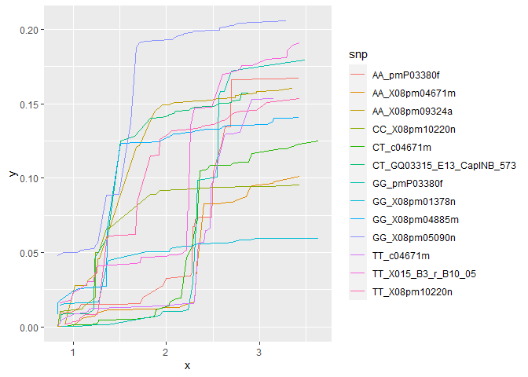
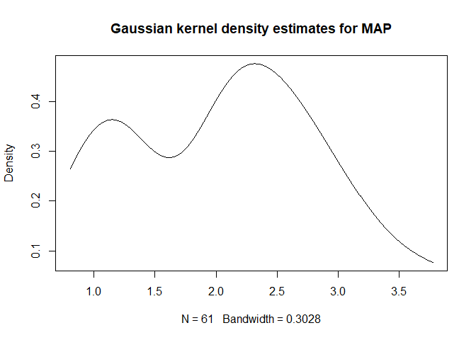

R Notebook
================

Test gradient forest

``` r
library(gradientForest)
library(dplyr)
```

    ## 
    ## Attaching package: 'dplyr'

    ## The following objects are masked from 'package:stats':
    ## 
    ##     filter, lag

    ## The following objects are masked from 'package:base':
    ## 
    ##     intersect, setdiff, setequal, union

``` r
library(ggplot2)
```

``` r
## Importe
data_genotype <- read.csv("./Genotypes.csv", header = TRUE, stringsAsFactors = FALSE)
data_climate  <- read.csv("./climate_provenances.csv", header = TRUE, stringsAsFactors = FALSE)

## Nettoie
data_climate  <- data_climate[-1]
data_genotype <- subset(data_genotype, select = -c(Sample_Name, Site))
head(data_genotype)
```

    ##   Provenance_Code X011_BR_F15_02 X013_BR_1_E01_02 X015_B3_r_B10_05
    ## 1             321             GG               GG               CC
    ## 2             321             AA               AA               CT
    ## 3             321             GG               AG               CT
    ## 4             321             AA               AG               CC
    ## 5             321           <NA>               AG             <NA>
    ## 6             321             AG               AG               TT
    ##   X021_BR_1_G24_03_01 X033_TB_D02_02 X042_BR_E10_15 X044_B3_r_N02_11
    ## 1                  CT             AA             GT               CC
    ## 2                  CT             AA             GG               CT
    ## 3                  TT             AA             GT               CC
    ## 4                  TT             AT             GT               CT
    ## 5                  CT             AT             TT               CC
    ## 6                  TT             AT             GG               CT
    ##   X044_B3_r_N02_13 X046_B3_L09_02 X0612_B3_G14_05 X062_B3_r_P04_02
    ## 1               TT             CT              CC               AG
    ## 2               TT             CC              CT               AG
    ## 3               AT             CT              CC               AA
    ## 4               AA             CC              CC               AA
    ## 5               TT           <NA>              CC               AG
    ## 6               AT             CC              CT             <NA>
    ##   X072_B3_r_I19_04 X074_B3_r_L04_05 X08pm00650e X08pm01378n X08pm01471a
    ## 1               AA               CG          GG          GG          AG
    ## 2               AG               CC          AG          GG        <NA>
    ## 3               GG               CG          GG          GG          GG
    ## 4               AG             <NA>          GG          GG          AG
    ## 5             <NA>             <NA>          AG          GG          GG
    ## 6               GG               GG          AG          GG          AG
    ##   X08pm01529e X08pm01685n X08pm02343e X08pm02470a X08pm02470c X08pm02623e
    ## 1          GG          CC          CT          AA          AG          CC
    ## 2          AG          CT          CT          AA          AA          TT
    ## 3          GG          TT          TT          AA          AA          CT
    ## 4          GG        <NA>          TT          AA          AA          CC
    ## 5          GG        <NA>          CC          AA          GG          CC
    ## 6          AG          CC          TT          AG          AA          TT
    ##   X08pm03656e X08pm04073m X08pm04142a X08pm04220m X08pm04312b X08pm04486a
    ## 1          GG          CT          CC          TT          GG          GG
    ## 2          GG          CC          GG          CT          AA          GG
    ## 3          AG          CC          CG          CT          GG          CG
    ## 4          GG          CT          GG          TT          GG          GG
    ## 5          AG          CT          CG          CT          AG          GG
    ## 6          GG          CT          GG          CT          AG          GG
    ##   X08pm04550n X08pm04662f X08pm04671m X08pm04794b X08pm04801a X08pm04885m
    ## 1          CT          GG          AG          GG          GG          GG
    ## 2          CC          TG          AA          GG          AG          GG
    ## 3          CC          TG          AA          CG          AG          AG
    ## 4        <NA>          GG          AA          GG          AG          GG
    ## 5        <NA>        <NA>          AA          CG        <NA>          AG
    ## 6          CC          TG          GG          GG          AG          GG
    ##   X08pm04914n X08pm05090n X08pm05205e X08pm05601n X08pm05720a X08pm05731a
    ## 1          TT        <NA>          AT          CC          GT          AA
    ## 2          AT          GT          AT          CG          TT          AC
    ## 3          AT          GT          AT          CG          GT          CC
    ## 4          TT          GT          AA          GG          TT          CC
    ## 5          TT          GG          AA          CC          GT          AC
    ## 6          AT          TT          AA          CG          TT          AA
    ##   X08pm05811e X08pm05883n X08pm06036f X08pm06122n X08pm06372a X08pm06511g
    ## 1          AA          TT          GG          AA          AA          CT
    ## 2          AG          TT          CG          AG          AA          CC
    ## 3          AA          TT          GG          AA          AA          CC
    ## 4        <NA>          TT        <NA>          AG          AA          CT
    ## 5          AG          TT          GG          AG          AC          CC
    ## 6          AA          TT          GG          AG          AA          CT
    ##   X08pm06677e X08pm07074m X08pm07126a X08pm07183g X08pm07185m X08pm07350a
    ## 1          AA          AG          CT        <NA>          GG          GG
    ## 2          AA          GG          CC          CT          GG          GG
    ## 3          AA          AA          CT        <NA>          AA          AG
    ## 4          AT          AG          CC          TT          AG          AG
    ## 5        <NA>          AA        <NA>          TT          AG          AA
    ## 6          AA          AG          CC          TT          GG          GG
    ##   X08pm07400k X08pm07414e X08pm07506d X08pm07561n X08pm07562n X08pm07602a
    ## 1          TT          GG          TT          CC          CC          AA
    ## 2          TT          AG          TT          AC          CT          CC
    ## 3          AT          AA          CT          CC          CT          AA
    ## 4          AT          GG          CC          AC          CC          AA
    ## 5          AT          GG          CC          AC          CC        <NA>
    ## 6          AT          GG          TT          AC          CC          CC
    ##   X08pm07602b X08pm07667a X08pm07681e X08pm07759a X08pm08021m X08pm08125a
    ## 1          CC          CC          CT          TT          AG          TG
    ## 2          TT          CC          CT          TT          AG          TT
    ## 3          CC          CC          CT          TT          GG          TG
    ## 4          CT          CC          CC          TG          AG          TT
    ## 5          TT          CC          CT          TG          AG        <NA>
    ## 6          TT          CC          CT          GG          AA          TT
    ##   X08pm08143a X08pm08152b X08pm08177a X08pm08250f X08pm08316b X08pm08339a
    ## 1          TT          CC          AC          AA          AA          GG
    ## 2          TT          CC          CC          AA          CA          GG
    ## 3          TT        <NA>          CC          AG        <NA>          GG
    ## 4        <NA>          CC        <NA>        <NA>        <NA>          GG
    ## 5          CT          CT        <NA>        <NA>          CA          GG
    ## 6          TT          CT          CC          AG          AA          GG
    ##   X08pm08349n X08pm08441m X08pm08525f X08pm08892f X08pm08922f X08pm09027f
    ## 1          GT          AG          AG          TT          AG          CT
    ## 2          GG          AG          AA          CT          GG          CC
    ## 3          GG        <NA>          AA          CT          AG          CT
    ## 4          GG          GG          AG          TT        <NA>          CC
    ## 5          GT          AG          AA          TT          AG          CC
    ## 6          GG          AG          AA          TT          AG          CT
    ##   X08pm09063f X08pm09163e X08pm09324a X08pm09324c X08pm09327m X08pm09440a
    ## 1          CC          AA          AC          AG          GG          TT
    ## 2          CC          AG          AA          AA          GG          TT
    ## 3          CT          AA          AC          AA          GG          CT
    ## 4          CC          AA          CC        <NA>          GG          TT
    ## 5          CC        <NA>          AC          AG          GG        <NA>
    ## 6          CC          AG          CC          AG          GG          TT
    ##   X08pm09562b X08pm09573a X08pm09870a X08pm10001f X08pm10140e X08pm10193f
    ## 1          CT          AT          AA          AA          AA          TT
    ## 2          TT          AT          CA          AT          TT          TT
    ## 3          CT          AA          CC          TT          TT          CT
    ## 4          CT          AT          CC          AT          TT          TT
    ## 5          TT        <NA>          CC          AA        <NA>        <NA>
    ## 6          TT          AT          CC          AA          TT          TT
    ##   X08pm10220n X08pm10254m X08pm10328f X08pm10438f X08pm10784k X08pm10998e
    ## 1          CC          TT          CT          TT          CC          TG
    ## 2          TT          TT          CC          CC          CG          GG
    ## 3          TT          CT          CC          CT        <NA>          TG
    ## 4          TT          TT          TT          TT          CC          GG
    ## 5          TT          CT        <NA>          TT          CG          GG
    ## 6          TT          CC          CT          TT          CC          GG
    ##   X08pm11112m X08pm11157e X08pm11291f X08pm11326a X08pm11408m X08pm11945m
    ## 1          AA          GG        <NA>          CT          TG          CG
    ## 2          AA          AG          AG          CT          TT          CG
    ## 3          TT          GG          AG          CT          TT          CG
    ## 4          TT          GG          AA          CC          TT          CG
    ## 5          AT          AG          GG        <NA>        <NA>        <NA>
    ## 6          AT          AG          AG          CC          GG          CC
    ##   X08pm12124a X08pm12492e X08pm12821e X08pm13366n X08pm13634e X08pm13661m
    ## 1          CC          CC          CC          GG          TT          GG
    ## 2          CT          CC          CT          CG          AA          GG
    ## 3          CC          CC          CT          CG        <NA>          GG
    ## 4          CT          CT          CC          CC        <NA>          TG
    ## 5          CC          CC          CT          CC          AT          TG
    ## 6          CT          CC          CT          CG          AT          GG
    ##   X08pm13855m X08pm13855n X08pm13950f X08pm14745h X08pm15280b X08pm15328f
    ## 1          TT          CT          TT          GT          CC          TT
    ## 2          CT          CC          TT          GG          CC          CC
    ## 3          CC          CC          TT          GG          CC        <NA>
    ## 4          CC          CC          TT          GG          CC          CC
    ## 5          CC          CC          TT          GG          TT        <NA>
    ## 6          CT          CC          TT          GT          CT          CC
    ##   X08pm15817a X08pm15817d X08pm15965e X08pm16192b X08pm16324a X08pm16364e
    ## 1          CC          TT          AA          CG          GG          AA
    ## 2          CC          TT          AA          CC          AG          AA
    ## 3          CC          TT          AG        <NA>          GG          AA
    ## 4          CC          TT          AA          GG          GG          AA
    ## 5        <NA>          TT        <NA>          CC          GG          AC
    ## 6          CC          TT          AA          CC          AG          AC
    ##   X08pm16502m X08pm90012m X08pm90013a X08pm90035a X08pm90155e X08pm90172a
    ## 1          AA          CT          AG          CC          AA          AG
    ## 2          AC          TT          GG          CC          CA          AG
    ## 3          AC          TT          GG          CC          AA          AG
    ## 4        <NA>          TT          GG          CC          AA          GG
    ## 5          AC          TT          AA          CC          CA        <NA>
    ## 6          AC          TT          GG          CT          AA          AA
    ##   X13749d X162_B3_r_L01_10 X191_B3_r_G18_01 X2016_B3_r_M09_02 X206_B3_C13_06
    ## 1      AA               GT               GG                AA             CA
    ## 2      AA               GT               GG                CA             CA
    ## 3      AA               GT               AA                CA             CA
    ## 4      AA             <NA>               GG                CA             CA
    ## 5      AA               TT               AG              <NA>             AA
    ## 6    <NA>               GT               AG                AA             AA
    ##   c01529e c02309e c02343e c03056e c03870a c04220m c04312b c04554n c04662f
    ## 1      GG      AG      CT      AA      TT      TT      CC      CT      GG
    ## 2      AG      GG      CT      AA      CT      CT      TT      TT      TG
    ## 3      GG      AG      TT      AA      TT      CT      CC    <NA>      TG
    ## 4      GG      AG      TT      AA      CT      TT      CC      CC      GG
    ## 5      GG      GG      CC      AA      CT      CT      CT      TT      TT
    ## 6      AG      GG      TT      AA      TT      CT      CT      CT      TG
    ##   c04671m c05720c c05937s c07074e c08080a c08085m c08102m c08398a c09063f
    ## 1      CT      TT      TT      CT      CC      AA      GG      CT      CG
    ## 2      TT      TT      AT      TT      CT      AA      TT      CC      GG
    ## 3      TT      CT      AT      TT      CC      AA      GG      CT      CC
    ## 4      TT      TT      TT      TT      CC      AA      TT      CC      CG
    ## 5      TT      CT      TT      TT      CC      AA      GT      CT      CG
    ## 6      CC      TT      AT      TT      CT      AA      TT      CC      GG
    ##   c09406f c09573a c09644m c09870a c09889a c09898f c10140e c10254m c11176n
    ## 1      AT      AT      TT      GG      CT      GG      AA    <NA>      AG
    ## 2      AA      AT      CT      GG      CC      GG      TT      TT      AG
    ## 3      AA      AA      CT      GG      CT      GG      TT      CT      AG
    ## 4      AA      AT      CT      AG      CC      GG      TT      TT      AG
    ## 5      AT      AA      CT      AG      CC      AG      TT      CT      AG
    ## 6      AT      AT      CC      GG      CC      GG      TT      CC      AG
    ##   c13855m c14320f c15051g GQ0013_BR_1.P02_1.220 GQ0046_B3.E02_1.564
    ## 1      AA      AA      GG                    AA                  TT
    ## 2      AG      AA      GG                  <NA>                  CT
    ## 3      GG    <NA>      GG                    AA                  CC
    ## 4      GG      AA      GG                    AA                  CT
    ## 5      GG      AA    <NA>                    CA                <NA>
    ## 6      AG      AA      GG                    AA                  CT
    ##   GQ0066_B3.L09_1.205 GQ0164_N16_CapINB_268 GQ0165_E01_CapINB_457
    ## 1                  CC                    AT                    AA
    ## 2                  CC                    TT                    GG
    ## 3                  CT                    TT                  <NA>
    ## 4                  CC                    AT                    AG
    ## 5                  CC                    AT                    AG
    ## 6                  CT                    AT                    AA
    ##   GQ0173_B3_r.O10_1.244 GQ0201_E06_CapINB_784 GQ0206_J07_CapINB_529
    ## 1                  <NA>                    CT                    TG
    ## 2                    CC                    TT                    TT
    ## 3                    CC                    TT                    TG
    ## 4                    CC                    CT                    TG
    ## 5                    CC                  <NA>                  <NA>
    ## 6                    CC                    TT                    TG
    ##   GQ0222_B7.B17_1.379 GQ0253_G06_CapINB_355 GQ0255_K05_CapINB_525
    ## 1                <NA>                    CT                    GG
    ## 2                  TG                    CC                    GG
    ## 3                  TG                    CC                    GG
    ## 4                  GG                    CC                    GG
    ## 5                  TT                    CT                    GG
    ## 6                  TG                    CC                    GG
    ##   GQ02903_P22_CapINB_607 GQ03105_I04_CapINB_621 GQ03110_A22_CapINB_594
    ## 1                     TG                     AG                     CC
    ## 2                     TG                     AG                     CT
    ## 3                     TT                     GG                     CT
    ## 4                     TT                   <NA>                     CT
    ## 5                     TG                     AG                   <NA>
    ## 6                     TT                     AG                     TT
    ##   GQ03113_N22_CapINB_1684 GQ03126_O11_CapINB_993 GQ03208_E06_CapINB_506
    ## 1                      GG                     AA                     CT
    ## 2                      GG                     AG                     CT
    ## 3                    <NA>                     AG                     CT
    ## 4                      GG                     AA                     CT
    ## 5                      CG                   <NA>                     TT
    ## 6                      CG                     AA                     TT
    ##   GQ03215_H11_CapINB_881 GQ03303_N09_CapINB_1240 GQ03304_O08_CapINB_248
    ## 1                     TT                      CC                     CC
    ## 2                     TT                    <NA>                     TT
    ## 3                     TT                      CC                     CC
    ## 4                     TT                      CT                     CC
    ## 5                     TT                      CT                     CT
    ## 6                     TT                      CC                     TT
    ##   GQ03311_L15_CapINB_1645 GQ03312_B13_CapINB_151 GQ03313_G17_CapINB_320
    ## 1                      CC                     CC                     AG
    ## 2                      CT                     CC                     AA
    ## 3                      CC                     CC                     AG
    ## 4                    <NA>                     CC                     AG
    ## 5                      CC                     CT                     AG
    ## 6                      CC                     CC                     AG
    ##   GQ03315_E13_CapINB_573 GQ03318_K08_CapINB_566 GQ03510_A24_CapINB_661
    ## 1                     TT                     GG                     CT
    ## 2                     CT                     TT                     CC
    ## 3                     CT                     GT                     CC
    ## 4                     CT                     GT                     CC
    ## 5                     CT                     GT                     CC
    ## 6                     CC                     GT                     CC
    ##   GQ03606_L11_CapINB_1166 GQ03607_L12_CapINB_1080 GQ04102_B16_CapINB_705
    ## 1                      AG                      CC                     CC
    ## 2                      AG                      CG                     TT
    ## 3                      AA                      CG                     TT
    ## 4                      AA                      CG                     CT
    ## 5                    <NA>                      CC                     CT
    ## 6                      AG                      GG                     TT
    ##   GQ04111_E10_CapINB_447 n01685e n01685n n02722g n04563m n04569a n06008a
    ## 1                     CG      AG      CC      CC    <NA>      AA      TT
    ## 2                     CG      AA      CT      CT      CC      AA      CT
    ## 3                     GG      AA      TT      CT    <NA>      AA      TT
    ## 4                     CG      AA      CC      CT      CG      AA      TT
    ## 5                     GG      AA      CT      TT      CC      AA      TT
    ## 6                     GG      AG      CC      CT      CC      AA      CT
    ##   n06447n n07126a n07245m n07265a n07964b n08152e n08316b n08892e n09324c
    ## 1      GG      CT      CC      CT      TT      GG      TT      CC      AG
    ## 2      TT      CC      CC      CC      TT      GG      TG      CC      AA
    ## 3      TT      CT      CC      CT      TT    <NA>      TT      CC      AA
    ## 4      TT      CC      CC      CT      TT      GG      TT      CC      GG
    ## 5      TT      TT      CC      CT      TT      GG      TG      CC      AG
    ## 6      TT      CC      CC      TT      TT      GG      TT      CT      AG
    ##   n09327n n10085e n10503e n14751j P01075.1 P12463.1 P13240.1 P9580.1 pmP01687.3
    ## 1      CC      GG      TT      GG       AC       AG       AT      TT         GT
    ## 2      CC      GG      TT      GG       AC       AA       AT      CT         GT
    ## 3      CC      GG    <NA>      GG       CC       GG       TT      TT         GT
    ## 4      CC      GG      TG      AG       CC       GG       TT    <NA>         GT
    ## 5      CC      GG      TG      GG       CC     <NA>       TT      TT         TT
    ## 6      CC      TG      TT      GG       AC       GG       AT      CT         TT
    ##   pmP03380f pmP04543.1 pmP04543.2 pmP05280.1 pmP05312.1 pmP06392.1 pmP06490.1
    ## 1        AG         TT         CT         CT         CC         CC         AG
    ## 2        AG         CT         CT         TT         GG       <NA>         AA
    ## 3        AG         TT         CC         TT         GG         CA         AG
    ## 4        AG         TT       <NA>         TT         CG         CC         AG
    ## 5        AA         TT         TT         TT         GG         CA         AA
    ## 6        AG         TT         CC         TT         CG         CA         AG
    ##   pmP06661.1 pmP06742j pmP07757.1 pmP10060.1 pmP10495.1 pmP10520.2 pmP10981.1
    ## 1         TT        GG         AA         GT         CC         GG         TT
    ## 2         CT        AA         AT         TT         CC         AG         CC
    ## 3         TT        AG         AT         TT         CT         GG         TT
    ## 4       <NA>        AG         AT       <NA>         CT         AG         TT
    ## 5         CT        AA         AT         TT       <NA>         GG         CT
    ## 6         TT        AG         AA         GG         CC         GG         CC
    ##   pmP16279a pmPBB.PF00847.7b.a
    ## 1        CT                 AA
    ## 2        CC                 AG
    ## 3        CT                 AG
    ## 4        CT                 AG
    ## 5      <NA>               <NA>
    ## 6        CC                 AA

Premierement, nous avons besoin de calculer la frequence de chaque SNP
dans chaque population à partir de nos données d’origine et d’associer
cette fréquence aux variables environnementales. Pour cela nous allons
commencer par definir la fonction suivante :

``` r
get_freq <- function(col){
  #'Cette fonction calcule la fréquence d'une variable categorique (ex alléles) dans une column donnée'
  freq <- table(col)
  freq <- freq/sum(freq)
  freq <- as.data.frame(freq)
  row.names(freq) <- freq$col
  freq$col <- NULL
  freq <- t(freq)
  return(freq) 
}
```

Puis on l’utilise sur nos données :

``` r
## On crée un dataframe vide avec une provencance (population) par ligne
provenances    <- unique(data_genotype$Provenance_Code)
data_freq_snps <- data.frame(Provenance_Code = provenances)

## Puis, pour chaque SNP (column),...  
for(col in names(data_genotype[-1])){
  locus_freq <- data.frame(matrix(ncol = 0, nrow = 0))
  
  ## ... on calcule la frequence par provenance...
  for(prov in provenances){
    pop      <- subset(data_genotype, Provenance_Code == prov)
    pop_freq <- get_freq(pop[[col]])
    pop_freq <- cbind(pop_freq, Provenance_Code = c(prov))

    names(pop_freq) <- prov
    locus_freq      <- bind_rows(locus_freq, pop_freq)
  }
  locus_freq[is.na(locus_freq)] <- 0
  colnames(locus_freq)[names(locus_freq) != "Provenance_Code"] <- paste(colnames(locus_freq)[names(locus_freq) != "Provenance_Code"], col, sep = '_')
  
  ## ... et on l'ajoute à notre dataframe vide
  data_freq_snps <- merge(data_freq_snps, locus_freq, by = "Provenance_Code")
}

## On peut ensuite ajouter nos donées environnemental pour n'avoir qu'un seul dataframe
data_freq_snps <- merge(data_climate, data_freq_snps, by.x = "Site", by.y = "Provenance_Code")
head(data_freq_snps)
```

    ##   Site       MATp     MAPp Latitude Longitude     GDD5p AA_X011_BR_F15_02
    ## 1  321  3.0671632 3.218771  46.9333  -72.1000 1487.1250         0.4705882
    ## 2  325 -0.8911627 2.298253  50.4500  -73.6333 1098.3672         0.3333333
    ## 3  326  0.1481915 2.390652  49.0333  -73.4500 1162.1219         0.1388889
    ## 4  329 -0.7708920 3.101132  47.8667  -71.2000  903.6547         0.1875000
    ## 5  332  1.2763965 2.760583  48.5000  -67.1167 1183.9156         0.2500000
    ## 6  333  0.1047177 2.543326  49.6167  -77.7500 1236.5531         0.2941176
    ##   AG_X011_BR_F15_02 GG_X011_BR_F15_02 AA_X013_BR_1_E01_02 AG_X013_BR_1_E01_02
    ## 1         0.2941176         0.2352941           0.3529412           0.2941176
    ## 2         0.5555556         0.1111111           0.3428571           0.4000000
    ## 3         0.6944444         0.1666667           0.4166667           0.3888889
    ## 4         0.5625000         0.2500000           0.1875000           0.5625000
    ## 5         0.5555556         0.1944444           0.3142857           0.3428571
    ## 6         0.4411765         0.2647059           0.1875000           0.4062500
    ##   GG_X013_BR_1_E01_02 CC_X015_B3_r_B10_05 CT_X015_B3_r_B10_05
    ## 1           0.3529412          0.11764706           0.2941176
    ## 2           0.2571429          0.13888889           0.4444444
    ## 3           0.1944444          0.05555556           0.5000000
    ## 4           0.2500000          0.12500000           0.3125000
    ## 5           0.3428571          0.13888889           0.4166667
    ## 6           0.4062500          0.17647059           0.5588235
    ##   TT_X015_B3_r_B10_05 CC_X021_BR_1_G24_03_01 CT_X021_BR_1_G24_03_01
    ## 1           0.5882353              0.1111111              0.5555556
    ## 2           0.4166667              0.0000000              0.2647059
    ## 3           0.4444444              0.1111111              0.5277778
    ## 4           0.5625000              0.2352941              0.5882353
    ## 5           0.4444444              0.2000000              0.4285714
    ## 6           0.2647059              0.1176471              0.5000000
    ##   TT_X021_BR_1_G24_03_01 AA_X033_TB_D02_02 AT_X033_TB_D02_02 TT_X033_TB_D02_02
    ## 1              0.3333333         0.5555556         0.4444444        0.00000000
    ## 2              0.7352941         0.5142857         0.3142857        0.17142857
    ## 3              0.3611111         0.4166667         0.4444444        0.13888889
    ## 4              0.1764706         0.5882353         0.2352941        0.17647059
    ## 5              0.3714286         0.4000000         0.5714286        0.02857143
    ## 6              0.3823529         0.5882353         0.3529412        0.05882353
    ##   GG_X042_BR_E10_15 GT_X042_BR_E10_15 TT_X042_BR_E10_15 CC_X044_B3_r_N02_11
    ## 1         0.4117647         0.4705882         0.1176471           0.5000000
    ## 2         0.1666667         0.4444444         0.3888889           0.1111111
    ## 3         0.4444444         0.3611111         0.1944444           0.5000000
    ## 4         0.1764706         0.6470588         0.1764706           0.1764706
    ## 5         0.3055556         0.5555556         0.1388889           0.1944444
    ## 6         0.1818182         0.5454545         0.2727273           0.2058824
    ##   CT_X044_B3_r_N02_11 TT_X044_B3_r_N02_11 AA_X044_B3_r_N02_13
    ## 1           0.4444444          0.05555556          0.05555556
    ## 2           0.4722222          0.41666667          0.05555556
    ## 3           0.3333333          0.16666667          0.00000000
    ## 4           0.3529412          0.47058824          0.11764706
    ## 5           0.4722222          0.33333333          0.11111111
    ## 6           0.4411765          0.35294118          0.24242424
    ##   AT_X044_B3_r_N02_13 TT_X044_B3_r_N02_13 CC_X046_B3_L09_02 CT_X046_B3_L09_02
    ## 1           0.3333333           0.6111111         0.5882353         0.3529412
    ## 2           0.3888889           0.5555556         0.3428571         0.5142857
    ## 3           0.3888889           0.6111111         0.5882353         0.2941176
    ## 4           0.3529412           0.5294118         0.3125000         0.6250000
    ## 5           0.3888889           0.5000000         0.5555556         0.4444444
    ## 6           0.4848485           0.2727273         0.4411765         0.3235294
    ##   TT_X046_B3_L09_02 CC_X0612_B3_G14_05 CT_X0612_B3_G14_05 TT_X0612_B3_G14_05
    ## 1        0.05882353          0.7500000          0.1875000         0.06250000
    ## 2        0.14285714          0.5000000          0.3333333         0.16666667
    ## 3        0.11764706          0.5000000          0.4166667         0.08333333
    ## 4        0.06250000          0.1764706          0.5882353         0.23529412
    ## 5        0.00000000          0.4117647          0.5000000         0.08823529
    ## 6        0.23529412          0.1935484          0.4193548         0.38709677
    ##   AA_X062_B3_r_P04_02 AG_X062_B3_r_P04_02 GG_X062_B3_r_P04_02
    ## 1           0.5000000           0.3750000          0.12500000
    ## 2           0.5483871           0.2580645          0.19354839
    ## 3           0.4545455           0.3333333          0.21212121
    ## 4           0.5333333           0.1333333          0.33333333
    ## 5           0.7352941           0.2352941          0.02941176
    ## 6           0.4516129           0.2903226          0.25806452
    ##   AA_X072_B3_r_I19_04 AG_X072_B3_r_I19_04 GG_X072_B3_r_I19_04
    ## 1           0.3529412           0.4117647           0.2352941
    ## 2           0.1666667           0.5277778           0.3055556
    ## 3           0.1428571           0.4571429           0.4000000
    ## 4           0.1250000           0.6875000           0.1875000
    ## 5           0.1944444           0.5555556           0.2500000
    ## 6           0.1764706           0.4411765           0.3823529
    ##   CC_X074_B3_r_L04_05 CG_X074_B3_r_L04_05 GG_X074_B3_r_L04_05 AA_X08pm00650e
    ## 1          0.25000000           0.5625000           0.1875000     0.05555556
    ## 2          0.28571429           0.3142857           0.4000000     0.17142857
    ## 3          0.23529412           0.3235294           0.4411765     0.22857143
    ## 4          0.25000000           0.5000000           0.2500000     0.11764706
    ## 5          0.08333333           0.4166667           0.5000000     0.08571429
    ## 6          0.21212121           0.5151515           0.2727273     0.14705882
    ##   AG_X08pm00650e GG_X08pm00650e AG_X08pm01378n GG_X08pm01378n AA_X08pm01378n
    ## 1      0.4444444      0.5000000     0.22222222      0.7777778     0.00000000
    ## 2      0.5428571      0.2857143     0.17142857      0.7714286     0.05714286
    ## 3      0.5428571      0.2285714     0.08333333      0.8888889     0.02777778
    ## 4      0.4705882      0.4117647     0.23529412      0.7647059     0.00000000
    ## 5      0.3714286      0.5428571     0.11428571      0.8000000     0.08571429
    ## 6      0.4705882      0.3823529     0.12903226      0.8387097     0.03225806
    ##   AA_X08pm01471a AG_X08pm01471a GG_X08pm01471a AA_X08pm01529e AG_X08pm01529e
    ## 1     0.05882353      0.5294118      0.4117647     0.11111111      0.4444444
    ## 2     0.09090909      0.5151515      0.3939394     0.02777778      0.4166667
    ## 3     0.25000000      0.5277778      0.2222222     0.13888889      0.5833333
    ## 4     0.05882353      0.5882353      0.3529412     0.11764706      0.3529412
    ## 5     0.11428571      0.3714286      0.5142857     0.27777778      0.3611111
    ## 6     0.24242424      0.4242424      0.3333333     0.23529412      0.4117647
    ##   GG_X08pm01529e CC_X08pm01685n CT_X08pm01685n TT_X08pm01685n CC_X08pm02343e
    ## 1      0.4444444      0.6250000     0.12500000     0.25000000      0.2777778
    ## 2      0.5555556      0.9722222     0.02777778     0.00000000      0.4000000
    ## 3      0.2777778      0.6571429     0.34285714     0.00000000      0.3055556
    ## 4      0.5294118      0.8823529     0.11764706     0.00000000      0.4705882
    ## 5      0.3611111      0.7222222     0.25000000     0.02777778      0.3428571
    ## 6      0.3529412      0.6764706     0.26470588     0.05882353      0.2941176
    ##   CT_X08pm02343e TT_X08pm02343e AA_X08pm02470a AG_X08pm02470a GG_X08pm02470a
    ## 1      0.4444444     0.27777778      0.7647059     0.17647059     0.05882353
    ## 2      0.4857143     0.11428571      0.7500000     0.22222222     0.02777778
    ## 3      0.4722222     0.22222222      0.5555556     0.38888889     0.05555556
    ## 4      0.4705882     0.05882353      0.7058824     0.23529412     0.05882353
    ## 5      0.4000000     0.25714286      0.6571429     0.28571429     0.05714286
    ## 6      0.6176471     0.08823529      0.9117647     0.05882353     0.02941176
    ##   AA_X08pm02470c AG_X08pm02470c GG_X08pm02470c CC_X08pm02623e CT_X08pm02623e
    ## 1      0.6666667      0.2222222     0.11111111      0.3888889      0.3888889
    ## 2      0.6571429      0.2857143     0.05714286      0.3428571      0.4285714
    ## 3      0.7500000      0.2222222     0.02777778      0.2500000      0.4722222
    ## 4      0.5882353      0.4117647     0.00000000      0.3529412      0.4705882
    ## 5      0.6666667      0.3030303     0.03030303      0.1142857      0.6857143
    ## 6      0.6764706      0.3235294     0.00000000      0.3823529      0.4705882
    ##   TT_X08pm02623e AG_X08pm03656e GG_X08pm03656e AA_X08pm03656e CC_X08pm04073m
    ## 1      0.2222222     0.22222222      0.7777778     0.00000000     0.33333333
    ## 2      0.2285714     0.11764706      0.8235294     0.05882353     0.36363636
    ## 3      0.2777778     0.22222222      0.6944444     0.08333333     0.25000000
    ## 4      0.1764706     0.23529412      0.7647059     0.00000000     0.05882353
    ## 5      0.2000000     0.28571429      0.7142857     0.00000000     0.34285714
    ## 6      0.1470588     0.08823529      0.8529412     0.05882353     0.26470588
    ##   CT_X08pm04073m TT_X08pm04073m CC_X08pm04142a CG_X08pm04142a GG_X08pm04142a
    ## 1      0.4444444      0.2222222     0.11111111      0.5000000      0.3888889
    ## 2      0.3939394      0.2424242     0.05714286      0.4000000      0.5428571
    ## 3      0.5833333      0.1666667     0.19444444      0.3055556      0.5000000
    ## 4      0.7058824      0.2352941     0.23529412      0.3529412      0.4117647
    ## 5      0.4857143      0.1714286     0.20000000      0.4285714      0.3714286
    ## 6      0.6176471      0.1176471     0.11764706      0.3235294      0.5588235
    ##   CC_X08pm04220m CT_X08pm04220m TT_X08pm04220m AA_X08pm04312b AG_X08pm04312b
    ## 1      0.3529412      0.5294118      0.1176471     0.11764706      0.4117647
    ## 2      0.5000000      0.5000000      0.0000000     0.08333333      0.3333333
    ## 3      0.2222222      0.5833333      0.1944444     0.11428571      0.3714286
    ## 4      0.2352941      0.4117647      0.3529412     0.00000000      0.3529412
    ## 5      0.3714286      0.4571429      0.1714286     0.08571429      0.4000000
    ## 6      0.3333333      0.3939394      0.2727273     0.03030303      0.3333333
    ##   GG_X08pm04312b CG_X08pm04486a GG_X08pm04486a CC_X08pm04486a CC_X08pm04550n
    ## 1      0.4705882      0.1764706      0.8235294     0.00000000      0.4666667
    ## 2      0.5833333      0.1142857      0.8571429     0.02857143      0.6571429
    ## 3      0.5142857      0.1935484      0.8064516     0.00000000      0.4000000
    ## 4      0.6470588      0.4000000      0.6000000     0.00000000      0.5333333
    ## 5      0.5142857      0.3103448      0.6206897     0.06896552      0.6470588
    ## 6      0.6363636      0.2352941      0.7352941     0.02941176      0.7272727
    ##   CT_X08pm04550n TT_X08pm04550n GG_X08pm04662f TG_X08pm04662f TT_X08pm04662f
    ## 1      0.5333333     0.00000000      0.2352941      0.7058824     0.05882353
    ## 2      0.3142857     0.02857143      0.6571429      0.1714286     0.17142857
    ## 3      0.5142857     0.08571429      0.5555556      0.3055556     0.13888889
    ## 4      0.3333333     0.13333333      0.5625000      0.3125000     0.12500000
    ## 5      0.3235294     0.02941176      0.7500000      0.1388889     0.11111111
    ## 6      0.2727273     0.00000000      0.4687500      0.3437500     0.18750000
    ##   AA_X08pm04671m AG_X08pm04671m GG_X08pm04671m CC_X08pm04794b CG_X08pm04794b
    ## 1      0.5555556      0.3333333     0.11111111     0.11111111      0.3333333
    ## 2      0.7142857      0.2571429     0.02857143     0.11111111      0.3888889
    ## 3      0.8055556      0.1944444     0.00000000     0.00000000      0.1714286
    ## 4      0.4117647      0.5882353     0.00000000     0.17647059      0.3529412
    ## 5      0.6571429      0.2571429     0.08571429     0.05555556      0.2777778
    ## 6      0.5294118      0.4411765     0.02941176     0.08823529      0.3235294
    ##   GG_X08pm04794b AA_X08pm04801a AG_X08pm04801a GG_X08pm04801a AG_X08pm04885m
    ## 1      0.5555556      0.2941176      0.6470588     0.05882353      0.3888889
    ## 2      0.5000000      0.4166667      0.4722222     0.11111111      0.1250000
    ## 3      0.8285714      0.4857143      0.4000000     0.11428571      0.2222222
    ## 4      0.4705882      0.5000000      0.4375000     0.06250000      0.2352941
    ## 5      0.6666667      0.4571429      0.4571429     0.08571429      0.2285714
    ## 6      0.5882353      0.5000000      0.4117647     0.08823529      0.1176471
    ##   GG_X08pm04885m AA_X08pm04885m AA_X08pm04914n AT_X08pm04914n TT_X08pm04914n
    ## 1      0.6111111     0.00000000      0.2222222      0.3333333     0.44444444
    ## 2      0.8437500     0.03125000      0.2500000      0.4722222     0.27777778
    ## 3      0.7222222     0.05555556      0.4166667      0.5000000     0.08333333
    ## 4      0.7647059     0.00000000      0.2941176      0.4705882     0.23529412
    ## 5      0.7714286     0.00000000      0.1944444      0.3055556     0.50000000
    ## 6      0.8823529     0.00000000      0.3529412      0.5000000     0.14705882
    ##   GG_X08pm05090n GT_X08pm05090n TT_X08pm05090n AA_X08pm05205e AT_X08pm05205e
    ## 1      0.6250000      0.3125000     0.06250000      0.6875000      0.3125000
    ## 2      0.6111111      0.3611111     0.02777778      0.4722222      0.4444444
    ## 3      0.6000000      0.3714286     0.02857143      0.1388889      0.6388889
    ## 4      0.4375000      0.4375000     0.12500000      0.6470588      0.2941176
    ## 5      0.5000000      0.4444444     0.05555556      0.5277778      0.3611111
    ## 6      0.6666667      0.3333333     0.00000000      0.4242424      0.4545455
    ##   TT_X08pm05205e CC_X08pm05601n CG_X08pm05601n GG_X08pm05601n GT_X08pm05720a
    ## 1     0.00000000      0.2222222      0.6111111     0.16666667      0.3333333
    ## 2     0.08333333      0.4000000      0.5142857     0.08571429      0.5000000
    ## 3     0.22222222      0.4444444      0.4444444     0.11111111      0.3333333
    ## 4     0.05882353      0.3529412      0.4117647     0.23529412      0.4117647
    ## 5     0.11111111      0.4857143      0.4571429     0.05714286      0.6944444
    ## 6     0.12121212      0.3235294      0.4117647     0.26470588      0.3636364
    ##   TT_X08pm05720a GG_X08pm05720a AA_X08pm05731a AC_X08pm05731a CC_X08pm05731a
    ## 1      0.6666667     0.00000000     0.50000000      0.2222222      0.2777778
    ## 2      0.4444444     0.05555556     0.14285714      0.3428571      0.5142857
    ## 3      0.6111111     0.05555556     0.11428571      0.5142857      0.3714286
    ## 4      0.2941176     0.29411765     0.11764706      0.5882353      0.2941176
    ## 5      0.1666667     0.13888889     0.19444444      0.5277778      0.2777778
    ## 6      0.5151515     0.12121212     0.05882353      0.4117647      0.5294118
    ##   AA_X08pm05811e AG_X08pm05811e GG_X08pm05811e TT_X08pm05883n AT_X08pm05883n
    ## 1      0.7647059      0.2352941     0.00000000      1.0000000     0.00000000
    ## 2      0.6363636      0.2727273     0.09090909      0.6774194     0.32258065
    ## 3      0.6363636      0.1818182     0.18181818      0.8888889     0.11111111
    ## 4      0.7647059      0.2352941     0.00000000      0.6470588     0.35294118
    ## 5      0.8484848      0.1212121     0.03030303      0.9705882     0.02941176
    ## 6      0.4545455      0.4545455     0.09090909      0.8437500     0.12500000
    ##   AA_X08pm05883n CC_X08pm06036f CG_X08pm06036f GG_X08pm06036f AA_X08pm06122n
    ## 1        0.00000     0.06250000      0.1250000      0.8125000      0.2777778
    ## 2        0.00000     0.00000000      0.2500000      0.7500000      0.1176471
    ## 3        0.00000     0.08333333      0.3611111      0.5555556      0.4000000
    ## 4        0.00000     0.00000000      0.3529412      0.6470588      0.5294118
    ## 5        0.00000     0.02857143      0.4000000      0.5714286      0.1428571
    ## 6        0.03125     0.12121212      0.3939394      0.4848485      0.1470588
    ##   AG_X08pm06122n GG_X08pm06122n AA_X08pm06372a AC_X08pm06372a CC_X08pm06372a
    ## 1      0.4444444      0.2777778      0.7058824      0.2352941     0.05882353
    ## 2      0.5882353      0.2941176      0.8125000      0.1875000     0.00000000
    ## 3      0.4000000      0.2000000      0.8285714      0.1714286     0.00000000
    ## 4      0.2941176      0.1764706      0.7647059      0.2352941     0.00000000
    ## 5      0.3714286      0.4857143      0.7428571      0.2285714     0.02857143
    ## 6      0.4705882      0.3823529      0.7352941      0.2352941     0.02941176
    ##   CC_X08pm06511g CT_X08pm06511g TT_X08pm06511g AA_X08pm06677e AT_X08pm06677e
    ## 1      0.4444444      0.5000000     0.05555556      0.8823529      0.1176471
    ## 2      0.2857143      0.4285714     0.28571429      0.8888889      0.1111111
    ## 3      0.2058824      0.6176471     0.17647059      0.7777778      0.2222222
    ## 4      0.4117647      0.4705882     0.11764706      0.8750000      0.0625000
    ## 5      0.5588235      0.2352941     0.20588235      0.7777778      0.2222222
    ## 6      0.2666667      0.3333333     0.40000000      0.7941176      0.1764706
    ##   TT_X08pm06677e AA_X08pm07074m AG_X08pm07074m GG_X08pm07074m CC_X08pm07126a
    ## 1     0.00000000      0.1666667      0.5555556     0.27777778      0.7058824
    ## 2     0.00000000      0.3333333      0.6111111     0.05555556      0.5277778
    ## 3     0.00000000      0.3333333      0.4166667     0.25000000      0.4722222
    ## 4     0.06250000      0.5625000      0.4375000     0.00000000      0.3750000
    ## 5     0.00000000      0.4571429      0.2571429     0.28571429      0.4166667
    ## 6     0.02941176      0.5882353      0.3235294     0.08823529      0.1764706
    ##   CT_X08pm07126a TT_X08pm07126a CC_X08pm07183g CT_X08pm07183g TT_X08pm07183g
    ## 1      0.2941176     0.00000000     0.18181818      0.1818182      0.6363636
    ## 2      0.4444444     0.02777778     0.03225806      0.1935484      0.7741935
    ## 3      0.4444444     0.08333333     0.03030303      0.2121212      0.7575758
    ## 4      0.5000000     0.12500000     0.00000000      0.2666667      0.7333333
    ## 5      0.3888889     0.19444444     0.09375000      0.4687500      0.4375000
    ## 6      0.4705882     0.35294118     0.00000000      0.2758621      0.7241379
    ##   AA_X08pm07185m AG_X08pm07185m GG_X08pm07185m AA_X08pm07350a AG_X08pm07350a
    ## 1      0.2222222      0.4444444      0.3333333     0.05882353      0.3529412
    ## 2      0.3611111      0.4722222      0.1666667     0.18181818      0.2727273
    ## 3      0.4285714      0.4285714      0.1428571     0.00000000      0.2727273
    ## 4      0.4705882      0.4117647      0.1176471     0.05882353      0.4117647
    ## 5      0.2222222      0.5833333      0.1944444     0.06060606      0.5151515
    ## 6      0.2941176      0.4705882      0.2352941     0.03125000      0.2812500
    ##   GG_X08pm07350a AA_X08pm07400k AT_X08pm07400k TT_X08pm07400k AA_X08pm07414e
    ## 1      0.5882353      0.1764706      0.5294118      0.2941176     0.17647059
    ## 2      0.5454545      0.2571429      0.5428571      0.2000000     0.14285714
    ## 3      0.7272727      0.2352941      0.5882353      0.1764706     0.22222222
    ## 4      0.5294118      0.1176471      0.6470588      0.2352941     0.00000000
    ## 5      0.4242424      0.1562500      0.4375000      0.4062500     0.08333333
    ## 6      0.6875000      0.1935484      0.2903226      0.5161290     0.21212121
    ##   AG_X08pm07414e GG_X08pm07414e CC_X08pm07506d CT_X08pm07506d TT_X08pm07506d
    ## 1      0.3529412      0.4705882     0.22222222      0.2222222      0.5555556
    ## 2      0.2857143      0.5714286     0.08571429      0.4285714      0.4857143
    ## 3      0.5555556      0.2222222     0.00000000      0.2857143      0.7142857
    ## 4      0.5000000      0.5000000     0.05882353      0.3529412      0.5882353
    ## 5      0.4166667      0.5000000     0.14285714      0.4285714      0.4285714
    ## 6      0.3030303      0.4848485     0.03125000      0.3437500      0.6250000
    ##   AA_X08pm07561n AC_X08pm07561n CC_X08pm07561n CC_X08pm07562n CT_X08pm07562n
    ## 1      0.1666667      0.6666667      0.1666667      0.7222222      0.2777778
    ## 2      0.3611111      0.4444444      0.1944444      0.6857143      0.2857143
    ## 3      0.2571429      0.6000000      0.1428571      0.6470588      0.2941176
    ## 4      0.4117647      0.4117647      0.1764706      0.7500000      0.1875000
    ## 5      0.3055556      0.5555556      0.1388889      0.7941176      0.2058824
    ## 6      0.1470588      0.5882353      0.2647059      0.7058824      0.2941176
    ##   TT_X08pm07562n AA_X08pm07602a CC_X08pm07602a CA_X08pm07602a CC_X08pm07602b
    ## 1     0.00000000      0.7500000     0.25000000     0.00000000      0.2222222
    ## 2     0.02857143      0.8709677     0.06451613     0.06451613      0.1176471
    ## 3     0.05882353      0.7941176     0.14705882     0.05882353      0.2857143
    ## 4     0.06250000      0.8750000     0.12500000     0.00000000      0.1764706
    ## 5     0.00000000      0.7352941     0.20588235     0.05882353      0.2571429
    ## 6     0.00000000      0.8181818     0.12121212     0.06060606      0.3636364
    ##   CT_X08pm07602b TT_X08pm07602b CC_X08pm07667a CT_X08pm07667a TT_X08pm07667a
    ## 1      0.3333333     0.44444444      1.0000000     0.00000000     0.00000000
    ## 2      0.6470588     0.23529412      0.8823529     0.08823529     0.02941176
    ## 3      0.6000000     0.11428571      0.5000000     0.38888889     0.11111111
    ## 4      0.7647059     0.05882353      0.6470588     0.29411765     0.05882353
    ## 5      0.5714286     0.17142857      0.5428571     0.37142857     0.08571429
    ## 6      0.4545455     0.18181818      0.5294118     0.44117647     0.02941176
    ##   CC_X08pm07681e CT_X08pm07681e TT_X08pm07681e GG_X08pm07759a TG_X08pm07759a
    ## 1      0.3750000      0.5625000     0.06250000     0.16666667      0.3888889
    ## 2      0.4545455      0.4848485     0.06060606     0.00000000      0.4411765
    ## 3      0.3235294      0.6176471     0.05882353     0.08571429      0.3428571
    ## 4      0.6875000      0.0625000     0.25000000     0.00000000      0.4117647
    ## 5      0.1714286      0.5142857     0.31428571     0.08571429      0.4571429
    ## 6      0.4848485      0.4242424     0.09090909     0.00000000      0.2352941
    ##   TT_X08pm07759a AA_X08pm08021m AG_X08pm08021m GG_X08pm08021m GG_X08pm08125a
    ## 1      0.4444444      0.3333333      0.5555556     0.11111111     0.11764706
    ## 2      0.5588235      0.3235294      0.5588235     0.11764706     0.27777778
    ## 3      0.5714286      0.5555556      0.3611111     0.08333333     0.13888889
    ## 4      0.5882353      0.4705882      0.5294118     0.00000000     0.31250000
    ## 5      0.4571429      0.3428571      0.5142857     0.14285714     0.11111111
    ## 6      0.7647059      0.2727273      0.4848485     0.24242424     0.08823529
    ##   TG_X08pm08125a TT_X08pm08125a CT_X08pm08143a TT_X08pm08143a CC_X08pm08143a
    ## 1      0.4705882      0.4117647      0.1875000      0.8125000     0.00000000
    ## 2      0.5277778      0.1944444      0.3888889      0.1666667     0.44444444
    ## 3      0.6944444      0.1666667      0.4722222      0.3611111     0.16666667
    ## 4      0.3125000      0.3750000      0.3125000      0.5625000     0.12500000
    ## 5      0.5277778      0.3611111      0.3714286      0.5428571     0.08571429
    ## 6      0.5000000      0.4117647      0.5151515      0.2424242     0.24242424
    ##   CC_X08pm08152b CT_X08pm08152b TT_X08pm08152b AC_X08pm08177a CC_X08pm08177a
    ## 1      0.8125000     0.18750000     0.00000000      0.3750000      0.6250000
    ## 2      0.9393939     0.06060606     0.00000000      0.3611111      0.5000000
    ## 3      0.7428571     0.22857143     0.02857143      0.5000000      0.4722222
    ## 4      0.8750000     0.12500000     0.00000000      0.3750000      0.5625000
    ## 5      0.7714286     0.20000000     0.02857143      0.3055556      0.6944444
    ## 6      0.6666667     0.33333333     0.00000000      0.3529412      0.5882353
    ##   AA_X08pm08177a AA_X08pm08250f AG_X08pm08250f GG_X08pm08250f AA_X08pm08316b
    ## 1     0.00000000      0.5000000      0.3750000     0.12500000      0.6250000
    ## 2     0.13888889      0.5555556      0.4166667     0.02777778      0.4166667
    ## 3     0.02777778      0.3611111      0.5833333     0.05555556      0.5833333
    ## 4     0.06250000      0.6875000      0.3125000     0.00000000      0.7058824
    ## 5     0.00000000      0.7222222      0.2500000     0.02777778      0.8055556
    ## 6     0.05882353      0.6764706      0.2647059     0.05882353      0.2121212
    ##   CA_X08pm08316b CC_X08pm08316b CG_X08pm08339a GG_X08pm08339a CC_X08pm08339a
    ## 1      0.3750000     0.00000000     0.05555556      0.9444444              0
    ## 2      0.4166667     0.16666667     0.31428571      0.6857143              0
    ## 3      0.3611111     0.05555556     0.02777778      0.9722222              0
    ## 4      0.2352941     0.05882353     0.05882353      0.9411765              0
    ## 5      0.1388889     0.05555556     0.05714286      0.9428571              0
    ## 6      0.6060606     0.18181818     0.00000000      1.0000000              0
    ##   GG_X08pm08349n GT_X08pm08349n TT_X08pm08349n AA_X08pm08441m AG_X08pm08441m
    ## 1      0.8333333      0.1666667     0.00000000     0.06250000      0.5000000
    ## 2      0.8285714      0.1714286     0.00000000     0.08823529      0.5000000
    ## 3      0.8285714      0.1428571     0.02857143     0.00000000      0.3888889
    ## 4      0.7647059      0.2352941     0.00000000     0.06250000      0.4375000
    ## 5      0.7428571      0.2285714     0.02857143     0.02777778      0.5555556
    ## 6      0.6176471      0.2647059     0.11764706     0.03030303      0.2727273
    ##   GG_X08pm08441m AA_X08pm08525f AG_X08pm08525f GG_X08pm08525f CC_X08pm08892f
    ## 1      0.4375000      0.7058824      0.2352941     0.05882353     0.05555556
    ## 2      0.4117647      0.4166667      0.4444444     0.13888889     0.02857143
    ## 3      0.6111111      0.7222222      0.2500000     0.02777778     0.02777778
    ## 4      0.5000000      0.5882353      0.4117647     0.00000000     0.00000000
    ## 5      0.4166667      0.4722222      0.4444444     0.08333333     0.02777778
    ## 6      0.6969697      0.5454545      0.3939394     0.06060606     0.05882353
    ##   CT_X08pm08892f TT_X08pm08892f AA_X08pm08922f AG_X08pm08922f GG_X08pm08922f
    ## 1     0.33333333      0.6111111      0.1764706      0.4705882      0.3529412
    ## 2     0.37142857      0.6000000      0.3750000      0.5312500      0.0937500
    ## 3     0.30555556      0.6666667      0.3428571      0.4857143      0.1714286
    ## 4     0.05882353      0.9411765      0.2307692      0.6153846      0.1538462
    ## 5     0.41666667      0.5555556      0.3823529      0.4705882      0.1470588
    ## 6     0.44117647      0.5000000      0.3939394      0.3636364      0.2424242
    ##   CC_X08pm09027f CT_X08pm09027f TT_X08pm09027f CC_X08pm09063f CT_X08pm09063f
    ## 1      0.5000000      0.5000000      0.0000000      0.8823529      0.1176471
    ## 2      0.2500000      0.5833333      0.1666667      0.6666667      0.2777778
    ## 3      0.2222222      0.5000000      0.2777778      0.4857143      0.3428571
    ## 4      0.2941176      0.5882353      0.1176471      0.5625000      0.3750000
    ## 5      0.3055556      0.5000000      0.1944444      0.7500000      0.2500000
    ## 6      0.2352941      0.5882353      0.1764706      0.7878788      0.2121212
    ##   TT_X08pm09063f AA_X08pm09163e AG_X08pm09163e GG_X08pm09163e AA_X08pm09324a
    ## 1     0.00000000      0.4117647      0.3529412      0.2352941     0.05555556
    ## 2     0.05555556      0.2222222      0.5277778      0.2500000     0.02857143
    ## 3     0.17142857      0.4166667      0.4166667      0.1666667     0.05555556
    ## 4     0.06250000      0.3125000      0.4375000      0.2500000     0.11764706
    ## 5     0.00000000      0.1666667      0.6666667      0.1666667     0.14285714
    ## 6     0.00000000      0.2647059      0.5588235      0.1764706     0.00000000
    ##   AC_X08pm09324a CC_X08pm09324a AA_X08pm09324c AG_X08pm09324c GG_X08pm09324c
    ## 1      0.3333333      0.6111111      0.1176471      0.5882353      0.2941176
    ## 2      0.5142857      0.4571429      0.3437500      0.5000000      0.1562500
    ## 3      0.5833333      0.3611111      0.2500000      0.5277778      0.2222222
    ## 4      0.2941176      0.5882353      0.2941176      0.2941176      0.4117647
    ## 5      0.2571429      0.6000000      0.3611111      0.3333333      0.3055556
    ## 6      0.2647059      0.7352941      0.1176471      0.5588235      0.3235294
    ##   AG_X08pm09327m GG_X08pm09327m AA_X08pm09327m CT_X08pm09440a TT_X08pm09440a
    ## 1      0.2777778      0.7222222     0.00000000      0.2941176      0.7058824
    ## 2      0.2352941      0.7647059     0.00000000      0.4285714      0.4857143
    ## 3      0.5000000      0.4117647     0.08823529      0.2285714      0.7714286
    ## 4      0.2142857      0.7857143     0.00000000      0.0000000      1.0000000
    ## 5      0.4857143      0.5142857     0.00000000      0.1388889      0.8333333
    ## 6      0.2187500      0.7812500     0.00000000      0.2121212      0.6666667
    ##   CC_X08pm09440a CC_X08pm09562b CT_X08pm09562b TT_X08pm09562b AA_X08pm09573a
    ## 1     0.00000000      0.2500000      0.3750000     0.37500000      0.5000000
    ## 2     0.08571429      0.5555556      0.3888889     0.05555556      0.3030303
    ## 3     0.00000000      0.4166667      0.4444444     0.13888889      0.2500000
    ## 4     0.00000000      0.6875000      0.2500000     0.06250000      0.8000000
    ## 5     0.02777778      0.4722222      0.4166667     0.11111111      0.4838710
    ## 6     0.12121212      0.6666667      0.3333333     0.00000000      0.3437500
    ##   AT_X08pm09573a TT_X08pm09573a AA_X08pm09870a CA_X08pm09870a CC_X08pm09870a
    ## 1      0.4166667     0.08333333     0.17647059      0.2941176      0.5294118
    ## 2      0.3939394     0.30303030     0.02777778      0.5000000      0.4722222
    ## 3      0.5937500     0.15625000     0.08333333      0.4722222      0.4444444
    ## 4      0.2000000     0.00000000     0.12500000      0.6250000      0.2500000
    ## 5      0.2903226     0.22580645     0.08823529      0.4411765      0.4705882
    ## 6      0.5312500     0.12500000     0.15151515      0.5454545      0.3030303
    ##   AA_X08pm10001f AT_X08pm10001f TT_X08pm10001f AA_X08pm10140e AT_X08pm10140e
    ## 1      0.2777778      0.4444444      0.2777778     0.17647059      0.2352941
    ## 2      0.2000000      0.4000000      0.4000000     0.11111111      0.4722222
    ## 3      0.1212121      0.3939394      0.4848485     0.16666667      0.4166667
    ## 4      0.1176471      0.5882353      0.2941176     0.18750000      0.3750000
    ## 5      0.1212121      0.3939394      0.4848485     0.05555556      0.3333333
    ## 6      0.0000000      0.3870968      0.6129032     0.02941176      0.3235294
    ##   TT_X08pm10140e CT_X08pm10193f TT_X08pm10193f CC_X08pm10193f CC_X08pm10220n
    ## 1      0.5882353      0.2941176      0.7058824     0.00000000     0.05882353
    ## 2      0.4166667      0.5000000      0.5000000     0.00000000     0.17142857
    ## 3      0.4166667      0.3611111      0.6388889     0.00000000     0.05555556
    ## 4      0.4375000      0.3750000      0.4375000     0.18750000     0.00000000
    ## 5      0.6111111      0.1944444      0.7500000     0.05555556     0.11111111
    ## 6      0.6470588      0.3823529      0.5882353     0.02941176     0.05882353
    ##   CT_X08pm10220n TT_X08pm10220n CC_X08pm10254m CT_X08pm10254m TT_X08pm10254m
    ## 1      0.4117647      0.5294118      0.4000000      0.2666667      0.3333333
    ## 2      0.4857143      0.3428571      0.3428571      0.4571429      0.2000000
    ## 3      0.3055556      0.6388889      0.2777778      0.2777778      0.4444444
    ## 4      0.2500000      0.7500000      0.3529412      0.5294118      0.1176471
    ## 5      0.5277778      0.3611111      0.2647059      0.3529412      0.3823529
    ## 6      0.4411765      0.5000000      0.2666667      0.2000000      0.5333333
    ##   CC_X08pm10328f CT_X08pm10328f TT_X08pm10328f CC_X08pm10438f CT_X08pm10438f
    ## 1      0.3529412      0.3529412      0.2941176      0.1111111     0.50000000
    ## 2      0.2222222      0.1388889      0.6388889      0.1142857     0.51428571
    ## 3      0.4857143      0.2285714      0.2857143      0.1388889     0.36111111
    ## 4      0.0625000      0.6875000      0.2500000      0.1176471     0.05882353
    ## 5      0.3611111      0.2777778      0.3611111      0.1428571     0.62857143
    ## 6      0.1250000      0.3437500      0.5312500      0.2058824     0.50000000
    ##   TT_X08pm10438f CC_X08pm10784k CG_X08pm10784k GG_X08pm10784k GG_X08pm10998e
    ## 1      0.3888889      0.6250000      0.3750000      0.0000000      0.7222222
    ## 2      0.3714286      0.3142857      0.2857143      0.4000000      0.6285714
    ## 3      0.5000000      0.4857143      0.2857143      0.2285714      0.5714286
    ## 4      0.8235294      0.5625000      0.3125000      0.1250000      0.5294118
    ## 5      0.2285714      0.4444444      0.3611111      0.1944444      0.6857143
    ## 6      0.2941176      0.6562500      0.1250000      0.2187500      0.5882353
    ##   TG_X08pm10998e TT_X08pm10998e AA_X08pm11112m AT_X08pm11112m TT_X08pm11112m
    ## 1      0.2777778     0.00000000     0.17647059      0.4705882      0.3529412
    ## 2      0.3428571     0.02857143     0.05714286      0.5142857      0.4285714
    ## 3      0.3714286     0.05714286     0.19444444      0.3888889      0.4166667
    ## 4      0.4705882     0.00000000     0.18750000      0.5000000      0.3125000
    ## 5      0.3142857     0.00000000     0.20588235      0.4705882      0.3235294
    ## 6      0.3823529     0.02941176     0.24242424      0.4545455      0.3030303
    ##   AG_X08pm11157e GG_X08pm11157e AA_X08pm11157e AA_X08pm11291f AG_X08pm11291f
    ## 1     0.44444444      0.5555556     0.00000000      0.3125000      0.3750000
    ## 2     0.34285714      0.6571429     0.00000000      0.1034483      0.5862069
    ## 3     0.08333333      0.9166667     0.00000000      0.2500000      0.4062500
    ## 4     0.29411765      0.7058824     0.00000000      0.3750000      0.4375000
    ## 5     0.17142857      0.7714286     0.05714286      0.4411765      0.4117647
    ## 6     0.05882353      0.9411765     0.00000000      0.4090909      0.4545455
    ##   GG_X08pm11291f CC_X08pm11326a CT_X08pm11326a TT_X08pm11326a GG_X08pm11408m
    ## 1      0.3125000      0.4117647      0.5294118     0.05882353      0.1176471
    ## 2      0.3103448      0.3055556      0.5000000     0.19444444      0.1944444
    ## 3      0.3437500      0.3055556      0.4722222     0.22222222      0.2222222
    ## 4      0.1875000      0.2500000      0.5000000     0.25000000      0.2500000
    ## 5      0.1470588      0.4444444      0.4166667     0.13888889      0.1944444
    ## 6      0.1363636      0.3823529      0.5588235     0.05882353      0.2647059
    ##   TG_X08pm11408m TT_X08pm11408m CC_X08pm11945m CG_X08pm11945m GG_X08pm11945m
    ## 1      0.3529412      0.5294118     0.11764706      0.5882353      0.2941176
    ## 2      0.4166667      0.3888889     0.27777778      0.5277778      0.1944444
    ## 3      0.3888889      0.3888889     0.08333333      0.6388889      0.2777778
    ## 4      0.4375000      0.3125000     0.43750000      0.3125000      0.2500000
    ## 5      0.4722222      0.3333333     0.25000000      0.4166667      0.3333333
    ## 6      0.4117647      0.3235294     0.20588235      0.5882353      0.2058824
    ##   CC_X08pm12124a CT_X08pm12124a TT_X08pm12124a CC_X08pm12492e CT_X08pm12492e
    ## 1      0.4444444      0.3333333     0.22222222      0.7777778      0.2222222
    ## 2      0.5294118      0.4117647     0.05882353      0.6571429      0.3142857
    ## 3      0.3055556      0.5833333     0.11111111      0.4166667      0.3611111
    ## 4      0.5882353      0.2352941     0.17647059      0.4117647      0.5294118
    ## 5      0.4857143      0.4285714     0.08571429      0.7714286      0.2285714
    ## 6      0.3529412      0.5588235     0.08823529      0.3823529      0.5000000
    ##   TT_X08pm12492e CC_X08pm12821e CT_X08pm12821e TT_X08pm12821e CC_X08pm13366n
    ## 1     0.00000000      0.3888889      0.6111111     0.00000000      0.4444444
    ## 2     0.02857143      0.6666667      0.3333333     0.00000000      0.2500000
    ## 3     0.22222222      0.7777778      0.2222222     0.00000000      0.1666667
    ## 4     0.05882353      0.7058824      0.2352941     0.05882353      0.2941176
    ## 5     0.00000000      0.5142857      0.4857143     0.00000000      0.4166667
    ## 6     0.11764706      0.6764706      0.3235294     0.00000000      0.2941176
    ##   CG_X08pm13366n GG_X08pm13366n AA_X08pm13634e AT_X08pm13634e TT_X08pm13634e
    ## 1      0.4444444      0.1111111      0.1250000      0.5625000     0.31250000
    ## 2      0.5555556      0.1944444      0.2222222      0.5555556     0.22222222
    ## 3      0.5555556      0.2777778      0.2727273      0.3636364     0.36363636
    ## 4      0.2941176      0.4117647      0.3529412      0.5294118     0.11764706
    ## 5      0.4722222      0.1111111      0.3714286      0.5428571     0.08571429
    ## 6      0.5294118      0.1764706      0.3548387      0.3870968     0.25806452
    ##   GG_X08pm13661m TG_X08pm13661m TT_X08pm13661m CC_X08pm13855m CT_X08pm13855m
    ## 1      0.7500000     0.25000000     0.00000000      0.5000000     0.38888889
    ## 2      0.7714286     0.14285714     0.08571429      0.8857143     0.11428571
    ## 3      0.7777778     0.19444444     0.02777778      0.8857143     0.08571429
    ## 4      0.9411765     0.05882353     0.00000000      0.7647059     0.23529412
    ## 5      0.7500000     0.13888889     0.11111111      0.3714286     0.57142857
    ## 6      0.5882353     0.14705882     0.26470588      0.8484848     0.15151515
    ##   TT_X08pm13855m CC_X08pm13855n CT_X08pm13855n TT_X08pm13855n CT_X08pm13950f
    ## 1     0.11111111      0.6470588     0.29411765     0.05882353     0.05882353
    ## 2     0.00000000      0.9722222     0.02777778     0.00000000     0.30555556
    ## 3     0.02857143      0.9166667     0.05555556     0.02777778     0.16666667
    ## 4     0.00000000      0.7647059     0.23529412     0.00000000     0.29411765
    ## 5     0.05714286      0.3714286     0.62857143     0.00000000     0.05555556
    ## 6     0.00000000      0.9090909     0.09090909     0.00000000     0.09375000
    ##   TT_X08pm13950f CC_X08pm13950f GG_X08pm14745h GT_X08pm14745h TT_X08pm14745h
    ## 1      0.9411765     0.00000000      0.6470588      0.2352941     0.11764706
    ## 2      0.6944444     0.00000000      0.6666667      0.3333333     0.00000000
    ## 3      0.8333333     0.00000000      0.6111111      0.3611111     0.02777778
    ## 4      0.6470588     0.05882353      0.6470588      0.3529412     0.00000000
    ## 5      0.9166667     0.02777778      0.7142857      0.2857143     0.00000000
    ## 6      0.9062500     0.00000000      0.7272727      0.1515152     0.12121212
    ##   CC_X08pm15280b CT_X08pm15280b TT_X08pm15280b CC_X08pm15328f CT_X08pm15328f
    ## 1      0.6470588      0.2352941      0.1176471      0.4666667     0.06666667
    ## 2      0.7777778      0.2222222      0.0000000      0.8437500     0.09375000
    ## 3      1.0000000      0.0000000      0.0000000      0.7142857     0.22857143
    ## 4      1.0000000      0.0000000      0.0000000      0.6000000     0.06666667
    ## 5      0.8611111      0.1388889      0.0000000      0.6111111     0.13888889
    ## 6      1.0000000      0.0000000      0.0000000      0.5000000     0.15625000
    ##   TT_X08pm15328f AC_X08pm15817a CC_X08pm15817a AA_X08pm15817a AA_X08pm15817d
    ## 1     0.46666667      0.1176471      0.8823529     0.00000000      0.1176471
    ## 2     0.06250000      0.4166667      0.5277778     0.05555556      0.2777778
    ## 3     0.05714286      0.5555556      0.4166667     0.02777778      0.3055556
    ## 4     0.33333333      0.2500000      0.7500000     0.00000000      0.2941176
    ## 5     0.25000000      0.3142857      0.6571429     0.02857143      0.1944444
    ## 6     0.34375000      0.4705882      0.4411765     0.08823529      0.2121212
    ##   AT_X08pm15817d TT_X08pm15817d AA_X08pm15965e AG_X08pm15965e GG_X08pm15965e
    ## 1      0.2941176      0.5882353      0.9411765     0.05882353      0.0000000
    ## 2      0.3888889      0.3333333      0.8055556     0.19444444      0.0000000
    ## 3      0.5000000      0.1944444      0.6774194     0.19354839      0.1290323
    ## 4      0.5294118      0.1764706      0.8125000     0.12500000      0.0625000
    ## 5      0.4166667      0.3888889      0.7941176     0.20588235      0.0000000
    ## 6      0.6666667      0.1212121      0.6875000     0.31250000      0.0000000
    ##   CC_X08pm16192b CG_X08pm16192b GG_X08pm16192b AG_X08pm16324a GG_X08pm16324a
    ## 1      0.2500000      0.4375000      0.3125000     0.27777778      0.7222222
    ## 2      0.4242424      0.2424242      0.3333333     0.13888889      0.8611111
    ## 3      0.3571429      0.2500000      0.3928571     0.08333333      0.9166667
    ## 4      0.2857143      0.2857143      0.4285714     0.18750000      0.8125000
    ## 5      0.4285714      0.2857143      0.2857143     0.22222222      0.6944444
    ## 6      0.3225806      0.3548387      0.3225806     0.05882353      0.9411765
    ##   AA_X08pm16324a AA_X08pm16364e AC_X08pm16364e CC_X08pm16364e AA_X08pm16502m
    ## 1     0.00000000      0.6666667      0.2222222      0.1111111     0.11764706
    ## 2     0.00000000      0.5277778      0.3611111      0.1111111     0.11428571
    ## 3     0.00000000      0.4857143      0.5142857      0.0000000     0.00000000
    ## 4     0.00000000      0.4117647      0.4705882      0.1176471     0.00000000
    ## 5     0.08333333      0.3888889      0.3888889      0.2222222     0.08571429
    ## 6     0.00000000      0.6470588      0.3529412      0.0000000     0.06250000
    ##   AC_X08pm16502m CC_X08pm16502m CT_X08pm90012m TT_X08pm90012m CC_X08pm90012m
    ## 1      0.4705882      0.4117647      0.3333333      0.6666667     0.00000000
    ## 2      0.3714286      0.5142857      0.2285714      0.7428571     0.02857143
    ## 3      0.4722222      0.5277778      0.1111111      0.8333333     0.05555556
    ## 4      0.1764706      0.8235294      0.1875000      0.8125000     0.00000000
    ## 5      0.4857143      0.4285714      0.1111111      0.8888889     0.00000000
    ## 6      0.3750000      0.5625000      0.3235294      0.6470588     0.02941176
    ##   AA_X08pm90013a AG_X08pm90013a GG_X08pm90013a CC_X08pm90035a CT_X08pm90035a
    ## 1      0.1176471      0.4117647      0.4705882      0.8888889      0.1111111
    ## 2      0.3125000      0.6250000      0.0625000      0.6857143      0.3142857
    ## 3      0.2647059      0.5588235      0.1764706      0.8888889      0.1111111
    ## 4      0.3333333      0.4666667      0.2000000      0.8125000      0.0625000
    ## 5      0.2187500      0.4375000      0.3437500      0.8055556      0.1666667
    ## 6      0.3437500      0.4687500      0.1875000      0.7941176      0.2058824
    ##   TT_X08pm90035a AA_X08pm90155e CA_X08pm90155e CC_X08pm90155e AA_X08pm90172a
    ## 1     0.00000000      0.8888889      0.1111111     0.00000000      0.3750000
    ## 2     0.00000000      0.6285714      0.3714286     0.00000000      0.3750000
    ## 3     0.00000000      0.8055556      0.1666667     0.02777778      0.4444444
    ## 4     0.12500000      0.5882353      0.2941176     0.11764706      0.3529412
    ## 5     0.02777778      0.8055556      0.1944444     0.00000000      0.3870968
    ## 6     0.00000000      0.8529412      0.1470588     0.00000000      0.5333333
    ##   AG_X08pm90172a GG_X08pm90172a AA_X13749d AG_X13749d GG_X13749d
    ## 1      0.2500000      0.3750000  0.8000000 0.06666667 0.13333333
    ## 2      0.3437500      0.2812500  0.6129032 0.19354839 0.19354839
    ## 3      0.2592593      0.2962963  0.5625000 0.18750000 0.25000000
    ## 4      0.3529412      0.2941176  0.3846154 0.30769231 0.30769231
    ## 5      0.2903226      0.3225806  0.7307692 0.19230769 0.07692308
    ## 6      0.2666667      0.2000000  0.7096774 0.06451613 0.22580645
    ##   GG_X162_B3_r_L01_10 GT_X162_B3_r_L01_10 TT_X162_B3_r_L01_10
    ## 1          0.18750000           0.5000000           0.3125000
    ## 2          0.09090909           0.4848485           0.4242424
    ## 3          0.19354839           0.4838710           0.3225806
    ## 4          0.00000000           0.7500000           0.2500000
    ## 5          0.19354839           0.3548387           0.4516129
    ## 6          0.09375000           0.5937500           0.3125000
    ##   AA_X191_B3_r_G18_01 AG_X191_B3_r_G18_01 GG_X191_B3_r_G18_01
    ## 1          0.27777778           0.2777778           0.4444444
    ## 2          0.08571429           0.3714286           0.5428571
    ## 3          0.11111111           0.3055556           0.5833333
    ## 4          0.12500000           0.5625000           0.3125000
    ## 5          0.20000000           0.2571429           0.5428571
    ## 6          0.18181818           0.3030303           0.5151515
    ##   AA_X2016_B3_r_M09_02 CA_X2016_B3_r_M09_02 CC_X2016_B3_r_M09_02
    ## 1            0.4705882            0.4705882           0.05882353
    ## 2            0.5454545            0.3030303           0.15151515
    ## 3            0.6111111            0.3611111           0.02777778
    ## 4            0.5882353            0.3529412           0.05882353
    ## 5            0.2777778            0.5555556           0.16666667
    ## 6            0.5757576            0.3939394           0.03030303
    ##   AA_X206_B3_C13_06 CA_X206_B3_C13_06 CC_X206_B3_C13_06 AA_c01529e AG_c01529e
    ## 1         0.5000000         0.5000000        0.00000000 0.11111111  0.4444444
    ## 2         0.4571429         0.4571429        0.08571429 0.02777778  0.4166667
    ## 3         0.5142857         0.4000000        0.08571429 0.11428571  0.6000000
    ## 4         0.7058824         0.2941176        0.00000000 0.11764706  0.3529412
    ## 5         0.4285714         0.4571429        0.11428571 0.25714286  0.3714286
    ## 6         0.2941176         0.4705882        0.23529412 0.23529412  0.4117647
    ##   GG_c01529e AG_c02309e GG_c02309e AA_c02309e CC_c02343e CT_c02343e TT_c02343e
    ## 1  0.4444444  0.1764706  0.8235294 0.00000000  0.2777778  0.4444444 0.27777778
    ## 2  0.5555556  0.2777778  0.6666667 0.05555556  0.3888889  0.5000000 0.11111111
    ## 3  0.2857143  0.3428571  0.6285714 0.02857143  0.3055556  0.4722222 0.22222222
    ## 4  0.5294118  0.3529412  0.6470588 0.00000000  0.4705882  0.4705882 0.05882353
    ## 5  0.3714286  0.2352941  0.7352941 0.02941176  0.2941176  0.4411765 0.26470588
    ## 6  0.3529412  0.2058824  0.7941176 0.00000000  0.2941176  0.6176471 0.08823529
    ##   AA_c03056e AG_c03056e GG_c03056e CT_c03870a TT_c03870a CC_c03870a CC_c04220m
    ## 1  1.0000000 0.00000000          0  0.2777778  0.7222222 0.00000000  0.3888889
    ## 2  0.9166667 0.08333333          0  0.1666667  0.8333333 0.00000000  0.5000000
    ## 3  1.0000000 0.00000000          0  0.2777778  0.7222222 0.00000000  0.2285714
    ## 4  0.8823529 0.11764706          0  0.2941176  0.7058824 0.00000000  0.2352941
    ## 5  0.7428571 0.25714286          0  0.2058824  0.7058824 0.08823529  0.3714286
    ## 6  0.9411765 0.05882353          0  0.2647059  0.7058824 0.02941176  0.3235294
    ##   CT_c04220m TT_c04220m CC_c04312b CT_c04312b TT_c04312b CC_c04554n CT_c04554n
    ## 1  0.5000000  0.1111111  0.5000000  0.3888889 0.11111111 0.05882353  0.2941176
    ## 2  0.5000000  0.0000000  0.5833333  0.3333333 0.08333333 0.02777778  0.4722222
    ## 3  0.6000000  0.1714286  0.4857143  0.4000000 0.11428571 0.02777778  0.1944444
    ## 4  0.4117647  0.3529412  0.6470588  0.3529412 0.00000000 0.06250000  0.3125000
    ## 5  0.4571429  0.1714286  0.4857143  0.4285714 0.08571429 0.02941176  0.3235294
    ## 6  0.4117647  0.2647059  0.6470588  0.3529412 0.00000000 0.02941176  0.3529412
    ##   TT_c04554n GG_c04662f TG_c04662f TT_c04662f CC_c04671m CT_c04671m TT_c04671m
    ## 1  0.6470588  0.2222222  0.6666667  0.1111111 0.11111111  0.3333333  0.5555556
    ## 2  0.5000000  0.6764706  0.1470588  0.1764706 0.02777778  0.2777778  0.6944444
    ## 3  0.7777778  0.5555556  0.3055556  0.1388889 0.00000000  0.1944444  0.8055556
    ## 4  0.6250000  0.5625000  0.3750000  0.0625000 0.00000000  0.5882353  0.4117647
    ## 5  0.6470588  0.7352941  0.1470588  0.1176471 0.08823529  0.2647059  0.6470588
    ## 6  0.6176471  0.4687500  0.3437500  0.1875000 0.02941176  0.4411765  0.5294118
    ##   CT_c05720c TT_c05720c CC_c05720c AA_c05937s AT_c05937s TT_c05937s CT_c07074e
    ## 1  0.2777778  0.7222222 0.00000000 0.11111111  0.3333333  0.5555556 0.23529412
    ## 2  0.4722222  0.5000000 0.02777778 0.08333333  0.3333333  0.5833333 0.20000000
    ## 3  0.2857143  0.7142857 0.00000000 0.08333333  0.3888889  0.5277778 0.13888889
    ## 4  0.3529412  0.5294118 0.11764706 0.05882353  0.4705882  0.4705882 0.23529412
    ## 5  0.6571429  0.2857143 0.05714286 0.11764706  0.4705882  0.4117647 0.20588235
    ## 6  0.3529412  0.5882353 0.05882353 0.11764706  0.3823529  0.5000000 0.05882353
    ##   TT_c07074e CC_c07074e CC_c08080a CT_c08080a TT_c08080a AA_c08085m AG_c08085m
    ## 1  0.7647059 0.00000000  0.7058824  0.2941176 0.00000000  0.8750000  0.1250000
    ## 2  0.8000000 0.00000000  0.6000000  0.4000000 0.00000000  0.5277778  0.3888889
    ## 3  0.8333333 0.02777778  0.5882353  0.4117647 0.00000000  0.4545455  0.5151515
    ## 4  0.7647059 0.00000000  0.5625000  0.4375000 0.00000000  0.5000000  0.4375000
    ## 5  0.7647059 0.02941176  0.4705882  0.5000000 0.02941176  0.3428571  0.5714286
    ## 6  0.9411765 0.00000000  0.7941176  0.1764706 0.02941176  0.4411765  0.4411765
    ##   GG_c08085m GG_c08102m GT_c08102m TT_c08102m CC_c08398a CT_c08398a TT_c08398a
    ## 1 0.00000000  0.1666667  0.4444444  0.3888889  0.3333333  0.6666667 0.00000000
    ## 2 0.08333333  0.3055556  0.5555556  0.1388889  0.4722222  0.3888889 0.13888889
    ## 3 0.03030303  0.2222222  0.4444444  0.3333333  0.3428571  0.6000000 0.05714286
    ## 4 0.06250000  0.1764706  0.4117647  0.4117647  0.3125000  0.5625000 0.12500000
    ## 5 0.08571429  0.4117647  0.4705882  0.1176471  0.5142857  0.4285714 0.05714286
    ## 6 0.11764706  0.2352941  0.6176471  0.1470588  0.2941176  0.5882353 0.11764706
    ##   CC_c09063f CG_c09063f GG_c09063f AA_c09406f AT_c09406f TT_c09406f AA_c09573a
    ## 1 0.11111111  0.2777778  0.6111111  0.6250000  0.3750000 0.00000000  0.3888889
    ## 2 0.05555556  0.3611111  0.5833333  0.4705882  0.4705882 0.05882353  0.2777778
    ## 3 0.17142857  0.4571429  0.3714286  0.7272727  0.2424242 0.03030303  0.2285714
    ## 4 0.11764706  0.3529412  0.5294118  0.7058824  0.2941176 0.00000000  0.7058824
    ## 5 0.02857143  0.4857143  0.4857143  0.5428571  0.3714286 0.08571429  0.4000000
    ## 6 0.02941176  0.2941176  0.6764706  0.8181818  0.1818182 0.00000000  0.3235294
    ##   AT_c09573a TT_c09573a CC_c09644m CT_c09644m TT_c09644m AG_c09870a GG_c09870a
    ## 1  0.3333333 0.27777778 0.27777778  0.4444444  0.2777778  0.2777778  0.7222222
    ## 2  0.3888889 0.33333333 0.19444444  0.4166667  0.3888889  0.1666667  0.8055556
    ## 3  0.5714286 0.20000000 0.05714286  0.5428571  0.4000000  0.2285714  0.7428571
    ## 4  0.2352941 0.05882353 0.17647059  0.6470588  0.1764706  0.2941176  0.7058824
    ## 5  0.3142857 0.28571429 0.48571429  0.4000000  0.1142857  0.3714286  0.6285714
    ## 6  0.5000000 0.17647059 0.29411765  0.4705882  0.2352941  0.2058824  0.7941176
    ##   AA_c09870a CC_c09889a CT_c09889a TT_c09889a AG_c09898f GG_c09898f AA_c09898f
    ## 1 0.00000000  0.7777778  0.2222222 0.00000000 0.05555556  0.9444444 0.00000000
    ## 2 0.02777778  0.5833333  0.3333333 0.08333333 0.20000000  0.7714286 0.02857143
    ## 3 0.02857143  0.6176471  0.3529412 0.02941176 0.11764706  0.8529412 0.02941176
    ## 4 0.00000000  0.4117647  0.5294118 0.05882353 0.05882353  0.9411765 0.00000000
    ## 5 0.00000000  0.5142857  0.4285714 0.05714286 0.28571429  0.6857143 0.02857143
    ## 6 0.00000000  0.5882353  0.3529412 0.05882353 0.00000000  1.0000000 0.00000000
    ##   AA_c10140e AT_c10140e TT_c10140e CC_c10254m CT_c10254m TT_c10254m AA_c11176n
    ## 1 0.16666667  0.2222222  0.6111111  0.3750000  0.3750000  0.2500000  0.4444444
    ## 2 0.11111111  0.4722222  0.4166667  0.3333333  0.4722222  0.1944444  0.5833333
    ## 3 0.16666667  0.4166667  0.4166667  0.2777778  0.2777778  0.4444444  0.5428571
    ## 4 0.17647059  0.3529412  0.4705882  0.3529412  0.5294118  0.1176471  0.4705882
    ## 5 0.05882353  0.3529412  0.5882353  0.2352941  0.3823529  0.3823529  0.5142857
    ## 6 0.02941176  0.3235294  0.6470588  0.2666667  0.2333333  0.5000000  0.7647059
    ##   AG_c11176n GG_c11176n AA_c13855m AG_c13855m GG_c13855m AA_c14320f CA_c14320f
    ## 1  0.5000000 0.05555556 0.12500000  0.3125000  0.5625000  0.9375000 0.06250000
    ## 2  0.3888889 0.02777778 0.00000000  0.1111111  0.8888889  0.9444444 0.05555556
    ## 3  0.4571429 0.00000000 0.02777778  0.1111111  0.8611111  0.8888889 0.08333333
    ## 4  0.4117647 0.11764706 0.00000000  0.1875000  0.8125000  0.7058824 0.29411765
    ## 5  0.3714286 0.11428571 0.06060606  0.6060606  0.3333333  0.9117647 0.08823529
    ## 6  0.2352941 0.00000000 0.00000000  0.1470588  0.8529412  0.7352941 0.26470588
    ##   CC_c14320f GG_c15051g GT_c15051g TT_c15051g AA_GQ0013_BR_1.P02_1.220
    ## 1 0.00000000  0.8823529 0.11764706 0.00000000                0.5000000
    ## 2 0.00000000  0.9166667 0.08333333 0.00000000                0.8181818
    ## 3 0.02777778  0.9722222 0.02777778 0.00000000                0.7142857
    ## 4 0.00000000  0.9411765 0.05882353 0.00000000                0.5882353
    ## 5 0.00000000  0.9393939 0.06060606 0.00000000                0.6470588
    ## 6 0.00000000  0.8181818 0.15151515 0.03030303                0.3636364
    ##   CA_GQ0013_BR_1.P02_1.220 CC_GQ0013_BR_1.P02_1.220 CC_GQ0046_B3.E02_1.564
    ## 1                0.3750000               0.12500000             0.11764706
    ## 2                0.1515152               0.03030303             0.16666667
    ## 3                0.2857143               0.00000000             0.08333333
    ## 4                0.4117647               0.00000000             0.12500000
    ## 5                0.3235294               0.02941176             0.14285714
    ## 6                0.5151515               0.12121212             0.17647059
    ##   CT_GQ0046_B3.E02_1.564 TT_GQ0046_B3.E02_1.564 CC_GQ0066_B3.L09_1.205
    ## 1              0.6470588              0.2352941              0.5000000
    ## 2              0.3888889              0.4444444              0.9142857
    ## 3              0.5277778              0.3888889              1.0000000
    ## 4              0.4375000              0.4375000              0.7647059
    ## 5              0.4571429              0.4000000              0.7647059
    ## 6              0.4117647              0.4117647              0.9705882
    ##   CT_GQ0066_B3.L09_1.205 TT_GQ0066_B3.L09_1.205 AA_GQ0164_N16_CapINB_268
    ## 1             0.50000000                      0               0.31250000
    ## 2             0.08571429                      0               0.02777778
    ## 3             0.00000000                      0               0.13888889
    ## 4             0.23529412                      0               0.35294118
    ## 5             0.23529412                      0               0.02857143
    ## 6             0.02941176                      0               0.03030303
    ##   AT_GQ0164_N16_CapINB_268 TT_GQ0164_N16_CapINB_268 AA_GQ0165_E01_CapINB_457
    ## 1                0.3125000                0.3750000               0.29411765
    ## 2                0.4166667                0.5555556               0.15625000
    ## 3                0.5277778                0.3333333               0.16129032
    ## 4                0.3529412                0.2941176               0.07692308
    ## 5                0.5714286                0.4000000               0.11764706
    ## 6                0.3939394                0.5757576               0.12903226
    ##   AG_GQ0165_E01_CapINB_457 GG_GQ0165_E01_CapINB_457 CC_GQ0173_B3_r.O10_1.244
    ## 1                0.4117647                0.2941176                0.9411765
    ## 2                0.3750000                0.4687500                0.9428571
    ## 3                0.4516129                0.3870968                0.4857143
    ## 4                0.3846154                0.5384615                1.0000000
    ## 5                0.4411765                0.4411765                0.8857143
    ## 6                0.3548387                0.5161290                0.8823529
    ##   CT_GQ0173_B3_r.O10_1.244 TT_GQ0173_B3_r.O10_1.244 CC_GQ0201_E06_CapINB_784
    ## 1               0.05882353               0.00000000               0.05882353
    ## 2               0.05714286               0.00000000               0.05555556
    ## 3               0.48571429               0.02857143               0.02777778
    ## 4               0.00000000               0.00000000               0.00000000
    ## 5               0.11428571               0.00000000               0.00000000
    ## 6               0.08823529               0.02941176               0.00000000
    ##   CT_GQ0201_E06_CapINB_784 TT_GQ0201_E06_CapINB_784 GG_GQ0206_J07_CapINB_529
    ## 1                0.3529412                0.5882353                0.1764706
    ## 2                0.2222222                0.7222222                0.3611111
    ## 3                0.3888889                0.5833333                0.2500000
    ## 4                0.4375000                0.5625000                0.5000000
    ## 5                0.2571429                0.7428571                0.4166667
    ## 6                0.1764706                0.8235294                0.4117647
    ##   TG_GQ0206_J07_CapINB_529 TT_GQ0206_J07_CapINB_529 GG_GQ0222_B7.B17_1.379
    ## 1                0.6470588               0.17647059              0.3750000
    ## 2                0.5000000               0.13888889              0.5277778
    ## 3                0.5555556               0.19444444              0.3333333
    ## 4                0.3750000               0.12500000              0.5000000
    ## 5                0.5277778               0.05555556              0.1944444
    ## 6                0.4117647               0.17647059              0.2500000
    ##   TG_GQ0222_B7.B17_1.379 TT_GQ0222_B7.B17_1.379 CC_GQ0253_G06_CapINB_355
    ## 1              0.5000000              0.1250000                0.6470588
    ## 2              0.3333333              0.1388889                0.5555556
    ## 3              0.4444444              0.2222222                0.5428571
    ## 4              0.3750000              0.1250000                0.7058824
    ## 5              0.5277778              0.2777778                0.6388889
    ## 6              0.4687500              0.2812500                0.3939394
    ##   CT_GQ0253_G06_CapINB_355 TT_GQ0253_G06_CapINB_355 GG_GQ0255_K05_CapINB_525
    ## 1                0.2941176               0.05882353                1.0000000
    ## 2                0.3611111               0.08333333                0.9166667
    ## 3                0.4000000               0.05714286                0.9166667
    ## 4                0.2352941               0.05882353                1.0000000
    ## 5                0.3055556               0.05555556                0.8333333
    ## 6                0.4545455               0.15151515                0.7878788
    ##   AG_GQ0255_K05_CapINB_525 AA_GQ0255_K05_CapINB_525 GG_GQ02903_P22_CapINB_607
    ## 1               0.00000000                        0                0.05555556
    ## 2               0.08333333                        0                0.08571429
    ## 3               0.08333333                        0                0.08333333
    ## 4               0.00000000                        0                0.23529412
    ## 5               0.16666667                        0                0.14285714
    ## 6               0.21212121                        0                0.06060606
    ##   TG_GQ02903_P22_CapINB_607 TT_GQ02903_P22_CapINB_607 AA_GQ03105_I04_CapINB_621
    ## 1                 0.5555556                 0.3888889                0.29411765
    ## 2                 0.5142857                 0.4000000                0.28571429
    ## 3                 0.3333333                 0.5833333                0.11111111
    ## 4                 0.4117647                 0.3529412                0.17647059
    ## 5                 0.5428571                 0.3142857                0.13888889
    ## 6                 0.5454545                 0.3939394                0.08823529
    ##   AG_GQ03105_I04_CapINB_621 GG_GQ03105_I04_CapINB_621 CC_GQ03110_A22_CapINB_594
    ## 1                 0.5294118                 0.1764706                 0.1176471
    ## 2                 0.4571429                 0.2571429                 0.2777778
    ## 3                 0.3888889                 0.5000000                 0.1388889
    ## 4                 0.5882353                 0.2352941                 0.3750000
    ## 5                 0.3611111                 0.5000000                 0.3333333
    ## 6                 0.6176471                 0.2941176                 0.4117647
    ##   CT_GQ03110_A22_CapINB_594 TT_GQ03110_A22_CapINB_594
    ## 1                 0.5294118                0.35294118
    ## 2                 0.5277778                0.19444444
    ## 3                 0.5555556                0.30555556
    ## 4                 0.3750000                0.25000000
    ## 5                 0.6388889                0.02777778
    ## 6                 0.3823529                0.20588235
    ##   CG_GQ03113_N22_CapINB_1684 GG_GQ03113_N22_CapINB_1684
    ## 1                  0.2352941                  0.7647059
    ## 2                  0.5833333                  0.2777778
    ## 3                  0.4571429                  0.3428571
    ## 4                  0.5333333                  0.4000000
    ## 5                  0.4285714                  0.4571429
    ## 6                  0.5937500                  0.2500000
    ##   CC_GQ03113_N22_CapINB_1684 AA_GQ03126_O11_CapINB_993
    ## 1                 0.00000000                 0.7058824
    ## 2                 0.13888889                 0.2777778
    ## 3                 0.20000000                 0.4000000
    ## 4                 0.06666667                 0.3750000
    ## 5                 0.11428571                 0.2777778
    ## 6                 0.15625000                 0.3529412
    ##   AG_GQ03126_O11_CapINB_993 GG_GQ03126_O11_CapINB_993 CC_GQ03208_E06_CapINB_506
    ## 1                 0.2352941                0.05882353                0.05882353
    ## 2                 0.5000000                0.22222222                0.08333333
    ## 3                 0.4285714                0.17142857                0.11111111
    ## 4                 0.4375000                0.18750000                0.05882353
    ## 5                 0.4722222                0.25000000                0.17142857
    ## 6                 0.5000000                0.14705882                0.12121212
    ##   CT_GQ03208_E06_CapINB_506 TT_GQ03208_E06_CapINB_506 CT_GQ03215_H11_CapINB_881
    ## 1                 0.4705882                 0.4705882                0.05882353
    ## 2                 0.5000000                 0.4166667                0.13888889
    ## 3                 0.3888889                 0.5000000                0.11428571
    ## 4                 0.5882353                 0.3529412                0.12500000
    ## 5                 0.4000000                 0.4285714                0.08333333
    ## 6                 0.3333333                 0.5454545                0.08823529
    ##   TT_GQ03215_H11_CapINB_881 CC_GQ03215_H11_CapINB_881
    ## 1                 0.9411765                0.00000000
    ## 2                 0.8611111                0.00000000
    ## 3                 0.8285714                0.05714286
    ## 4                 0.8750000                0.00000000
    ## 5                 0.8611111                0.05555556
    ## 6                 0.8529412                0.05882353
    ##   CC_GQ03303_N09_CapINB_1240 CT_GQ03303_N09_CapINB_1240
    ## 1                  0.5882353                  0.3529412
    ## 2                  0.7500000                  0.2222222
    ## 3                  0.7222222                  0.2777778
    ## 4                  0.8125000                  0.1875000
    ## 5                  0.7500000                  0.2222222
    ## 6                  0.6764706                  0.2941176
    ##   TT_GQ03303_N09_CapINB_1240 CC_GQ03304_O08_CapINB_248
    ## 1                 0.05882353                 0.3333333
    ## 2                 0.02777778                 0.3428571
    ## 3                 0.00000000                 0.5000000
    ## 4                 0.00000000                 0.5882353
    ## 5                 0.02777778                 0.4444444
    ## 6                 0.02941176                 0.7058824
    ##   CT_GQ03304_O08_CapINB_248 TT_GQ03304_O08_CapINB_248
    ## 1                 0.2777778                 0.3888889
    ## 2                 0.4000000                 0.2571429
    ## 3                 0.3333333                 0.1666667
    ## 4                 0.2941176                 0.1176471
    ## 5                 0.3611111                 0.1944444
    ## 6                 0.1764706                 0.1176471
    ##   CC_GQ03311_L15_CapINB_1645 CT_GQ03311_L15_CapINB_1645
    ## 1                  0.7058824                  0.2941176
    ## 2                  0.4444444                  0.4722222
    ## 3                  0.7222222                  0.2500000
    ## 4                  0.5294118                  0.4705882
    ## 5                  0.6111111                  0.3055556
    ## 6                  0.3529412                  0.5588235
    ##   TT_GQ03311_L15_CapINB_1645 CC_GQ03312_B13_CapINB_151
    ## 1                 0.00000000                 0.8125000
    ## 2                 0.08333333                 0.6944444
    ## 3                 0.02777778                 0.8611111
    ## 4                 0.00000000                 0.9375000
    ## 5                 0.08333333                 0.8285714
    ## 6                 0.08823529                 0.7878788
    ##   CT_GQ03312_B13_CapINB_151 TT_GQ03312_B13_CapINB_151 AA_GQ03313_G17_CapINB_320
    ## 1                 0.1875000                0.00000000                0.11764706
    ## 2                 0.2777778                0.02777778                0.13888889
    ## 3                 0.1111111                0.02777778                0.02857143
    ## 4                 0.0625000                0.00000000                0.11764706
    ## 5                 0.1714286                0.00000000                0.16666667
    ## 6                 0.1818182                0.03030303                0.15151515
    ##   AG_GQ03313_G17_CapINB_320 GG_GQ03313_G17_CapINB_320 CC_GQ03315_E13_CapINB_573
    ## 1                 0.6470588                 0.2352941                0.23529412
    ## 2                 0.3888889                 0.4722222                0.03125000
    ## 3                 0.4571429                 0.5142857                0.00000000
    ## 4                 0.4117647                 0.4705882                0.00000000
    ## 5                 0.4166667                 0.4166667                0.08823529
    ## 6                 0.3939394                 0.4545455                0.08823529
    ##   CT_GQ03315_E13_CapINB_573 TT_GQ03315_E13_CapINB_573 GG_GQ03318_K08_CapINB_566
    ## 1                 0.5294118                 0.2352941                 0.4444444
    ## 2                 0.5000000                 0.4687500                 0.4857143
    ## 3                 0.5000000                 0.5000000                 0.4166667
    ## 4                 0.4375000                 0.5625000                 0.5294118
    ## 5                 0.5588235                 0.3529412                 0.6857143
    ## 6                 0.4705882                 0.4411765                 0.2812500
    ##   GT_GQ03318_K08_CapINB_566 TT_GQ03318_K08_CapINB_566 CC_GQ03510_A24_CapINB_661
    ## 1                 0.4444444                0.11111111                 0.5000000
    ## 2                 0.5142857                0.00000000                 0.4571429
    ## 3                 0.4722222                0.11111111                 0.3611111
    ## 4                 0.4117647                0.05882353                 0.2352941
    ## 5                 0.2571429                0.05714286                 0.2777778
    ## 6                 0.5312500                0.18750000                 0.2500000
    ##   CT_GQ03510_A24_CapINB_661 TT_GQ03510_A24_CapINB_661
    ## 1                 0.3125000                 0.1875000
    ## 2                 0.4285714                 0.1142857
    ## 3                 0.4722222                 0.1666667
    ## 4                 0.4705882                 0.2941176
    ## 5                 0.4722222                 0.2500000
    ## 6                 0.5937500                 0.1562500
    ##   AA_GQ03606_L11_CapINB_1166 AG_GQ03606_L11_CapINB_1166
    ## 1                 0.52941176                  0.4117647
    ## 2                 0.16666667                  0.4166667
    ## 3                 0.19444444                  0.4166667
    ## 4                 0.00000000                  0.5625000
    ## 5                 0.14705882                  0.4117647
    ## 6                 0.05882353                  0.4117647
    ##   GG_GQ03606_L11_CapINB_1166 CC_GQ03607_L12_CapINB_1080
    ## 1                 0.05882353                  0.6111111
    ## 2                 0.41666667                  0.7647059
    ## 3                 0.38888889                  0.7714286
    ## 4                 0.43750000                  0.6470588
    ## 5                 0.44117647                  0.7647059
    ## 6                 0.52941176                  0.7647059
    ##   CG_GQ03607_L12_CapINB_1080 GG_GQ03607_L12_CapINB_1080
    ## 1                  0.3333333                 0.05555556
    ## 2                  0.2352941                 0.00000000
    ## 3                  0.2285714                 0.00000000
    ## 4                  0.2941176                 0.05882353
    ## 5                  0.2058824                 0.02941176
    ## 6                  0.2058824                 0.02941176
    ##   CC_GQ04102_B16_CapINB_705 CT_GQ04102_B16_CapINB_705 TT_GQ04102_B16_CapINB_705
    ## 1                0.13333333                 0.5333333                 0.3333333
    ## 2                0.26470588                 0.4411765                 0.2941176
    ## 3                0.08823529                 0.4705882                 0.4411765
    ## 4                0.18750000                 0.5000000                 0.3125000
    ## 5                0.22857143                 0.3714286                 0.4000000
    ## 6                0.28125000                 0.6875000                 0.0312500
    ##   CG_GQ04111_E10_CapINB_447 GG_GQ04111_E10_CapINB_447 CC_GQ04111_E10_CapINB_447
    ## 1                 0.3888889                 0.6111111                0.00000000
    ## 2                 0.5714286                 0.4000000                0.02857143
    ## 3                 0.2285714                 0.7714286                0.00000000
    ## 4                 0.5000000                 0.5000000                0.00000000
    ## 5                 0.3142857                 0.6857143                0.00000000
    ## 6                 0.6250000                 0.3437500                0.03125000
    ##   AA_n01685e AG_n01685e GG_n01685e CC_n01685n CT_n01685n TT_n01685n CC_n02722g
    ## 1  0.7058824 0.29411765 0.00000000  0.6111111 0.16666667 0.22222222 0.05882353
    ## 2  0.9444444 0.05555556 0.00000000  0.9722222 0.02777778 0.00000000 0.06666667
    ## 3  0.9428571 0.02857143 0.02857143  0.6388889 0.36111111 0.00000000 0.18750000
    ## 4  0.8823529 0.11764706 0.00000000  0.8823529 0.11764706 0.00000000 0.00000000
    ## 5  0.8571429 0.14285714 0.00000000  0.7272727 0.24242424 0.03030303 0.24242424
    ## 6  0.9117647 0.08823529 0.00000000  0.6764706 0.26470588 0.05882353 0.24242424
    ##   CT_n02722g TT_n02722g CC_n04563m CG_n04563m GG_n04563m AA_n04569a AG_n04569a
    ## 1  0.6470588  0.2941176  0.8000000  0.2000000          0  0.9444444 0.05555556
    ## 2  0.3666667  0.5666667  0.8333333  0.1666667          0  0.9166667 0.08333333
    ## 3  0.5312500  0.2812500  0.8857143  0.1142857          0  0.9142857 0.08571429
    ## 4  0.2352941  0.7647059  0.8235294  0.1764706          0  1.0000000 0.00000000
    ## 5  0.3939394  0.3636364  0.7586207  0.2413793          0  0.9714286 0.02857143
    ## 6  0.4242424  0.3333333  0.7812500  0.2187500          0  0.9705882 0.02941176
    ##   GG_n04569a CC_n06008a CT_n06008a TT_n06008a GG_n06447n TT_n06447n TG_n06447n
    ## 1          0 0.11111111  0.3888889  0.5000000 0.05555556  0.9444444 0.00000000
    ## 2          0 0.05882353  0.2941176  0.6470588 0.00000000  0.9444444 0.05555556
    ## 3          0 0.19354839  0.5161290  0.2903226 0.00000000  0.9142857 0.08571429
    ## 4          0 0.05882353  0.2941176  0.6470588 0.05882353  0.8823529 0.05882353
    ## 5          0 0.02857143  0.4285714  0.5428571 0.00000000  0.8000000 0.20000000
    ## 6          0 0.14705882  0.3823529  0.4705882 0.00000000  0.8235294 0.17647059
    ##   CC_n07126a CT_n07126a TT_n07126a CC_n07245m CT_n07245m TT_n07245m CC_n07265a
    ## 1  0.6666667  0.2777778 0.05555556  1.0000000 0.00000000          0  0.2777778
    ## 2  0.5277778  0.4444444 0.02777778  0.8611111 0.13888889          0  0.2500000
    ## 3  0.4722222  0.4444444 0.08333333  0.9714286 0.02857143          0  0.2500000
    ## 4  0.4117647  0.4705882 0.11764706  0.8235294 0.17647059          0  0.1176471
    ## 5  0.4117647  0.4117647 0.17647059  0.9428571 0.05714286          0  0.4117647
    ## 6  0.1764706  0.4705882 0.35294118  0.9705882 0.02941176          0  0.3235294
    ##   CT_n07265a TT_n07265a AA_n07964b TT_n07964b AT_n07964b GG_n08152e AG_n08152e
    ## 1  0.5000000  0.2222222 0.05555556  0.9444444 0.00000000  1.0000000 0.00000000
    ## 2  0.5555556  0.1944444 0.02777778  0.5555556 0.41666667  1.0000000 0.00000000
    ## 3  0.6111111  0.1388889 0.00000000  0.8857143 0.11428571  0.9166667 0.08333333
    ## 4  0.6470588  0.2352941 0.00000000  1.0000000 0.00000000  0.9411765 0.00000000
    ## 5  0.4705882  0.1176471 0.02857143  0.6857143 0.28571429  0.9705882 0.02941176
    ## 6  0.3529412  0.3235294 0.00000000  0.9117647 0.08823529  0.6470588 0.35294118
    ##   AA_n08152e TG_n08316b TT_n08316b GG_n08316b CC_n08892e CT_n08892e TT_n08892e
    ## 1 0.00000000  0.2941176  0.7058824 0.00000000  0.6111111  0.3888889 0.00000000
    ## 2 0.00000000  0.4166667  0.4166667 0.16666667  0.2500000  0.6944444 0.05555556
    ## 3 0.00000000  0.3714286  0.5714286 0.05714286  0.5000000  0.4166667 0.08333333
    ## 4 0.05882353  0.2352941  0.7058824 0.05882353  0.5294118  0.4705882 0.00000000
    ## 5 0.00000000  0.1142857  0.8285714 0.05714286  0.4117647  0.5000000 0.08823529
    ## 6 0.00000000  0.6363636  0.2121212 0.15151515  0.6176471  0.3823529 0.00000000
    ##   AA_n09324c AG_n09324c GG_n09324c CA_n09327n CC_n09327n AA_n09327n GG_n10085e
    ## 1  0.1111111  0.5555556  0.3333333 0.17647059  0.8235294 0.00000000  0.8888889
    ## 2  0.3333333  0.4722222  0.1944444 0.02777778  0.9722222 0.00000000  0.7222222
    ## 3  0.2571429  0.5428571  0.2000000 0.11428571  0.8857143 0.00000000  0.9444444
    ## 4  0.2941176  0.2941176  0.4117647 0.00000000  1.0000000 0.00000000  0.6470588
    ## 5  0.3428571  0.3714286  0.2857143 0.20588235  0.7647059 0.02941176  0.9411765
    ## 6  0.1176471  0.5588235  0.3235294 0.05882353  0.9117647 0.02941176  0.8823529
    ##   TG_n10085e TT_n10085e TG_n10503e TT_n10503e GG_n10503e AG_n14751j GG_n14751j
    ## 1 0.11111111          0 0.23529412  0.7647059  0.0000000 0.05882353  0.9411765
    ## 2 0.27777778          0 0.05555556  0.9444444  0.0000000 0.27272727  0.6969697
    ## 3 0.05555556          0 0.05555556  0.9444444  0.0000000 0.13793103  0.8620690
    ## 4 0.35294118          0 0.05882353  0.8235294  0.1176471 0.25000000  0.7500000
    ## 5 0.05882353          0 0.17647059  0.8235294  0.0000000 0.15151515  0.8484848
    ## 6 0.11764706          0 0.05882353  0.9411765  0.0000000 0.11764706  0.8823529
    ##   AA_n14751j AA_P01075.1 AC_P01075.1 CC_P01075.1 AA_P12463.1 AG_P12463.1
    ## 1 0.00000000  0.11111111   0.5000000   0.3888889  0.11764706   0.3529412
    ## 2 0.03030303  0.05555556   0.5277778   0.4166667  0.16666667   0.3611111
    ## 3 0.00000000  0.08333333   0.3888889   0.5277778  0.05555556   0.6944444
    ## 4 0.00000000  0.23529412   0.5294118   0.2352941  0.18750000   0.3750000
    ## 5 0.00000000  0.02777778   0.3888889   0.5833333  0.20000000   0.6285714
    ## 6 0.00000000  0.21212121   0.5151515   0.2727273  0.26470588   0.4411765
    ##   GG_P12463.1 AA_P13240.1 AT_P13240.1 TT_P13240.1 CT_P9580.1 TT_P9580.1
    ## 1   0.5294118  0.05555556   0.5000000   0.4444444  0.3529412  0.6470588
    ## 2   0.4722222  0.09375000   0.5312500   0.3750000  0.3888889  0.5833333
    ## 3   0.2500000  0.31428571   0.4857143   0.2000000  0.1944444  0.8055556
    ## 4   0.4375000  0.29411765   0.2352941   0.4705882  0.2352941  0.5882353
    ## 5   0.1714286  0.34285714   0.3428571   0.3142857  0.3611111  0.6111111
    ## 6   0.2941176  0.09375000   0.6875000   0.2187500  0.3823529  0.5588235
    ##   CC_P9580.1 GG_pmP01687.3 GT_pmP01687.3 TT_pmP01687.3 AA_pmP03380f
    ## 1 0.00000000     0.2941176     0.4705882     0.2352941    0.1111111
    ## 2 0.02777778     0.1764706     0.5000000     0.3235294    0.4230769
    ## 3 0.00000000     0.1388889     0.5000000     0.3611111    0.4193548
    ## 4 0.17647059     0.1176471     0.1764706     0.7058824    0.4705882
    ## 5 0.02777778     0.1666667     0.3055556     0.5277778    0.1111111
    ## 6 0.05882353     0.2500000     0.4062500     0.3437500    0.6666667
    ##   AG_pmP03380f GG_pmP03380f CT_pmP04543.1 TT_pmP04543.1 CC_pmP04543.1
    ## 1    0.5555556   0.33333333     0.3529412     0.6470588    0.00000000
    ## 2    0.3461538   0.23076923     0.3888889     0.5555556    0.05555556
    ## 3    0.3548387   0.22580645     0.3611111     0.5277778    0.11111111
    ## 4    0.3529412   0.17647059     0.1875000     0.7500000    0.06250000
    ## 5    0.4722222   0.41666667     0.2500000     0.6388889    0.11111111
    ## 6    0.2666667   0.06666667     0.4848485     0.3333333    0.18181818
    ##   CC_pmP04543.2 CT_pmP04543.2 TT_pmP04543.2 CC_pmP05280.1 CT_pmP05280.1
    ## 1     0.1875000     0.3750000     0.4375000    0.11111111     0.1111111
    ## 2     0.1388889     0.4444444     0.4166667    0.00000000     0.1944444
    ## 3     0.2777778     0.5000000     0.2222222    0.00000000     0.1111111
    ## 4     0.2352941     0.4117647     0.3529412    0.00000000     0.1764706
    ## 5     0.2222222     0.4722222     0.3055556    0.02777778     0.1944444
    ## 6     0.2121212     0.5151515     0.2727273    0.00000000     0.2121212
    ##   TT_pmP05280.1 CC_pmP05312.1 CG_pmP05312.1 GG_pmP05312.1 CA_pmP06392.1
    ## 1     0.7777778     0.2222222     0.3888889     0.3888889     0.6470588
    ## 2     0.8055556     0.2857143     0.4571429     0.2571429     0.5161290
    ## 3     0.8888889     0.3888889     0.2222222     0.3888889     0.5151515
    ## 4     0.8235294     0.5294118     0.2352941     0.2352941     0.8571429
    ## 5     0.7777778     0.2500000     0.4444444     0.3055556     0.4516129
    ## 6     0.7878788     0.2352941     0.4411765     0.3235294     0.8064516
    ##   CC_pmP06392.1 AA_pmP06392.1 AA_pmP06490.1 AG_pmP06490.1 GG_pmP06490.1
    ## 1     0.3529412    0.00000000     0.1111111     0.7222222     0.1666667
    ## 2     0.4193548    0.06451613     0.2777778     0.5277778     0.1944444
    ## 3     0.3333333    0.15151515     0.2285714     0.4285714     0.3428571
    ## 4     0.1428571    0.00000000     0.1764706     0.6470588     0.1764706
    ## 5     0.4516129    0.09677419     0.3888889     0.4444444     0.1666667
    ## 6     0.1935484    0.00000000     0.2647059     0.5294118     0.2058824
    ##   CC_pmP06661.1 CT_pmP06661.1 TT_pmP06661.1 AA_pmP06742j AG_pmP06742j
    ## 1        0.1250     0.1875000     0.6875000    0.2777778    0.5555556
    ## 2        0.0000     0.1666667     0.8333333    0.2222222    0.5277778
    ## 3        0.0000     0.1944444     0.8055556    0.1428571    0.5142857
    ## 4        0.0625     0.1875000     0.7500000    0.2941176    0.3529412
    ## 5        0.0000     0.2500000     0.7500000    0.4444444    0.5000000
    ## 6        0.0000     0.1764706     0.8235294    0.2647059    0.5294118
    ##   GG_pmP06742j AA_pmP07757.1 AT_pmP07757.1 TT_pmP07757.1 GG_pmP10060.1
    ## 1   0.16666667     0.4444444     0.3888889    0.16666667    0.05882353
    ## 2   0.25000000     0.5428571     0.4000000    0.05714286    0.02777778
    ## 3   0.34285714     0.4516129     0.4838710    0.06451613    0.02857143
    ## 4   0.35294118     0.4285714     0.2857143    0.28571429    0.00000000
    ## 5   0.05555556     0.5937500     0.3437500    0.06250000    0.02777778
    ## 6   0.20588235     0.3823529     0.3823529    0.23529412    0.06060606
    ##   GT_pmP10060.1 TT_pmP10060.1 CC_pmP10495.1 CT_pmP10495.1 TT_pmP10495.1
    ## 1    0.05882353     0.8823529     0.5294118     0.3529412    0.11764706
    ## 2    0.16666667     0.8055556     0.2222222     0.6388889    0.13888889
    ## 3    0.40000000     0.5714286     0.5555556     0.4166667    0.02777778
    ## 4    0.06250000     0.9375000     0.5625000     0.3750000    0.06250000
    ## 5    0.27777778     0.6944444     0.5428571     0.4000000    0.05714286
    ## 6    0.36363636     0.5757576     0.4411765     0.4705882    0.08823529
    ##   AG_pmP10520.2 GG_pmP10520.2 AA_pmP10520.2 CC_pmP10981.1 CT_pmP10981.1
    ## 1     0.4117647     0.5882353    0.00000000    0.29411765     0.2941176
    ## 2     0.3333333     0.5833333    0.08333333    0.08823529     0.5882353
    ## 3     0.2857143     0.6285714    0.08571429    0.08823529     0.4705882
    ## 4     0.3125000     0.5625000    0.12500000    0.13333333     0.8000000
    ## 5     0.4375000     0.4375000    0.12500000    0.11764706     0.4705882
    ## 6     0.2121212     0.7272727    0.06060606    0.12121212     0.3333333
    ##   TT_pmP10981.1 CC_pmP16279a CT_pmP16279a TT_pmP16279a AA_pmPBB.PF00847.7b.a
    ## 1    0.41176471    0.3529412    0.5882353   0.05882353            0.56250000
    ## 2    0.32352941    0.2941176    0.3235294   0.38235294            0.22857143
    ## 3    0.44117647    0.2941176    0.4705882   0.23529412            0.16129032
    ## 4    0.06666667    0.2500000    0.5000000   0.25000000            0.18750000
    ## 5    0.41176471    0.3611111    0.4722222   0.16666667            0.05714286
    ## 6    0.54545455    0.4411765    0.3529412   0.20588235            0.27586207
    ##   AG_pmPBB.PF00847.7b.a GG_pmPBB.PF00847.7b.a
    ## 1             0.3750000             0.0625000
    ## 2             0.3714286             0.4000000
    ## 3             0.3870968             0.4516129
    ## 4             0.4375000             0.3750000
    ## 5             0.4285714             0.5142857
    ## 6             0.6206897             0.1034483

``` r
clim_var_col <- c(2, 3, 4, 5, 6) #Syntactic sugar
snps_col <- c(-1, -2, -3, -4, -5, -6)

gf_test <- gradientForest(data=data_freq_snps,
                          predictor.vars=colnames(data_freq_snps[clim_var_col]),
                          response.vars=colnames(data_freq_snps[snps_col]))
```

    ## Warning in randomForest.default(x = X, y = spec_vec, maxLevel = maxLevel, :
    ## The response has five or fewer unique values. Are you sure you want to do
    ## regression?
    
    ## Warning in randomForest.default(x = X, y = spec_vec, maxLevel = maxLevel, :
    ## The response has five or fewer unique values. Are you sure you want to do
    ## regression?
    
    ## Warning in randomForest.default(x = X, y = spec_vec, maxLevel = maxLevel, :
    ## The response has five or fewer unique values. Are you sure you want to do
    ## regression?
    
    ## Warning in randomForest.default(x = X, y = spec_vec, maxLevel = maxLevel, :
    ## The response has five or fewer unique values. Are you sure you want to do
    ## regression?
    
    ## Warning in randomForest.default(x = X, y = spec_vec, maxLevel = maxLevel, :
    ## The response has five or fewer unique values. Are you sure you want to do
    ## regression?
    
    ## Warning in randomForest.default(x = X, y = spec_vec, maxLevel = maxLevel, :
    ## The response has five or fewer unique values. Are you sure you want to do
    ## regression?

``` r
sprintf("Nb of SNPs explained/total nb of SNPs : %g / %g", gf_test$species.pos.rsq, length(colnames(data_freq_snps[snps_col])))
```

    ## [1] "Nb of SNPs explained/total nb of SNPs : 165 / 687"

``` r
print("Importance of climate variables :")
```

    ## [1] "Importance of climate variables :"

``` r
print(gf_test$overall.imp)
```

    ##       GDD5p    Latitude   Longitude        MAPp        MATp 
    ## 0.001574224 0.004908747 0.006008487 0.006448096 0.002426444

Isolate the SNPs with the highest linked to climate (highest R^2 of the
trained forest). Those are putatively adaptive.

``` r
put_snps <- gf_test$result
thres <- 0.4 # min R^2 to consider
put_snps <- sort(put_snps[put_snps > thres], decreasing=TRUE)
put_snps <- data.frame(put_snps)
colnames(put_snps) <- "R2"
print(put_snps)
```

    ##                                  R2
    ## AA_pmP03380f              0.5950786
    ## GG_pmP03380f              0.5102154
    ## GG_X08pm04885m            0.4955042
    ## TT_X015_B3_r_B10_05       0.4952505
    ## GG_X08pm05090n            0.4805372
    ## TT_X08pm10220n            0.4721220
    ## AA_X08pm09324a            0.4583013
    ## CC_X08pm10220n            0.4574489
    ## CT_c04671m                0.4419084
    ## CT_GQ03315_E13_CapINB_573 0.4400182
    ## GG_X08pm01378n            0.4268688
    ## TT_c04671m                0.4094256
    ## AA_X08pm04671m            0.4074393

``` r
plot_cumimp <-function(var, snp_list, gf){
  # Plot the cumulative importance of a environmental variable for different SNPs
  # var : str, the variable of interest
  # snp_list : list of str, a list of the names of the SNPs to consider
  # gf : the gradient forest object
  
  # produce cummulative importance of all SNPs and subset the one we want
  var_imp <- cumimp(gf, var, type="Species") # Gradient forest was originally developed to study species turnover. the argument "Species" here means we consider the importance of the variable by SNP.
  var_imp <- var_imp[snp_list]
  
  #Reshape as a dataframe
  df_imp <- data.frame()
  for (n in names(var_imp)){
    i <- var_imp[n][[1]]
    df <- data.frame(x=i$x, y=i$y, snp=n)
    df_imp <- rbind(df_imp, df)
  }
  
  #Plot
  ggplot(df_imp, aes(x = x, y = y, col = snp)) +   
  geom_line()
}
```

``` r
snp_list <- rownames(put_snps)
plot_cumimp("MAPp", snp_list, gf_test)
```

<!-- -->

``` r
dens <- density(gf_test, "MAPp")
plot(dens, main="Gaussian kernel density estimates for MAP")
```

<!-- -->
